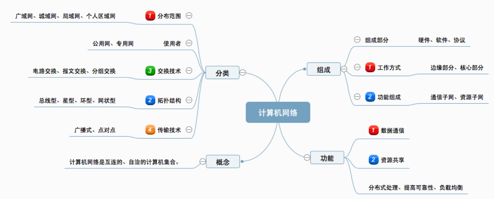

# 计算机网络体系结构

## 计算机网络概述

[TOC]

### 概念、组成、功能、分类

#### 概念

“三网融合”：有线电视网络、电信网络、计算机网络

“四网融合”：三网+电网

计算机网络：是一个将分散的、具有独立功能的==计算机系统==，通过==通信设备==与==线路==连接起来，由功能完善的==软件==实现==资源共享==和==信息传递==的系统

简单来说：计算机网络是==互连==的、==自治==的计算机集合

==互连==：通过通信链路互联互通

==自治==：无主从关系

#### 功能

1. 数据通信⭐
2. 资源共享⭐
    1. 可共享==硬件==、==软件==、==数据== //打印机，远程操作，下载文档
3. 分布式处理 //多台计算机格子承担同一工作的不同部分 Hadoop平台
4. 提高可靠性 //由分布式处理引申出的功能
5. 负载均衡  //分布式处理引申出的功能

#### 计算机网络的发展

1. 第一阶段：
    1. 美国ARPA设计的一个分散的指挥系统 ARPAnet
    2. 希望不同网络互连=> internet ( interconnected network )互连网，1983年阿帕网接收TCP/IP选定internet为主要的计算机通信系统 //相互连接的网络
    3. Internet 因特网  //专有名词，
    4. 网络把许多计算机连接在一起，互连网把许多网络连接在一起，因特网是世界上最大的互连网
2. 第二阶段：
    1. 美国NSF围绕6个大型计算机中心建设计算机网络，即国家科学基金网**NSFNET**
3. 第三阶段：
    1. 多层次ISP结构
    2. ISP：因特网服务提供者/因特网服务提供商，是一个向广大用户综合提供互联网接入服务、信息业务和增值业务的公司，比如中国移动、中国联通、中国电信等。分为主干ISP、地区ISP和本地ISP。

#### 组成

##### 组成部分

硬件、软件、协议(一系列规则和约定的集合)

##### 工作方式⭐

1. 边缘部分：主机，用户直接使用
    1. C/S方式：client/server				B/S: browser/server
    2. p2p: peer to peer 　　bt种子下载
2. 核心部分：为边缘部分服务，网络和路由器

##### 功能组成⭐

1. 通信子网：“物联网”三层
    1. 各种传输介质、通信设备、相应的网络协议组成
2. 资源子网：“会示用”三层
    1. 实现资源共享功能的设备和软件的集合

#### 分类

1. 分布范围
    1. ==广域网WAN==、城域网MAN、==局域网LAN==、个人局域网PAN
        1. 局域网通常使用广播技术，广域网通常使用交换技术
2. 使用者
    1. 公用网
    2. 专用网
3. 交换技术
    1. 电路交换
    2. 报文交换　　　//存储转发
    3. 分组交换　　　//存储转发
4. 拓扑结构
    1. 总线
    2. 星型     6个结点，几条链路？答：5条
    3. 环型
    4. 网状型　　常用于广域网
5. 传输技术
    1. 广播式网络：共享公共通信信道
    2. 点对点网络：使用**分组存储转发**和**路由选择**机制

### 标准化工作及相关组织*

实现不同厂商的硬、软件之间相互连通，必须遵从同一的标准

#### 分类

1. 法定标准：由权威机构制定的正式的、合法的标准 OSI
2. 事实标准：某些公司的产品在竞争中占据了主流，时间长了，就成了标准 TCP/IP

#### 标准化工作

RFC(Request For Comments)上升为正式标准的四个阶段

1. 因特网草案(Internet Draft)这个阶段还不是RFC文档
2. 建议标准(Proposed Standard)。这个阶段就开始称为RFC文档
3. 草案标准(Draft Standard) IETF、IAB审核
4. 因特网标准(Internet Standard)👏

#### 相关组织

1. 国际标准化组织ISO:  OSI模型、HDLC协议
2. 国际电信联盟ITU:   指定通信规则
3. 电气和电子工程师协会IEEE: 学术机构、IEEE802系列标准、5G
4. Internet工程任务组IETF: 负责因特网相关标准的指定

### 性能指标

#### 速率 b/s，考研做题速率按$10^3$进位

即==数据率==或称==数据传输率==或==比特率==

连接在计算机网络上的主机在数字信道上传送数据位数的速率

#### 带宽 b/s 放到信道上的速率

原来指最高频与最低频之差(Hz)

在计算机网络中用来表示网络的通信线路传送数据的能力，通常是指单位时间内从网络中的某一点到另一点所能通过的==“最高数据率”==

#### 吞吐量 b/s

表示在==单位时间==内通过==某个网络(或信道、接口)==的数据量，受到网络的带宽或网络的额定速率的限制

考虑两个服务器通过一台交换机向主机发送数据，交换机与主机相连的链路带宽为100Mb/s，两台服务器向主机发送数据的速率分别是20Mb/s和10Mb/s，则主机对应接口的吞吐量就是30Mb/s。

> 带宽是理想情况下能达到的最高速率，而吞吐量是当前的速率

## 体系结构&参考模型

### 分层结构

### 协议、接口、服务

### ISO/OSI 模型

### TCP/IP模型

