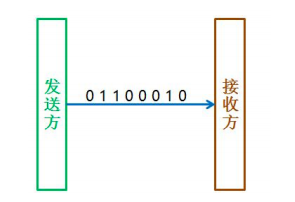
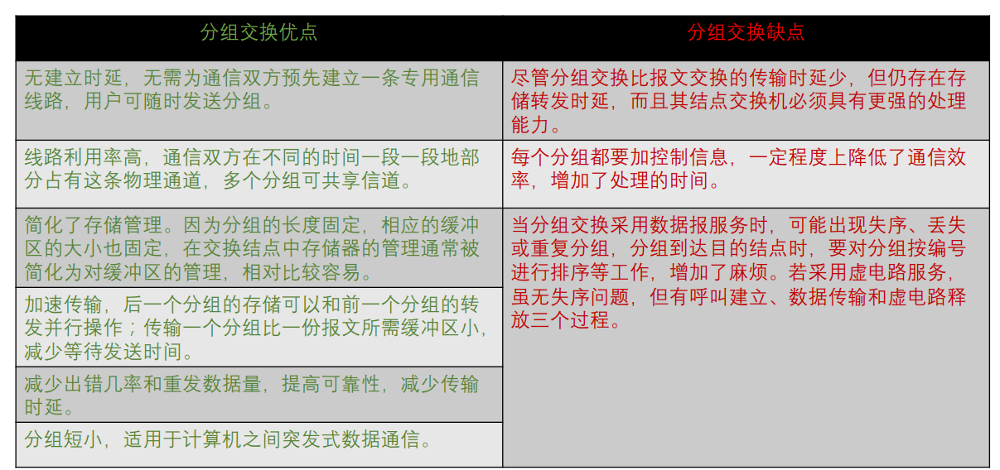
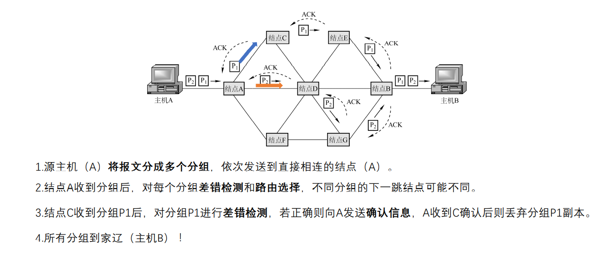
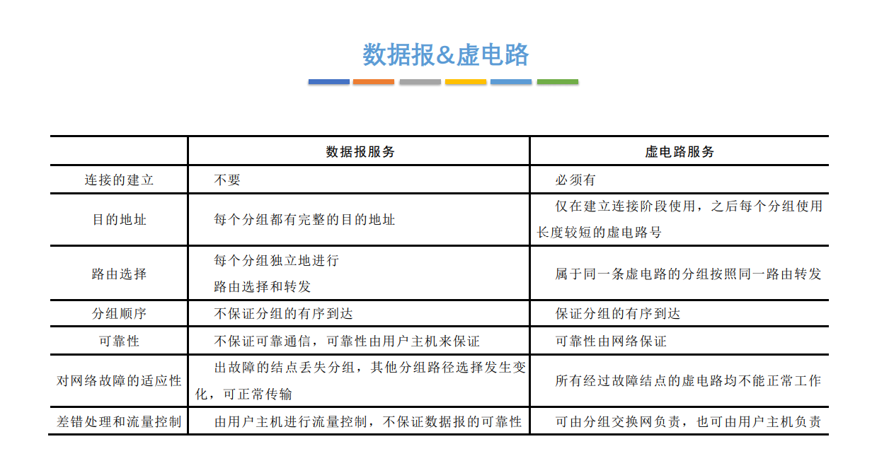

# 物理层

## 物理层基本概念

物理层解决如何在连接各种计算机的传输媒体上==传输数据比特流==，而不是指具体的传输媒体。

物理层主要任务：确定与传输媒体==接口==有关的一些特性=> ==定义标准==

## 数据通信基础知识

### 数据通信模型

### 相关术语

通信的目的是传送消息（消息：语音、文字、图像、视频等）

数据data：传送信息的实体，通常是有意义的符号序列。

信号：数据的电气/电磁的表现，是数据在传输过程中的==存在形式==。

1. 数字信号/离散信号：代表消息的参数的取值是离散的。

    

2. 模拟信号/连续信号：代表消息的参数的取值是连续的。

    

信源：产生和发送数据的源头。

信宿：接收数据的终点 。

信道：信号的传输媒介。一般用来表示向==某一个方向==传送信息的介质，因此一条通信线路往往包含一 条发送信道和一条接收信道。**信道是有方向的**

### 通信方式分类

1. 分类1

    1. 单工通信:只有一个方向的通信而没有反方向的交互，仅需要一条信道。
    2. 半双工通信/双向交替通信: 通信的双方都可以发送或接收信息，但任何一方都不能同时发送和接收， 需要两条信道。
    3. 全双工通信/双向同时通信: 通信双方可以同时发送和接受信息，也需要两条信道。

2. 分类2

    1. 串行传输

        

        速度慢，费用低，适合远距离

    2. 并行传输

        

        速度快，费用高，适合近距离

3. 分类3

    1. 同步传输: 在同步传输的模式下，数据的传送是以一个==数据区==块为单位，因此同步传输又称为区块传输。 在传送数据时，需先送出1个或多个同步字符，再送出整批的数据。

        ​		同步字符用于同步时钟, 例如做面包然后让人吃, 同步字符表明开始做面包了, 然后这边一直做, 那边一直吃

        

    2. 异步传输: 异步传输将比特分成小组进行传送，小组可以是8位的1个字符或更长。发送方可以在任何时刻 发送这些比特组，而接收方不知道它们会在什么时候到达。传送数据时，加一个字符起始位和一个字符终止位。

        ​		异步相当于看心情, 随机做面包, 做了那边再吃.  例如键盘的输入就是异步传输的, 电脑不知道用户什么时候会敲键盘上的哪个键, 所以一直处于准备状态, 敲了就响应, 敲完了这次传输就结束

        

        

### 单位

#### 码元

码元是指用一个固定时长的信号波形（数字脉冲）当码元的离散状态有M个时（M大于2）， 此时码元为M进制码元。

离散的波形, 一小段代表一个码元, 长度代表码元宽度(时间)

1码元可以携带多个比特的信息量。

#### 速率

码元传输速率/脉冲个数/信号变化的次数: 一秒内传输的码元个数, 单位是波特(Baud / B), 每一小段就代表一个码元/脉冲/一次信号变换.无论电平高低是否发生变化.

题目中给的可能是波形的种类, 也就是对应的k进制码元

码元传输速率只与码元长度T有关

信息传输速率: 一秒传输多少比特 

#### 带宽

模拟信号系统中: 最高频与最低频之差

数字信号系统中: 将数据放上信道的最大速率 bps

## 两个极限🚩

### 奈氏准则

1. 采样定理

    ​		采样频率必须$\ge$二倍的带宽

2. 奈氏准则

    ​		$C_{max} = f_{采样}\times log_2N=2Wlog_2N\quad (bit/s)$

> 结论：
>
> 1. 在任何信道中，码元传输的速率是有上限的。超过上限会产生码间串扰
> 2. 带宽越大，码元速率就可以越大
> 3. 奈氏准则只限制码元传输速率，不限制信息传输速率(理论上可以是$\infty$)
> 4. 提升数据传输速率就要想办法让码元携带尽可能多的比特

### 香农定理

$信噪比(dB)=10log_{10}(S/N)\\ 信噪比=信号平均功率/噪声平均功率$

上述两个表达式含义相同，只是单位不一样，类似于使用科学计数法来表示大数

$C_{max}=W\times log_2(1+S/N)\quad(bit/s)$

> 结论：
>
> 1. 提升极限传输速率需要提高信噪比
> 2. 对于一定的带宽和信噪比，极限速率就确定了
> 3. 只要信息传输速率低于极限速率，就一定能找到某种方法实现==无差错传输==
> 4. 实际信道传输速率要比极限速率低不少

## 编码与调制🚩

### 基带信号与宽带信号

基带信号:

计网中的理解: 将数字信号1和0直接用两种不同的电压表示，再送到数字信道上去传输（基带传输）

> 基带信号就是发出的直接表达了要传输的信息的信号，比如我们说话的声波, 基带信号可以是模拟信号也可以是数字信号, 但是计算机的语言就是0和1, 所以在计算机网络中一般将基带信号对应数字信号

宽带信号:

计网中的理解: 将基带信号进行调制后形成的频分复用模拟信号，再传送到模拟信道上去传输（宽带传输）

> 宽带信号就是把基带信号进行了处理之后的信号.

在传输距离较==近==时，计算机网络采用==基带传输==方式（近距离衰减小，从而信号内容不易发生变化）

在传输距离较==远==时，计算机网络采用==宽带传输==方式（远距离衰减大，即使信号变化大也能最后过滤出来基带信号）

### 编码与调制

最终得到的是数字信号就是编码

最终得到的是模拟信号就是调制

#### 数字->数字

非归零编码: 高1低0

曼彻斯特编码: 前高后低代表1,  

> 一次电平的跳转视作一个码元的时长, 曼彻斯特编码两个码元的时长才传送一个码元, 故它所占的频带宽度是原始基带宽度的两倍

差分曼彻斯特编码: 同1异0, 在两个码元的中间, 如果前一个码元的后半部分与后一个码元的前半部分相同,则后一个码元代表1, 不相同代表0

4B/5B编码

用5个比特表示4个比特的信息, 只需使用16种组合, 剩下的16中组合表示一些控制信息

编码效率位80%

#### 数字->模拟

调幅(ASK) 不同的幅度代表不同信号

调频(FSK) 不同的频率代表不同信号

调相(PSK) 不同的相位代表不同信号

调幅+调相(正交振幅调制)(QAM): 同一相位中不同的幅度也代表不同的信号

#### 模拟->数字

脉码调制PCM: 

抽/采样: $f_{采样频率}\ge 2f_{信号最高频率}$

量化: 把采样得到的不同电平值按某种规则转换为数字, 并取整

编码: 量化结果转换成二进制编码

#### 模拟->模拟

将低频率的原始信号增加频率, 以应对恶劣的信道环境.

## 数据交换方式🚩

### 电路交换

特点：独占资源，用户始终占用端到端的固定传输带宽。适用于远 程批处理信息传输或系统间实时性要求高的大量数据传输的情况。

### 报文交换

报文: 包含要发送的完整的数据信息, 长度不限且可变

### 分组交换

分组: 将大块的数据分段, 就叫分组

#### 数据报方式

特点:

> 1. 为网络层提供无连接服务
> 2. 到达目的结点可能失序
> 3. 每个分组传输过程中都带有序号, 目的地址, 源地址
> 4. 存储转发时需排队处理, 会产生时延
> 5. 具有冗余路径, 对故障适应能力强, 适用于突发性通信, 不适合长报文, 会话式通信

#### 虚电路方式

特点:

> 1. 为网络层提供连接服务(逻辑连接)
> 2. 分组顺序传送, 传送过程不需携带目的地址, 源地址, 携带虚电路号
> 3. 结点只进行差错检测, 不需进行路由选择
> 4. 每个结点可能与多个结点之间建立多条虚电路, 每条虚电路支持特定的两个端系统之间的数据传输，可以对 两个数据端点的流量进行控制，两个端系统之间也可以有多条虚电路为不同的进程服务。
> 5. 某个结点/链路故障, 所有经过该结点/链路的虚电路都会被破坏

#### 对比

### 数据交换方式的选择

## 传输介质

传输介质也称传输媒体/传输媒介，它就是数据传输系统中在发送设备和接收设备之间的物理通路。

==传输媒体不是物理层==, 物理层知道信号的含义, 传输媒体不知道

### 导向性介质

#### 双绞线

由==两根==采用一定规则并排==绞合==的、相互绝缘的==铜导线==组成

绞合可以减少对相邻导线的电磁干扰。

进一步提高抗干扰能力=> 再加一层金属丝编成的屏蔽层=> 屏蔽双绞线

距离太远时, 模拟信号需要放大器放大衰减的信号, 数字传输要使用中继器将失真的信号整形

#### 同轴电缆

同轴电缆由==导体铜质芯线==、==绝缘层==、==网状编织屏蔽层(抗干扰能力强的原因)==和==塑料外层==构成。共用一个轴心

分为基带同轴电缆(局域网), 宽带同轴电缆(有线电视系统)

#### 光纤

光纤主要由纤芯(实心的！)和包层构成, 纤芯折射率大于包层. 入射角足够大, 就会发生全反射

特点:

1. 传输损耗小, 对远距离传输特别经济
2. 抗雷电和电磁干扰性能好。
3. 无串音干扰，保密性好，也不易被窃听或截取数据。
4. 体积小，重量轻。

### 非导向传输介质

### 物理层接口四大特性

泄气工程

机械特性

电气特性

功能特性

规程特性

## 物理层设备

### 中继器

对==数字信号==进行==再生和还原==，对衰减的信号进行放大，保持与原数据相同，以增加信号传输的距离，延长 网络的长度。

两端连接的内容:

> 1. 两端的网络部分是网段，而不是子网，适用于完全相同的==两类==网络的互连，且两个网段速率要相同。
> 2. 给什么传什么, 不管是否错误或不合适
> 3. 两端可连相同媒体，也可连不同媒体。
> 4. 中继器两端的网段一定要是同一个协议。

5-4-3规则: 10兆以太网: 不超过5个网段, 最多4个物理层设备, 只有3个段可以连接计算机

### 集线器

对信号进行再生==放大转发==, 转发到所有(除了输入端口)处于工作状态的端口上. 不具备定向传送能力, 是一个共享式设备.

集线器不能分割冲突域

连在集线器上的工作主机平分带宽

