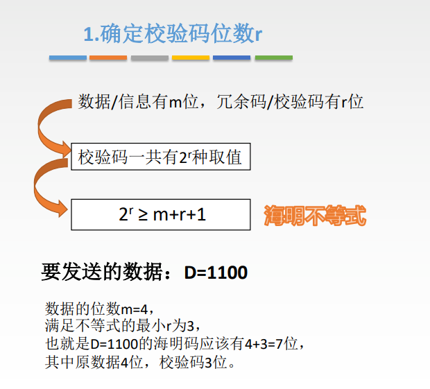
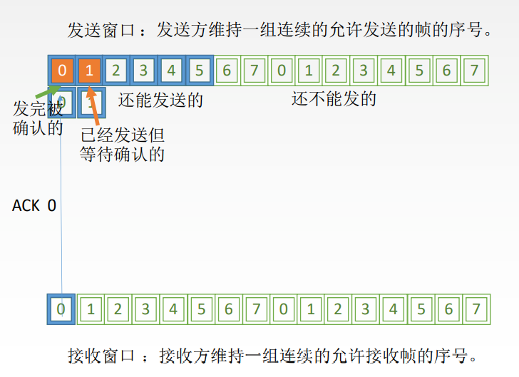

# 数据链路层

## 功能概述

结点：主机、路由器

链路：网络中两个结点之间的==物理通道==，链路的传输介质主要有双绞线、光纤和微波。分为有线链路、无线链路。

数据链路：网络中两个结点之间的==逻辑通道==，把实现控制数据传输协议的硬件和软件加到链路上就构成数据链路。

帧：链路层的协议数据单元，封装网络层数据报。

数据链路层负责通过一条链路从一个结点向另一个物理链路直接相连的相邻结点传送数据报。

数据链路层在物理层提供服务的基础上==向网络层提供服务==，其最基本的服务是将源自网络层来的数据可靠地传输到 相邻节点的目标机网络层。其主要作用是==加强物理层传输原始比特流的功能==，将物理层提供的可能出错的物理连接 改造成为**逻辑上无差错的数据链路**，使之对网络层表现为一条无差错的链路。

1. 功能一：为网络层提供服务。无确认无连接服务，有确认无连接服务，有确认面向连接服务。
2. 功能二：链路管理，即连接的建立、维持、释放（用于面向连接的服务）。
3. 功能三：组帧。
4. 功能四：流量控制。
5. 功能五：差错控制（帧错/位错）。

## 功能

### 封装成帧&透明传输

封装成帧就是给一段数据加头加尾，构成帧。首部和尾部包含许多控制信息，一个重要的作用就是“帧定界”

帧同步：接收方应当能从接收到的二进制比特流中区分出帧的起始和终止。

组帧的四种方法：1.字符计数法，2.字符（节）填充法，3.零比特填充法，4.违规编码法

透明传输：不管所传数据是什么样的比特组合，都应当能够在链路上传送。

#### 字符计数法

#### 字符填充法

#### 零比特填充法

5 “1” 1 “0”

保证了透明传输：在传送的比特流中可以传送任意比特组合，而不会引起对帧边界的判断错误。

#### 违规编码法

### 差错控制

#### 奇偶校验码

#### 循环冗余码

#### 海明码

> 原因： 
>
> 
>
> 检测d位错需要d+1位码距
>
> 纠正d位错需要2d+1位码距
>
> r位冗余码可以确定$2^r$种情况，用1种情况对应正确。则可以表示$2^r-1$个错误位置。

> 这里采用偶校验的意思是校验码取一个值使得所有它负责校验的序列中1的个数位偶数个

### 流量控制与可靠传输机制

==较高的发送速度==和==较低的接收能力==的不匹配，会造成传输出错，因此流量控制也是数据链路层的一项重要工作。

数据链路层的流量控制是点对点的，而传输层的流量控制是端到端的。

数据链路层流量控制手段：接收方收不下就不回复确认。

传输层流量控制手段：接收端给发送端一个窗口公告。

#### 停止-等待协议

1. 为什么要有

    1. 实现流量控制
    2. 出差错或丢包的处理

2. 前提

    1. 仅考虑一方发送一方接收
    2. 讨论可靠传输原理，不关心是在哪一层上传输的

3. 几种应用情况

    1. 无差错

        

    2. 有差错

        1. 
        2. 
        3. 

4. 性能分析

    信道利用率低，太简单了

    

    

    

#### 后退N帧协议

1. GBN协议中的滑动窗口机制

    1. 

2. 发送方需要做的三件事

    1. 

3. 接收方需要做的两件事

    1. 

4. 运行状态

    1. 

5. 窗口大小

    1. $1\le W_T\le2^n-1$

6. 重点总结

    1. 

7. 性能分析

    1. 优点：连续发送数据帧从而提高信道利用率
    2. 缺点：重传时须把原来已经正确传送的数据帧重传，使传送效率降低。

8. 题目：

    1. 主机甲与主机乙之间使用后退N帧协议（GBN）传输数据，甲的发送窗口尺寸为1000，数据帧长为1000字节， 信道带宽为100Mb/s，乙每收到一个数据帧立即利用一个短帧（忽略其传输延迟）进行确认，若甲、乙之间 的单向传播时延是50ms，则甲可以达到的最大平均数据传输率约为（ ）。

        A. 10Mb/s		B. 20Mb/s		C. 80Mb/s		D. 100Mb/s

        > 【分析】如果往返时延小于将发送窗口内所有数据帧发出去的时延，则传输率就是发送的传输率(题目给的理想情况)
        >
        > 先算往返时延：$2\times50=100ms$
        >
        > 再算将发送窗口全部发出去的时间：$\frac{1000\times1000\times8}{100\times10^6b/s}=80ms$
        >
        > 从而可以知道当窗口内的数据全部发送出去之后，还有20ms左右的时间是在等待第一个帧的确认帧。
        >
        > 此时算一下收到第一个确认帧的时间：$2\times50+\frac{1000}{100\times10^6}=100.08ms$
        >
        > 此后所有的帧都会跟着第一个帧继续发送，或者说理解成一个周期结束了，也就是在低100.08ms时，使用发送数据长度除以总时间，就是甲可以达到的最大平均数据传输率
        >
        > 用数据长度除以传输时间：$\frac{1000\times1000\times8}{100.08ms}\approx80Mb/s$

#### 选择重传协议

1. 滑动窗口

    1. 

2. 发送方要做的三件事

    1. 

3. 接收方要做的两件事

    1. 对于窗口内的帧，来一个收一个，失序的会被缓存，收谁确认谁，当收到窗口下届时，就将窗口向前移动到第一个没有收到的地方。

    2. 如果收到的是在从窗口最右端到最右端减去一个周期的位置内的帧，无论怎样都返回一个ack，其余情况忽略。

        

        最右端到减去一个周期：在上图中，如果收到12345670，都会返回ack，比如受到了3号帧，则证明之前发回去的ack丢了，再返回一个ack就可以了。

4. 运行状态

    

5. 窗口大小

    1. $W_{Tmax}=W_{Rmax}=2^{n-1}  此处的n代表的意思是编号所需要的位数，比如0,1,2,3则n就是2$
    2. 

6. 重点总结

    

