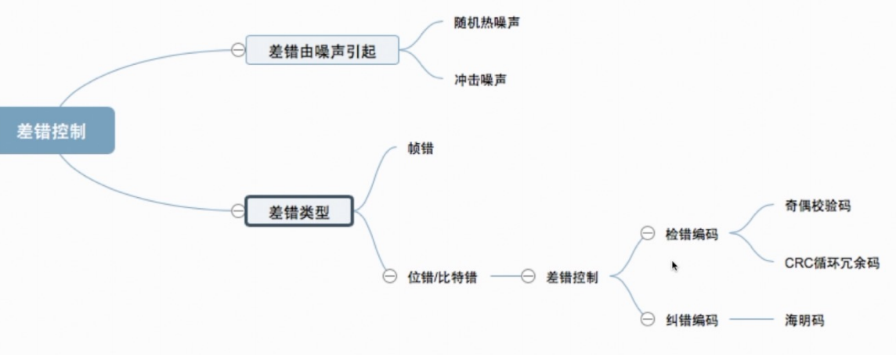
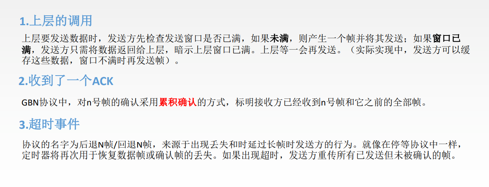

# 数据链路层

[TOC]

## 功能概述

结点：主机、路由器

链路：网络中两个结点之间的==物理通道==，链路的传输介质主要有双绞线、光纤和微波。分为有线链路、无线链路。

数据链路：网络中两个结点之间的==逻辑通道==，把实现控制数据传输协议的硬件和软件加到链路上就构成数据链路。

帧：链路层的协议数据单元，封装网络层数据报。

数据链路层负责通过一条链路从一个结点向另一个物理链路直接相连的相邻结点传送数据报。

数据链路层在物理层提供服务的基础上==向网络层提供服务==，其最基本的服务是将源自网络层来的数据可靠地传输到 相邻节点的目标机网络层。其主要作用是==加强物理层传输原始比特流的功能==，将物理层提供的可能出错的物理连接 改造成为**逻辑上无差错的数据链路**，使之对网络层表现为一条无差错的链路。

1. 功能一：为网络层提供服务。无确认无连接服务，有确认无连接服务，有确认面向连接服务。
2. 功能二：链路管理，即连接的建立、维持、释放（用于面向连接的服务）。
3. 功能三：组帧。
4. 功能四：流量控制。
5. 功能五：差错控制（帧错/位错）。

## 功能

### 封装成帧&透明传输

封装成帧就是给一段数据加头加尾，构成帧。首部和尾部包含许多控制信息，一个重要的作用就是“帧定界”

帧同步：接收方应当能从接收到的二进制比特流中区分出帧的起始和终止。

组帧的四种方法：1.字符计数法，2.字符（节）填充法，3.零比特填充法，4.违规编码法

透明传输：不管所传数据是什么样的比特组合，都应当能够在链路上传送。

#### 字符计数法

#### 字符填充法

#### 零比特填充法

5 “1” 1 “0”

保证了透明传输：在传送的比特流中可以传送任意比特组合，而不会引起对帧边界的判断错误。

#### 违规编码法

### 差错控制

#### 奇偶校验码

#### 循环冗余码

#### 海明码

> 原因： 
>
> 
>
> 检测d位错需要d+1位码距
>
> 纠正d位错需要2d+1位码距
>
> r位冗余码可以确定$2^r$种情况，用1种情况对应正确。则可以表示$2^r-1$个错误位置。

> 这里采用偶校验的意思是校验码取一个值使得所有它负责校验的序列中1的个数位偶数个

### 流量控制与可靠传输机制

==较高的发送速度==和==较低的接收能力==的不匹配，会造成传输出错，因此流量控制也是数据链路层的一项重要工作。

数据链路层的流量控制是点对点的，而传输层的流量控制是端到端的。

数据链路层流量控制手段：接收方收不下就不回复确认。

传输层流量控制手段：接收端给发送端一个窗口公告。

#### 停止-等待协议

1. 为什么要有

    1. 实现流量控制
    2. 出差错或丢包的处理

2. 前提

    1. 仅考虑一方发送一方接收
    2. 讨论可靠传输原理，不关心是在哪一层上传输的

3. 几种应用情况

    1. 无差错

        

    2. 有差错

        1. 
        2. 
        3. 

4. 性能分析

    信道利用率低，太简单了

    

    

    

#### 后退N帧协议

1. GBN协议中的滑动窗口机制

    1. 

2. 发送方需要做的三件事

    1. 

3. 接收方需要做的两件事

    1. 

4. 运行状态

    1. 

5. 窗口大小

    1. $1\le W_T\le2^n-1$

6. 重点总结

    1. 

7. 性能分析

    1. 优点：连续发送数据帧从而提高信道利用率
    2. 缺点：重传时须把原来已经正确传送的数据帧重传，使传送效率降低。

8. 题目：

    1. 主机甲与主机乙之间使用后退N帧协议（GBN）传输数据，甲的发送窗口尺寸为1000，数据帧长为1000字节， 信道带宽为100Mb/s，乙每收到一个数据帧立即利用一个短帧（忽略其传输延迟）进行确认，若甲、乙之间 的单向传播时延是50ms，则甲可以达到的最大平均数据传输率约为（ ）。

        A. 10Mb/s		B. 20Mb/s		C. 80Mb/s		D. 100Mb/s

        > 【分析】如果往返时延小于将发送窗口内所有数据帧发出去的时延，则传输率就是发送的传输率(题目给的理想情况)
        >
        > 先算往返时延：$2\times50=100ms$
        >
        > 再算将发送窗口全部发出去的时间：$\frac{1000\times1000\times8}{100\times10^6b/s}=80ms$
        >
        > 从而可以知道当窗口内的数据全部发送出去之后，还有20ms左右的时间是在等待第一个帧的确认帧。
        >
        > 此时算一下收到第一个确认帧的时间：$2\times50+\frac{1000}{100\times10^6}=100.08ms$
        >
        > 此后所有的帧都会跟着第一个帧继续发送，或者说理解成一个周期结束了，也就是在低100.08ms时，使用发送数据长度除以总时间，就是甲可以达到的最大平均数据传输率
        >
        > 用数据长度除以传输时间：$\frac{1000\times1000\times8}{100.08ms}\approx80Mb/s$

#### 选择重传协议

1. 滑动窗口

    1. 

2. 发送方要做的三件事

    1. 

3. 接收方要做的两件事

    1. 对于窗口内的帧，来一个收一个，失序的会被缓存，收谁确认谁，当收到窗口下届时，就将窗口向前移动到第一个没有收到的地方。

    2. 如果收到的是在从窗口最右端到最右端减去一个周期的位置内的帧，无论怎样都返回一个ack，其余情况忽略。

        

        最右端到减去一个周期：在上图中，如果收到12345670，都会返回ack，比如受到了3号帧，则证明之前发回去的ack丢了，再返回一个ack就可以了。

4. 运行状态

    

5. 窗口大小

    1. $W_{Tmax}=W_{Rmax}=2^{n-1}  此处的n代表的意思是编号所需要的位数，比如0,1,2,3则n就是2$
    2. 

6. 重点总结

    

### 介质访问控制

传输数据的两种链路:

1. 点对点链路: 应用: PPP协议, 常用于广域网
2. 广播式链路: 应用: 常用于局域网, 典型拓扑结构: 总线型, 星型(逻辑总线型)

#### 静态划分信道/信道划分介质访问控制:

多路复用技术: 把多个信号组合在一条物理信道上进行传输, 使得多个计算机共享信道资源.

共享信道: 实际就是把广播信道转变为点对点信道.

1. 频分多路复用 FDM

    1. 

2. 时分多路复用 TDM

    1. 

    2. 

        时分多路复用每个主机的传输速率是$\frac{带宽}{时隙个数}$, 统计时分复用中每个主机的传输速率可以是带宽.

3. 波分多路复用 WDM

    1. 

4. 码分多路复用 CDM

    1. 

#### 动态划分信道

特点: 信道并非是在用户通信时固定分配给用户

##### 随机访问介质访问控制

所有用户可以随机发送信息. 发送信息时占全部带宽.

###### ALOHA 不听就说

1. 纯ALOHA比时隙ALOHA吞吐量更低，效率更低。
2. 纯ALOHA想发就发，时隙ALOHA只有在时间片段开始时才能发。

###### CSMA 先听再说

发送帧之前先监听信道

1. 1-坚持CSMA
    1. 
2. 非坚持CSMA
    1. 
3. p-坚持CSMA
    1. 

###### CSMA/CD

为什么先听再说仍然会发生冲突：信号传播需要时间，两个主机检测到空闲，同时发送，于是发生冲突

应用在半双工网络

1. 

2. 

3.  

    1. 
    2. 

    

###### CSMA/CA

1. 为什么有CSMA/CA
    1. 在无线局域网中, 无法做到360°全面检测碰撞
    2. 无线局域网中存在隐蔽站的问题, 当A和C都认为信道空闲的时候, 同时向B发送数据, 就会产生冲突.
2. 工作原理
    1. 
    2. RTS/CTS是成对出现的, 旨在解决隐蔽站的问题.
3. 与CSMA/CD的对比
    1. 

##### 轮询访问介质访问控制

轮询访问介质访问控制同样可以达到无冲突, 且发送时独占带宽的特点.

1. 轮询协议
    1. 
2. 令牌传递协议
    1. 会有一个令牌在环中依次通过每个结点, 通过结点时, 如果该结点不发送数据, 则继续到下一个结点, 如果当前结点需要发送数据, 则修改令牌的标志位(改成已被占用), 把数据帧加上, 在环中传. 传到某结点, 如果不是发给自己的则跳过, 如果是发给自己的则复制一份, 并继续在环中传递. 直到返回到发送方结点, 发送方检查是否出错,决定是否重发. 如果发完了, 则还原令牌, 继续传递令牌. 对于每个结点来说, ==持有令牌的时间有上限值==
    2. 

## 应用

### 局域网

#### 特点

#### 拓扑结构

1. 星型拓扑
    1. 优点: 任意两个结点通信最多只需**两步**, 传输速度快; 网络结构简单, 便于维护
    2. 缺点: 可靠性低,共享能力差(相对于总线型), 有单点故障问题
2. 总线型拓扑
    1. 网络可靠性高、网络节点 间响应速度快、共享资源能力强、设备投入量少、 成本低、安装使用方便， 当某个工作站节点出现故 障时，对整个网络系统影响小。
3. 环型拓扑
    1. 有**单点故障**问题, 不便于扩充, 系统响应时间长, 信息传递速率较低.
4. 树型拓扑
    1. 易于扩展, 易于隔离故障, 也容易有**单点故障**

#### 传输介质

1. 有线局域网: 双绞线, 同轴电缆, 光纤
2. 无线局域网: 电磁波

#### 介质访问控制

#### 分类

FDDI对应的是光纤

#### IEEE802

80年2月成立

1. 802.3对应以太网

2. 802.5对应令牌环网

3. 802.8对应光纤

4. 802.11对应无线局域网

#### 两个控制子层

### 以太网

#### 概述

#### 无连接、不可靠

无连接：发送方和接收方之间无“握手过程”

不可靠：不对发送方的数据帧编号，接收方不向发送方进行确认，差错帧直接丢弃，差错纠正由高层负责

==以太网只实现无差错接收，不实现可靠传输==

#### 传输介质与拓扑结构的发展

#### 10BASE-T以太网

#### 适配器与MAC地址

#### MAC帧格式

IEEE802.3帧格式改动：

1. 第三个字段“类型”是“长度/类型”
2. 当长度/类型字段值小于0x0600时，数据字段必须装入LLC子层

> 有前导码为什么结束位置不需要额外的编码表示结束？
>
> 因为以太网使用曼彻斯特编码，在发送时电压会有上下波动，发送结束之后电压不变，接收方能够感受到。然后往前推4个字节就是数据的结束部分。

#### 高速以太网

### IEEE802.11 无线局域网

#### MAC帧头格式

#### 分类

1. 有固定基础设施无线局域网
    1. 
2. 无固定基础设施无线局域网的自组织网络
    1. 
    2. 不需要交换设备，每个主机都充当交换设备，地位平等

### PPP协议&HDLC协议

#### 广域网

广域网与局域网的区别和联系

|                 | 广域网                                                       | 局域网                   |
| --------------- | ------------------------------------------------------------ | ------------------------ |
| 覆盖范围        | 很广，通常跨区域                                             | 较小，通常在一个区域内   |
| 连接方式        | 结点之间都是点到点连接，但为了提高网络的可靠性，一个结点交换机往往与多个结点交换机相连(结点交换机只能连接相同网络) | 普遍采用多点接入技术     |
| OSI参考模型层次 | 三层：物理，数据链路层，网络层                               | 两层：物理层，数据链路层 |
| 着重点          | 强调资源共享                                                 | 强调数据传输             |

联系与相似点：

1. 广域网和局域网都是互联网的重要组成构建，从互联网的角度上看，==二者平等==(不是包含关系)
2. 连接到一个广域网或一个局域网上的主机在该网内进行通信时，只需要使用其网络的物理地址

#### PPP协议

点对点协议PPP（Point-to-Point Protocol）是目前使用最广泛的数据链路层协议，用户使用拨号电话接入因特网 时一般都使用PPP协议。(==只支持全双工链路==)

> PPP协议既可以使用字节填充的方式(如上图，异步)，也可以使用比特填充。

#### HDLC协议

三种数据操作方式

1. 正常响应方式：主站控制，从站发送数据
2. 异步平衡方式：每个复合站都可以进行对另一个站的数据传输
3. 异步响应方式：从站胆子肥了，主站没说话就可以发送消息

#### 两种协议的异同

