# 网络层

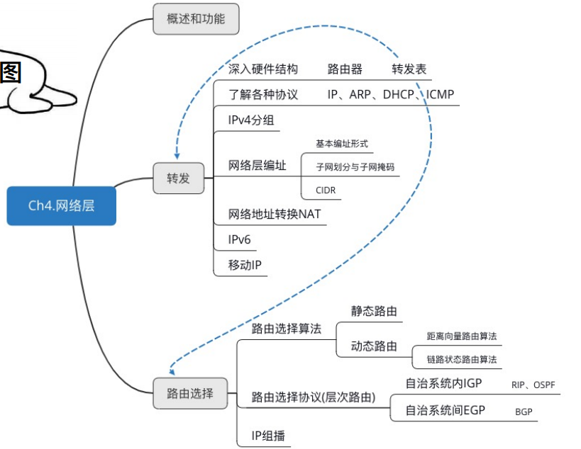

## 功能

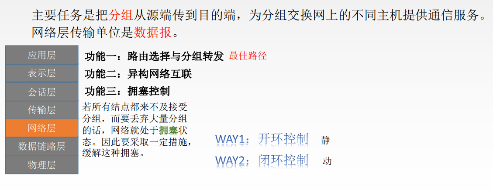

拥塞控制是全局性的，流量控制是针对发送方的。

## IP数据报格式

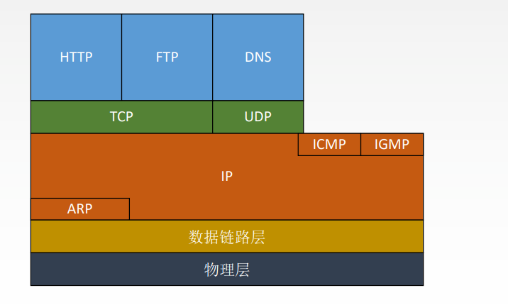

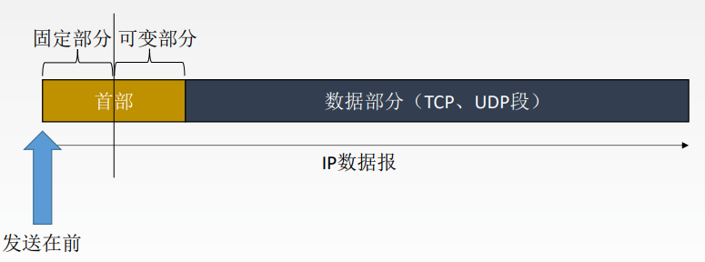

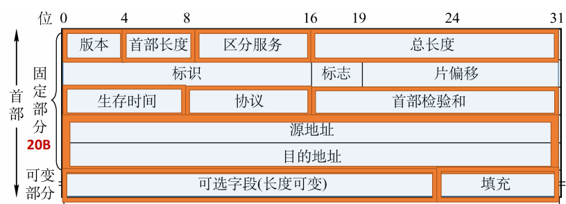

1. 版本：IPv4/IPv6
2. 首部长度：单位是==4B==，最小为5
3. 区分服务：指示期望获得什么服务
4. 总长度：首部+数据，单位==1B==
5. 生存时间(TTL)：经过一个路由器-1，变成0则丢弃
6. 协议：数据部分的协议，TCP对应6，UDP对应17
7. 首部检验和：只检验首部。
8. 可选字段：0~40B，用来支持排错、测量以及安全等措施
9. 填充：全0，把首部填充成4B的整数倍

## 分片

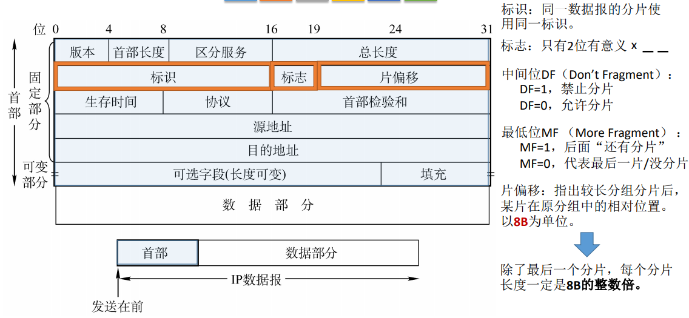

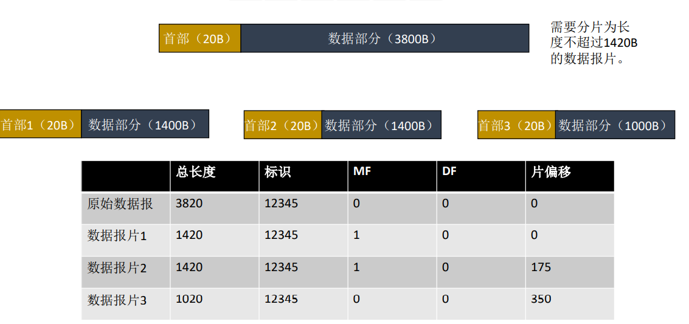

## IP地址

  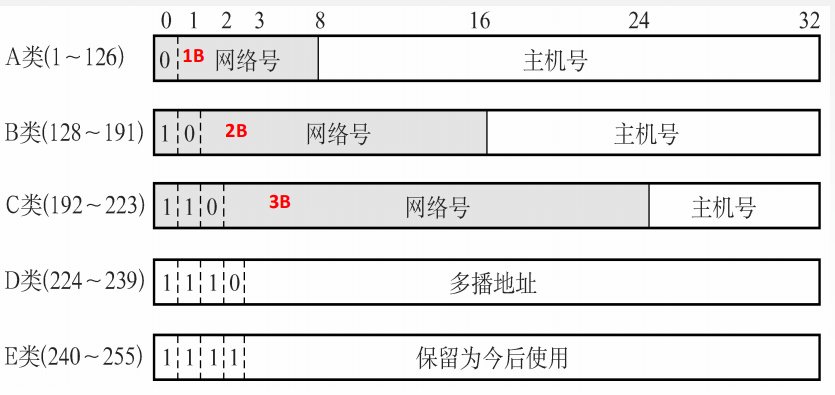

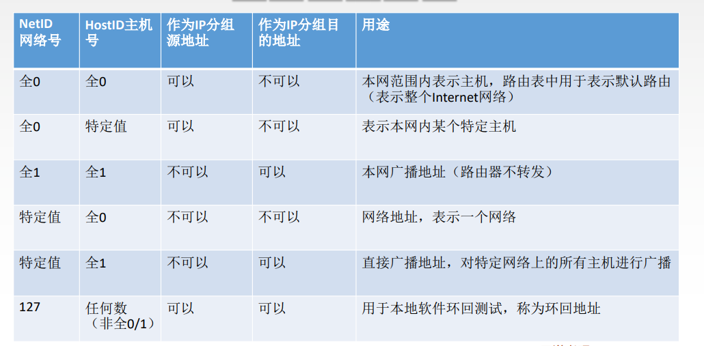

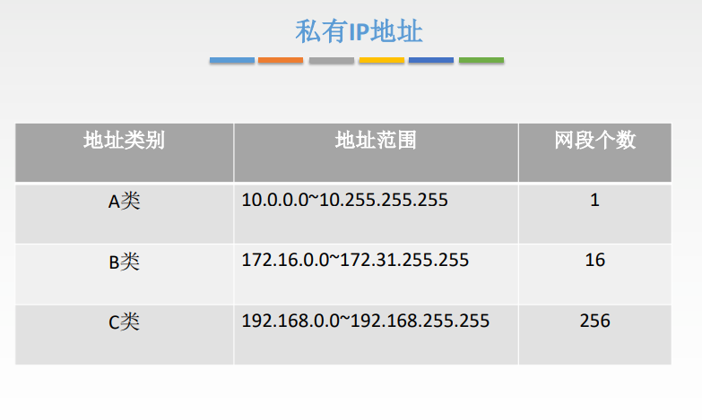

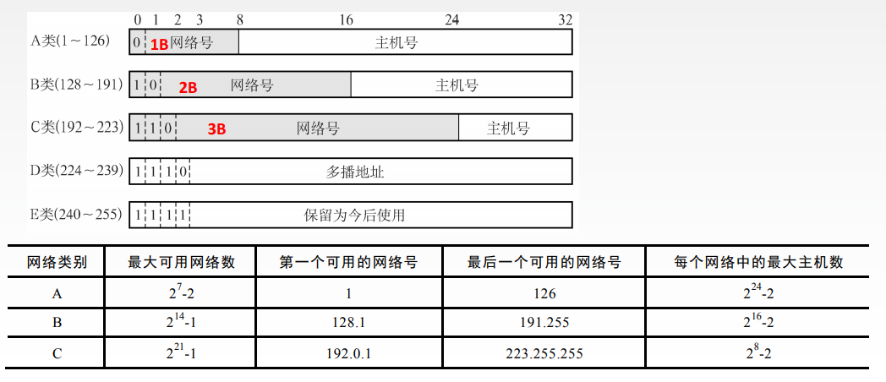

## NAT

路由器对目的地址是私有地址的数据报一律不进行转发

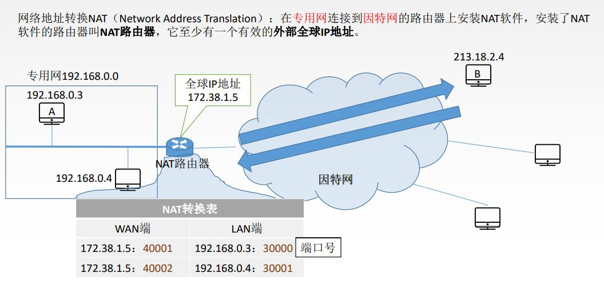