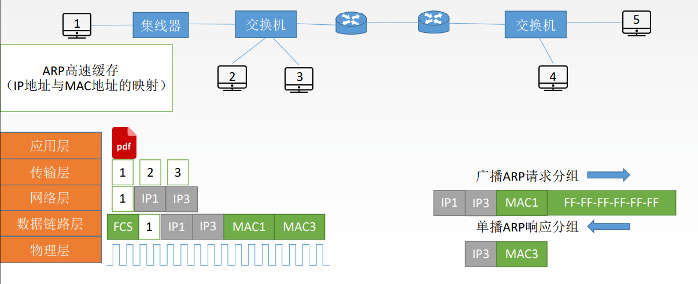
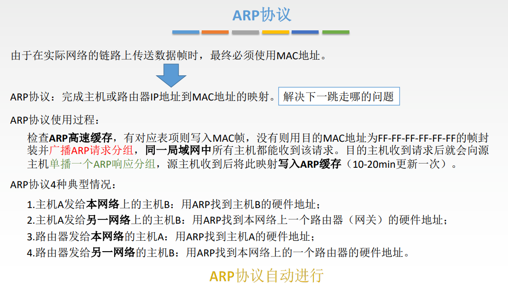
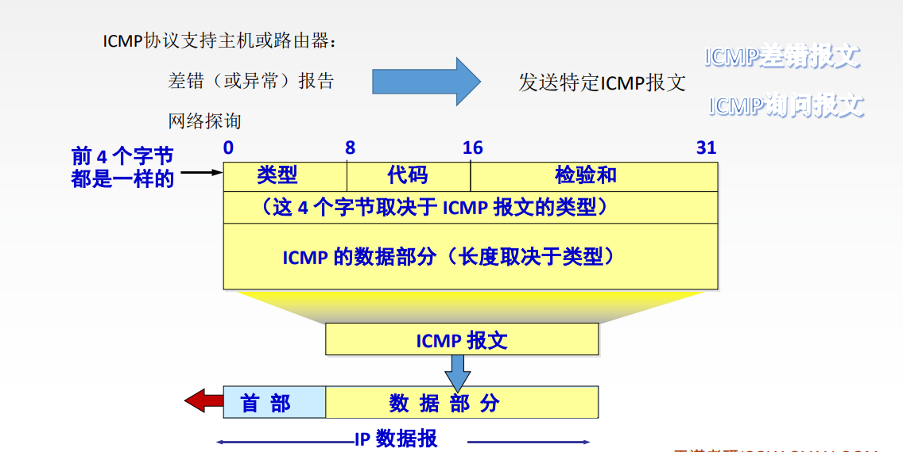

# 网络层

## 功能

拥塞控制是全局性的，流量控制是针对发送方的。

## IP数据报格式

1. 版本：IPv4/IPv6
2. 首部长度：单位是==4B==，最小为5
3. 区分服务：指示期望获得什么服务
4. 总长度：首部+数据，单位==1B==
5. 生存时间(TTL)：经过一个路由器-1，变成0则丢弃
6. 协议：数据部分的协议，TCP对应6，UDP对应17
7. 首部检验和：只检验首部。
8. 可选字段：0~40B，用来支持排错、测量以及安全等措施
9. 填充：全0，把首部填充成4B的整数倍

## 分片

## IP地址

  

## NAT

路由器对目的地址是私有地址的数据报一律不进行转发

## 子网划分/子网掩码

将主机号中的一部分拿出来当作子网号. 子网号能否全0或全1需要看是否使用CIDR技术，主机号不能全0或全1

划分子网后，对外仍然表现为一个网络。

## 无分类编址CIDR

1. 构成超网
    1. 取交集
    2. 
2. 最长前缀匹配
    1. 使用CIDR时，查找路由表可能得到几个匹配结果，应选择具有最长网络前缀的路由。前缀越长，地址块越小， 路由越具体。
    2. 目的地址与每个网络的子网掩码进行相与，在所有相与结果与对应网络号相同的表项中选择网络前缀最长的一个。

## ARP协议

主机中有一个ARP高速缓存，存储了自己所在局域网内主机/接口IP地址与MAC地址的映射。如果主机的缓存中没有目的主机的MAC地址，则需要广播一个ARP请求分组，将目的MAC地址填为全1，对应主机收到请求分组之后会单播返回ARP响应分组。主机将得到的MAC填入目的MAC地址，并在ARP高速缓存中填入新的表项。

## DHCP

第三步为什么还用广播的形式进行发送？

> 用来通知其他的DHCP服务器可以将他们拟分配的IP地址收回了。

## ICMP

> 3对应两种情况，一是到路由器，TTL为0，返回时间超过。二是到目的主机了，但是超时了，就将已经收到的数据都丢掉，返回时间超过。

ICMP的应用主要是 PING 和 Traceroute/Tracert

PING使用ICMP回送请求和回答报文

Tracert使用时间超过差错报告报文

> Tracert: 设置一连串的数据等待发送，第一个TTL设置为1，第二个设置为2, 依此类推，尝试计算一共需要经历多少跳。

PING工作在应用层，直接使用网络层的ICMP，不使用TCP或UDP

Tracert工作在网络层。