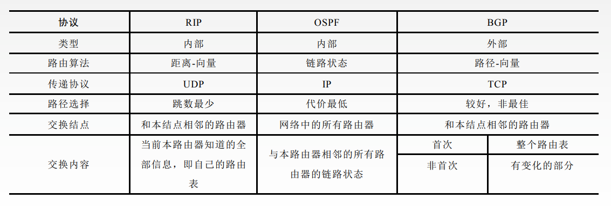
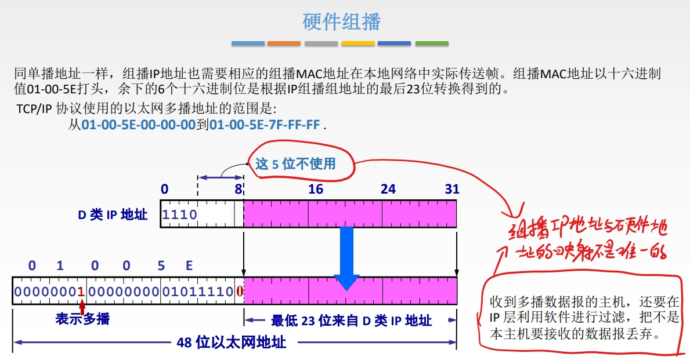
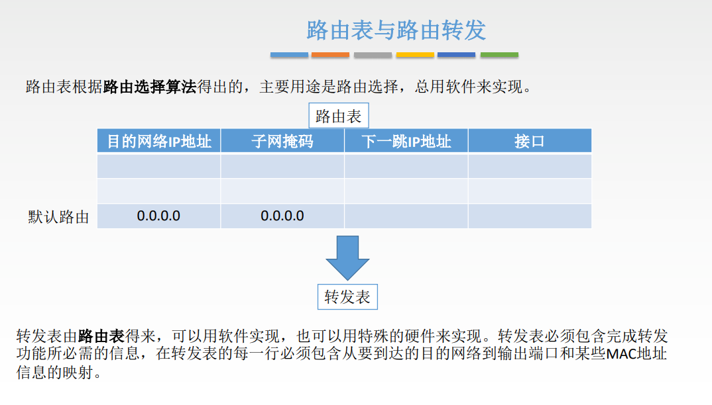

# 网络层

## 功能

拥塞控制是全局性的，流量控制是针对发送方的。

## IP数据报格式

1. 版本：IPv4/IPv6
2. 首部长度：单位是==4B==，最小为5
3. 区分服务：指示期望获得什么服务
4. 总长度：首部+数据，单位==1B==
5. 生存时间(TTL)：经过一个路由器-1，变成0则丢弃
6. 协议：数据部分的协议，TCP对应6，UDP对应17
7. 首部检验和：只检验首部。
8. 可选字段：0~40B，用来支持排错、测量以及安全等措施
9. 填充：全0，把首部填充成4B的整数倍

## 分片

## IP地址

  

## NAT

路由器对目的地址是私有地址的数据报一律不进行转发

## 子网划分/子网掩码

将主机号中的一部分拿出来当作子网号. 子网号能否全0或全1需要看是否使用CIDR技术，主机号不能全0或全1

划分子网后，对外仍然表现为一个网络。

## 无分类编址CIDR

1. 构成超网
    1. 取交集
    2. 
2. 最长前缀匹配
    1. 使用CIDR时，查找路由表可能得到几个匹配结果，应选择具有最长网络前缀的路由。前缀越长，地址块越小， 路由越具体。
    2. 目的地址与每个网络的子网掩码进行相与，在所有相与结果与对应网络号相同的表项中选择网络前缀最长的一个。

## ARP协议

### ==错题==

> TCP/IP的ARP属于__ __ __
>
> A. 物理层
>
> B. 网络接口层
>
> C. 互联网络层
>
> D. 传输层
>
> 答案: B
>
> ARP报文是由以太网帧进行封装传输的, 没有封装进IP包.

主机中有一个ARP高速缓存，存储了自己所在局域网内主机/接口IP地址与MAC地址的映射。如果主机的缓存中没有目的主机的MAC地址，则需要广播一个ARP请求分组，将目的MAC地址填为全1，对应主机收到请求分组之后会单播返回ARP响应分组。主机将得到的MAC填入目的MAC地址，并在ARP高速缓存中填入新的表项。

==MAC地址=>IP地址: RARP协议.==

==IP地址=>MAC地址: ARP协议.==

## DHCP

第三步为什么还用广播的形式进行发送？

> 用来通知其他的DHCP服务器可以将他们拟分配的IP地址收回了。

## ICMP

> 3对应两种情况，一是到路由器，TTL为0，返回时间超过。二是到目的主机了，但是超时了，就将已经收到的数据都丢掉，返回时间超过。

ICMP的应用主要是 PING 和 Traceroute/Tracert

PING使用ICMP回送请求和回答报文

Tracert使用时间超过差错报告报文

> Tracert: 设置一连串的数据等待发送，第一个TTL设置为1，第二个设置为2, 依此类推，尝试计算一共需要经历多少跳。

PING工作在应用层，直接使用网络层的ICMP，不使用TCP或UDP

Tracert工作在网络层。

## IPv6

1. 为什么有IPv6
    1. CIDR和NAT技术治标不治本
    2. 特点:
        1. 根本上解决了IP地址耗尽的问题
        2. 改进首部格式, 快速处理/转发数据报
        3. 支持QoS(Quality of Service) 指一个网络能够利用各种基础技术，为指 定的网络通信提供更好的服务能力, 是 网络的一种安全机制， 是用来解决网络延迟和阻塞等问题的一种技术。
2. 数据报格式
    1. 
    2. 
        1. 版本: 指明协议版本, 总是6
        2. 优先级: 区分数据报的类别和**优先级**。
        3. “流”是互联网络上从特定 源点到特定终点的一系列数据报。所有属于同一个流的数据报都具有同样的流标签。
        4. 下一个首部: 标识下一个扩展首部或上层协议首部。
        5. 跳数限制: 相当于IPv4中的TTL
3. 与IPv4的不同
    1. IPv6将地址从32位（4B）扩大到==128位（16B）==，更大的地址空间。
    2. IPv6将IPv4的校验和字段彻底移除，以减少每跳的处理时间。
    3. IPv6将IPv4的可选字段移出首部，变成了==扩展首部==，成为灵活的首部格式，路由器通常不对扩展首部进行检查， 大大提高了路由器的处理效率。
    4. IPv6支持==即插即用==（即自动配置），不需要DHCP协议。
    5. IPv6首部长度必须是==8B的整数倍==，IPv4首部是4B的整数倍。
    6. IPv6==只能在主机处分片==，IPv4可以在路由器和主机处分片。
    7. ICMPv6：附加报文类型“分组过大”。
    8. IPv6支持资源的预分配， 支持实时视像等要求，保证一定的带宽和时延的应用。
    9. IPv6取消了协议字段，改成下一个首部字段。
    10. IPv6取消了总长度字段，改用有效载荷长度字段。
    11. IPv6取消了服务类型字段。
4. 地址表示形式
    1. 一般形式: 冒号十六进制记法: 4BF5:AA12:0216:FEBC:BA5F:039A:BE9A:2170
    2. 压缩形式: 4BF5 : 0000 : 0000 : 0000 : BA5F : 039A : 000A : 2176
        1. 可以压缩为4BF5 : 0000 : 0000 : 0000 : BA5F : 039A : 000A : 2176
        2. 
5. 基本地址类型
    1. 
    2. 任播的目的站是一组计算机，但数据报在交付时只交付其中一台计算机。
6. 过渡策略
    1. 双协议栈
        1. 在一台设备上同时启用IPv4协议栈和IPv6协议栈
    2. 隧道技术
        1. 隧道协议将其它协议的数据帧或包重新封装然后通过隧道发送。

## 路由算法及路由协议

最佳路由：“最佳”只能是相对于某一种特定要求下得出的较为合理的选择而已。

## RIP协议

## OSPF协议

> R3, R4, R7 作为主干路由器的同时也是区域边界路由器.

## BGP协议

BGP 所交换的网络可达性的信息就是要==到达某个网络所要经过的一系列 AS==。当 BGP 发言人互相交换了网络可达 性的信息后，各 BGP 发言人就根据所采用的策略从收到的路由信息中找出到达各 AS 的较好路由。

特点:

1. BGP 支持==CIDR==，因此 BGP 的路由表也就应当包括目的网络前缀、下一跳路由器，以及到达该目的网络所要经过的各个自治系统序列。
2. 刚运行时, 邻站交换整个BGP路由表. 之后只需要在==发生变化时发送变化的部分==

## IP组播

IGMP使用IP数据报传递报文

## 移动IP

## 路由器

