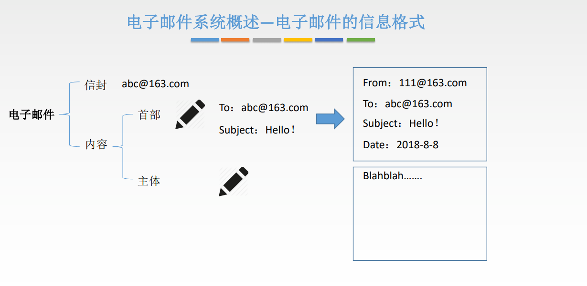
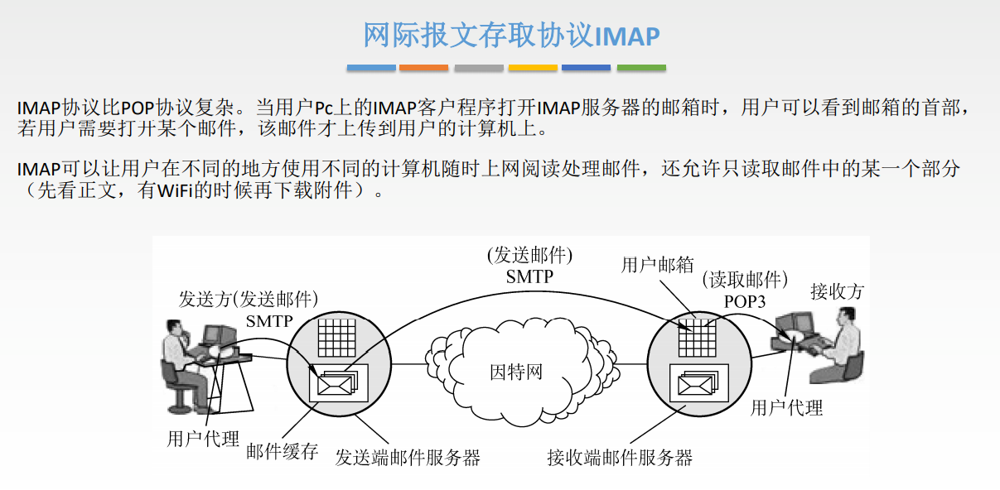

# 应用层

## 概述

## DNS

DNS服务的作用: ==将域名解析成IP地址.==

1. 根,  www.rs.com, com后面还有一个. 但是一般省略不写, 根就是那个点
2. 顶级域名
    1. 国家顶级域名 cn, us, uk
    2. 通用顶级域名 com, net, org, gov, int, aero, museum, travel
    3. 基础结构域名/反向域名 arpa
3. 二级域名
    1. 类别域名: ac, com, edu, gov, mil, net, org
    2. 行政区域域名, 用于我国各省, 自治区, 直辖市: bj
    3. 自己注册的域名
4. 三级域名
5. 四级域名.....

> 递归靠别人, 迭代靠自己.

## FTP

TFTP适用于较小文件，使用UDP

## 电子邮件

> 在邮件服务器之间传送使用SMTP，牵扯到用户代理的全使用HTTP协议

## 万维网

> 非流水线就是发一个响应一个。流水线就是一次发送多个请求。

