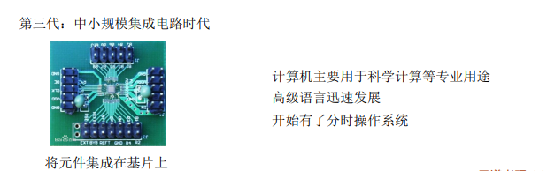

# 计算机系统概述

## 计算机发展

1. 计算机系统=硬件+软件

    硬件: 计算机的实体, 如主机, 外设

    软件: 由具有各类特殊功能的程序组成

2. 软件
    1. 系统软件
        1. 用来管理整个计算机系统
    2. 应用软件
        1. 按任务需要编制成的各种程序

机器字长: 计算机一次整数运算所能处理的二进制位数

摩尔定律: 集成电路上可容纳的晶体管数目, 约每隔18个月便会增加一倍，整体性能也将提升一倍

目前发展趋势:

"两级"分化

​	一极是微型计算机向更微型化、网络化、高性能、多用途方向发展;

​	另一极是巨型机向更巨型化、超高速、并行处理、智能化方向发展。

