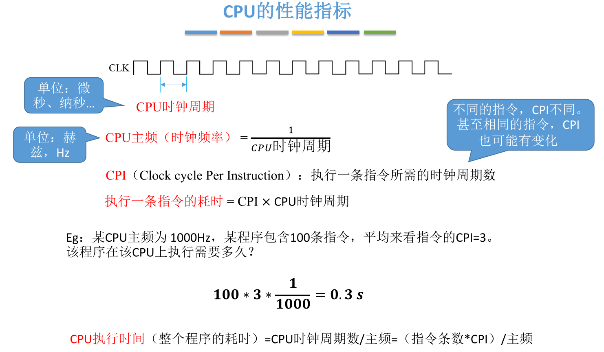

# 计算机系统概述

## 计算机发展

1. 计算机系统=硬件+软件

    硬件: 计算机的实体, 如主机, 外设

    软件: 由具有各类特殊功能的程序组成

2. 软件
    1. 系统软件
        1. 用来管理整个计算机系统
    2. 应用软件
        1. 按任务需要编制成的各种程序

机器字长: 计算机一次整数运算所能处理的二进制位数

摩尔定律: 集成电路上可容纳的晶体管数目, 约每隔18个月便会增加一倍，整体性能也将提升一倍

目前发展趋势:

"两级"分化

​	一极是微型计算机向更微型化、网络化、高性能、多用途方向发展;

​	另一极是巨型机向更巨型化、超高速、并行处理、智能化方向发展。

## 计算机硬件基本组成

第一台使用冯诺依曼结构的计算机-EDVAC

冯诺依曼在研究EDVAC机时提出了“存储程序”的概念

==“存储程序”==的概念是指将指令以==二进制代码的形式事先输入计算机的主存储器==，然后按其在存储器中的首地址执行程序的第一条指令，以后就按该程序的规定顺序执行其他指令，直 至程序执行结束

### 主存储器

### 运算器

### 控制器

### 模拟工作过程

> 上图中(PC)代表PC的值；M(MAR)代表在存储体中MAR地址处的值

> 区分指令和数据的依据:  根据指令执行的不同周期来区分，取指周期取的是指令，其他机器周期访问内存取的是操作数。

## 计算机系统层次结构

> 微指令就是上一小节模拟工作过程中对一个指令拆分成的一个有一个小指令。

机器语言是计算机唯一可以直接执行的语言，汇编语言用助记符编写，以便记忆。正则语言是编译原理中符合正则文法的语言。

## 性能指标

### 存储器性能指标

### CPU性能指标

主频可以理解为1秒有多少个时钟周期

### 系统整体性能指标

