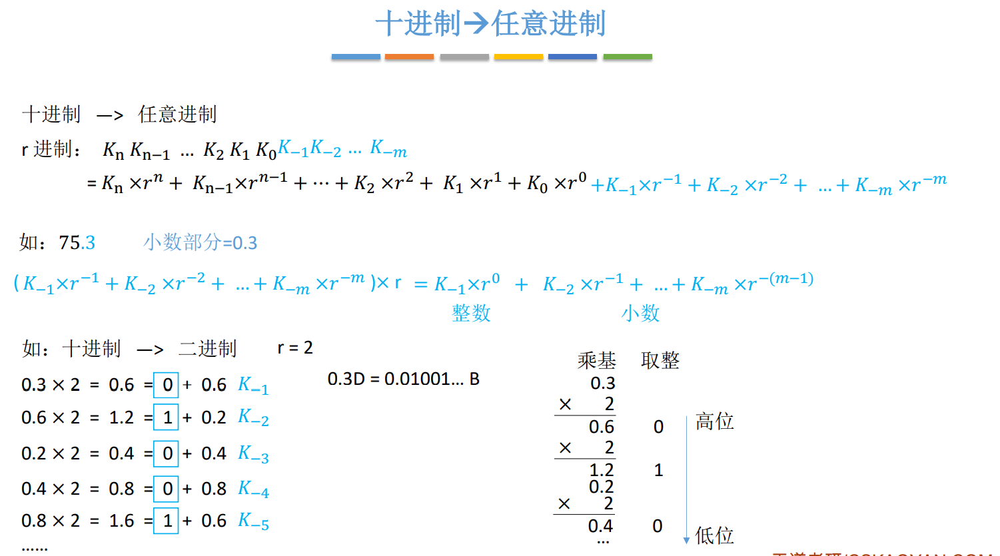
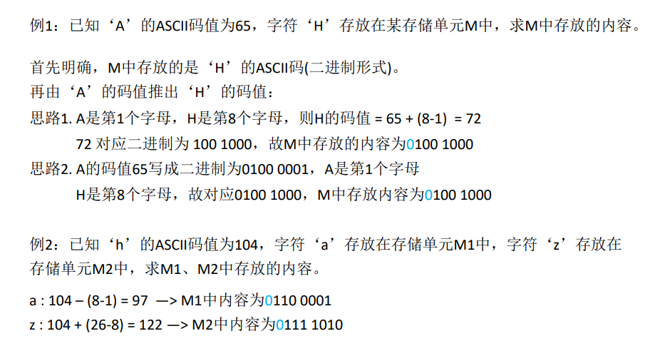
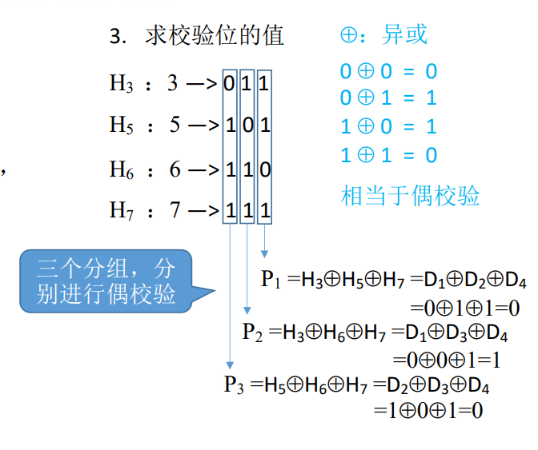
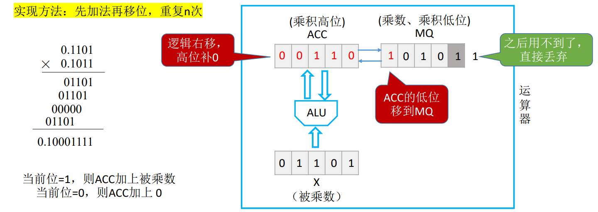
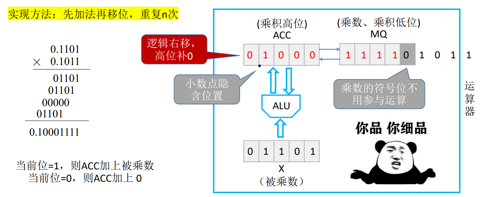
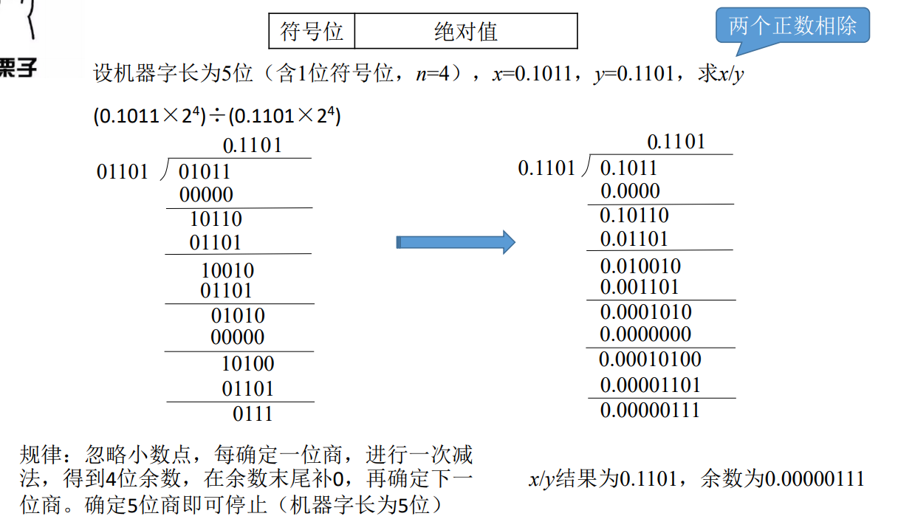
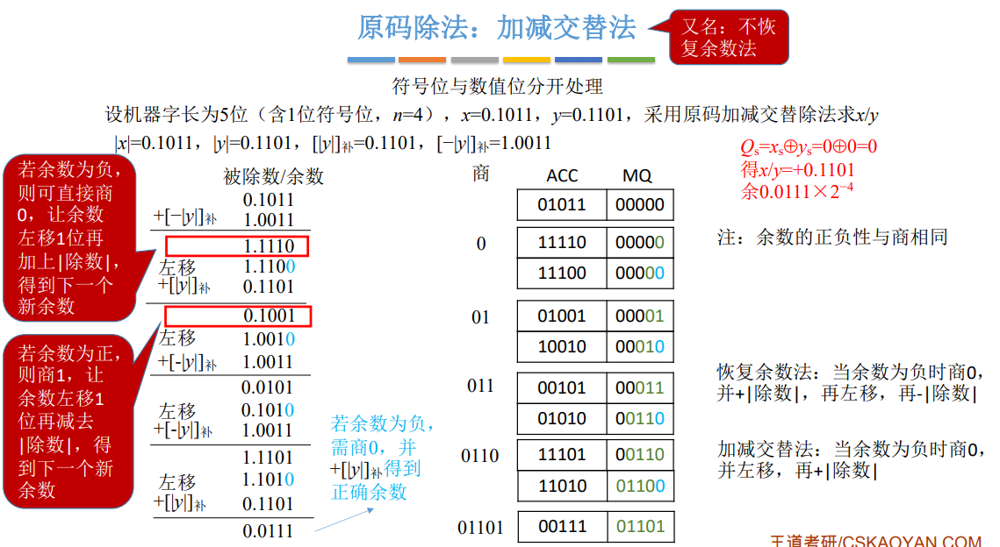
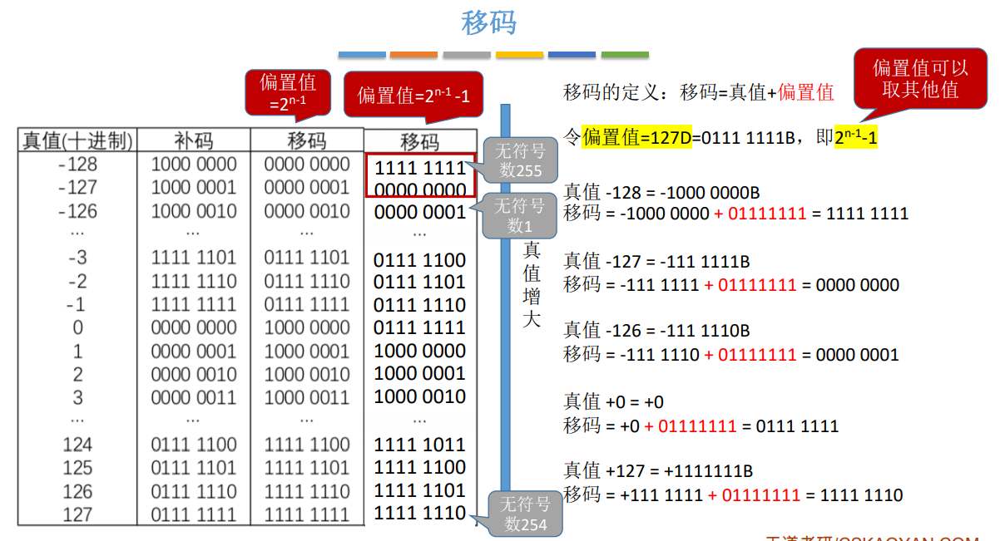
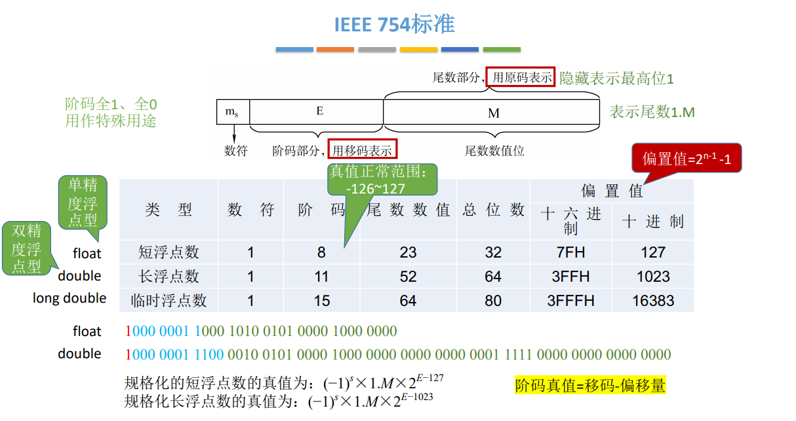
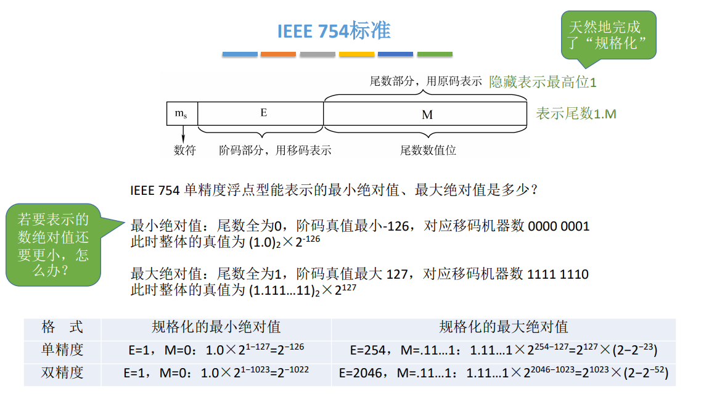

# 数据的表示和运算

[TOC]

 ## 数制与编码

### 进位计数法

k进制：
$$
十进制 \quad 975.36\\
等价于 9\times100+7\times10+5\times1+3\times0.1+6\times0.01
\\等价于 9\times10^2+7\times10^1+5\times10^0+3\times10^{-1}+6\times10^{-2}\\
K进制逢K进一\\

 A_nA_{n-1}\cdots A_0A_{-1}A_{-2}\cdots A_{-m}
 \\=A_n\times K^n+A_{n-1}\times K^{n-1}+\cdots +A_0\times K^0 + A_{-1}\times K^{-1}+\cdots + A_{-m}\times K^{-m}
$$
任意进制与十进制之间转换：

K进制=>十进制： 每次乘K，先乘出来的是高位

十进制=>K进制：每次除以K取余数，先取出来的余数是低位

真值：符合人类习惯的数字

机器数：数字实际存到机器里的形式，正负号需要被“数字化”

### BCD码

### 字符与字符串

#### 英文字符

ASCII码

可印刷字符：32～126，其余为控制、通信字符

数字：48(0011 0000)～57(0011 1001)

大写字母：65(0100 0001)～90(0101 1010)

小写字母：97(0110 0001)～122(0111 1010)

#### 中文字符

区位码: 94个区, 94个位, 构成一个矩阵, 行号代表区号, 列号代表位号, 每个坐标值占一个字节, 也就是一个汉字占两个字节 

加上20H (32D) 就不会与控制字符冲突了. 

再加上80H, 就可以保证机器看到一个大于128的字节, 表示是一个汉字, 就再往后识别一个字节, 如果小于等于128, 就表示是一个英文字符或者控制字符.

#### 字符串

### 校验码

#### 奇偶校验码

由若干位代码组成的一个字叫==码字==。

将两个码字逐位进行对比，具有不同的位的个数称为==两个码字间的距离==。

一种编码方案可能有若干个合法码字，各合法码字间的最小距离称为==“码距”==。

当d=1时，无检错能力；当d=2时，有检错能力；当d≥3时，若设计合理，可能具有检错、纠错能力, 码距越大, 检错、纠错能力越强，且检错能力总是大于纠错能力。

奇校验码：整个校验码（有效信息位和校验位）中“1”的个数为奇数。

偶校验码：整个校验码（有效信息位和校验位）中“1”的个数为偶数。

#### 海明码

对于奇偶校验码来说，只有一个校验位，只能携带两种状态信息：对/错

海明码基本思想：将信息为分成n个组，每个组分别进行偶校验。

求解步骤：例，信息位1010

1. 确定海明码的个数：$2^k\ge n+k+1$

    n=4 =>  k=3，

    设信息位设信息位$D_4D_3D_2D_1$（1010），共4位，校验位$P_3P_2P_1$， 共3位，对应的海明码为$H_7H_6H_5H_4H_3H_2H_1$。

2. 确定校验位的分布

    校验位$P_i$放在海明位号为$2^{i−1}$的位置上

    信息位按顺序放到其余位置

    

3. 求校验位的值

    二进制编号，第一位为1的是第一组，第二位为1的是第二组$\cdots$

    

4. 纠错

    

    最后书写的顺序是$S_3S_2S_1$

补充：

纠错能力 1位

检错能力 2位

假如上图中，$P_1$和$P_2$都发生了跳变，则获得的纠错位置是011，虽然发现有错，但是无法确定到底是哪一位错了。

全校验位是使整体的1达到偶数个

#### 循环冗余校验码

 计算方法：

上述说代表$C_2$出错是不严谨的，如下图

对于同一个生成多项式而言，出错位置相同时所产生的余数是固定的，因此当生成多项式与信息位相比足够长的时候就能够达到一一对应的关系，从而进行纠错。

## 定点数的表示与运算

### 表示

定点数: 小数点位置固定, 小数点不用'.'表示, 而是约定小数点的位置.

浮点数: 小数点位置不固定

#### 无符号数

整个机器字长的全部二进制位均为数值位，没有符号位，相当于数的绝对值。

通常只有无符号整数, 没有无符号小数

n位的无符号数表示范围为：$0 ～ 2^n-1$

#### 有符号数

使用最高位表示符号位

可用==原码==、==反码==、==补码== 三种方式来表示定点整数和定点小数。还可用==移码==表示定点整数。

若真值为x, 则用$[x]_原、[x]_反、[x]_补、[x]_移$分别表示对应的码

有符号数的定点表示:

1. 原码:

    用尾数表示真值的绝对值，符号位“0/1”对应“正/负”

    

    原码表示范围

    

2. 反码

    反码没什么卵用，只是原码到补码的一个过渡

    如果符号位为0，则反码与原码完全相同；如果符号位为1，尾数全部取反

    

3. 补码

    

    上图中约定定点整数 $[x]_补 = 1,0000000 表示x=-2^7$是因为在原码中10000000 表示-0，而在补码中没有它的定义，因此约定它为一个最小的负数。

4. 移码

    移码只能表示整数

    

    

> 技巧：由$[x]_补 $快速求 $[-x]_补 $的方法
>
> 符号位、数值位全部取反，末位+1
>
> 由补码获取对应原码:
>
> 尾数全部取反再+1(与原码求补码一样)

### 作用

#### 原码

只有对两个正数进行相加比较方便

因此如果采用原码作为计算机内部的编码方式，则需要在ALU中添加专门的实现减法的硬件逻辑。

#### 取模

$$
设x,m∈Z, m > 0则存在唯一决定的整数q和r，使得:\\
x = qm+r, \quad 0\le r < m
\\
例如: -3 \% 12 = 9
\\
原因：-3 = (-1)\times12+9
$$

#### 补码

对于计算机硬件而言，如果使用8bit的字长来表示数字，当最高位1又加1之后，会把进位的第9位舍掉，也就是天然的%2^8^

 #### 移码

便于使用硬件进行比较大小

### 运算

#### 移位运算

##### 算术移位

原码的算数移位——符号位保持不变，仅对数值位进行移位

右移：高位补0，低位舍弃。若舍弃的位=0，则相当于÷2；若舍弃的位≠0，则会==丢失精度==

左移：低位补0，高位舍弃。若舍弃的位=0，则相当于×2；若舍弃的位≠0，则会出现==严重误差==

定点小数同理

反码的算术移位：

补码的算术移位：

##### 逻辑移位

逻辑右移：高位补0，低位舍弃。

逻辑左移：低位补0，高位舍弃。

可以把逻辑移位看作是对“无符号数”的算数移位

##### 循环移位

#### 加减运算&溢出判断

##### 原码

直接使用加法器对原码进行加减运算, 可能会出错, 故需要引入减法器

##### 补码

对于补码而言, 

$$[A+B]_补 = [A]_补+[B]_补\\ [A-B]_补 = [A]_补 +[-B]_补$$

无论是加法还是减法，最终都会转换成加法，由加法器实现运算，符号位也参与运算。

> $$负数_补 => 负数_原 \\ 1. 尾数部分按位取反再加一\\ 2.在负数补码中从右向左找到第一个1，包含这个1以及右边的部分与原码相同，1左边的部分取反，就得到了原码$$

两个正数相加或两个负数相减会产生溢出

##### 溢出判断

1. 法一：逻辑表达式

    

    V为1，则代表左半部分表达式和右半部分表达式至少一个为1

    对于两个负数相减，如果得到了正数，则左半部分表达式为1

    对于两个正数相加，如果得到了负数，则右半部分表达式为1

2. 法二：使用进位位

    

3. 法三：==采用双符号位==

    

##### 符号扩展

#### 乘法运算

##### 原码

对于两个十进制数相乘，我们会列竖式

内部逻辑是：

而对于二进制乘法而言，使用手算模拟也是相同的道理

###### 原码一位乘法

每次逻辑右移符号位也移动

##### 补码

原码乘法中每次移位是逻辑右移，==符号位也移动==

补码乘法中每次移位是算术右移，==符号位固定不动==，符号位是1就补1，符号位是0就补0

原码一位乘法中：部分积、被乘数、乘数都可 采用双符号位原码，也可用 单符号位原码（手算时乘数 的符号位可不写）

补码一位乘法中：部分积、被乘数采用双符号 位补码；乘数采用单符号位 补码，并在末位添个0

#### 除法运算

##### 原码

计算十进制中 $0.211\div0.985$，内部逻辑如下

对于二进制除法，模式类似

使用机器模拟(恢复余数法)：

需要注意这里最后一位商1之后得到的余数是正值，所以结束了，如果得到的是负值，则需要商0并再做一次恢复余数的操作

##### 补码

### 强制类型转换

### 数据的存储和排列

> 为什么说小端方式便于机器处理？
>
> 取值是按照从低地址开始取的，如果进行两个int类型的数字加法，则需要从最低有效字节开始加，小端模式取出来的就是最低有效字节

字的地址编号转换为字节地址编号执行左移2位即可(乘以4)

比如图2.10中第二个字，编号为2，转换为字节编号就是 2左移2位，4

采用边界对齐的方式是因为无论取的数据是字、半字还是字节都可以通过一次访存取出，如果采用边界不对齐的方式取1号半字，则需要进行两次访存。

## 浮点数的表示与运算

### 浮点数的表示

#### 表示

阶码的底也可以使用$2^i$来代替，类比于科学计数法中可以使用100作为底

例题：阶码、尾数均用补码表示，求a、b的真值 

a = 0,01;1.1001

b = 0,10;0.0100

【解】

a: 
$$
阶码0,01对应真值 +1\\
尾数1.1001对应真值 -0.0111B = -(2^{-2}+2^{-3}+2^{-4})
\\
a的真值 = 2^1\times(-0.0111)=-0.111
\\
相当于尾数表示的定点小数算术左移一位
$$
b:

#### 规格化

例如8个bit，3位阶码，5位尾数

正数的最小值：

3位补码能表示的最小数是-4

5位尾数能表示的最小正数是0.1B 也就是$\frac{1}2$

故最小的正数为 0.00001，

当正数小于这个数字时就发生了正下溢

#### IEEE 754

移码： 补码的基础上将符号位取反。==注意：移码只能用于表示整数==

移码的定义：移码=真值+偏置值

偏置值一般取$2^{n-1}$，n代表位数

但是在IEEE 754中，偏置值取了$2^{n-1}-1$

计算E-127时可以将E看作一个无符号数

