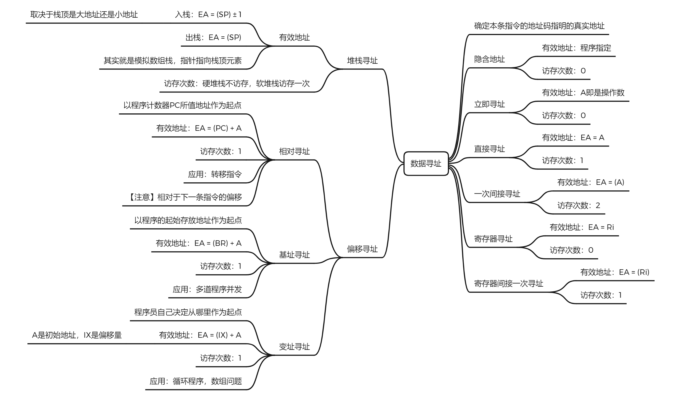
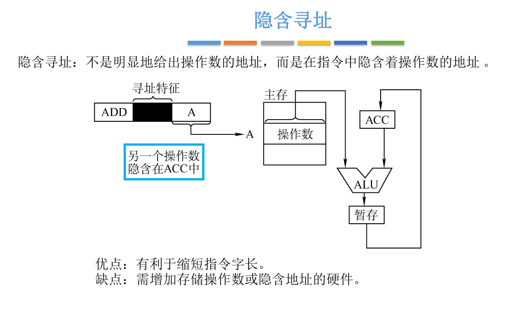
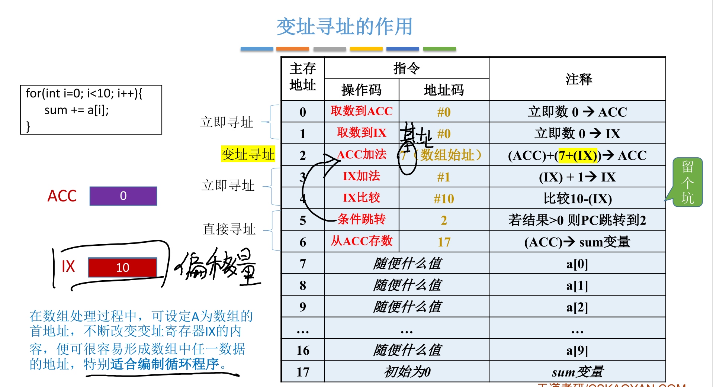
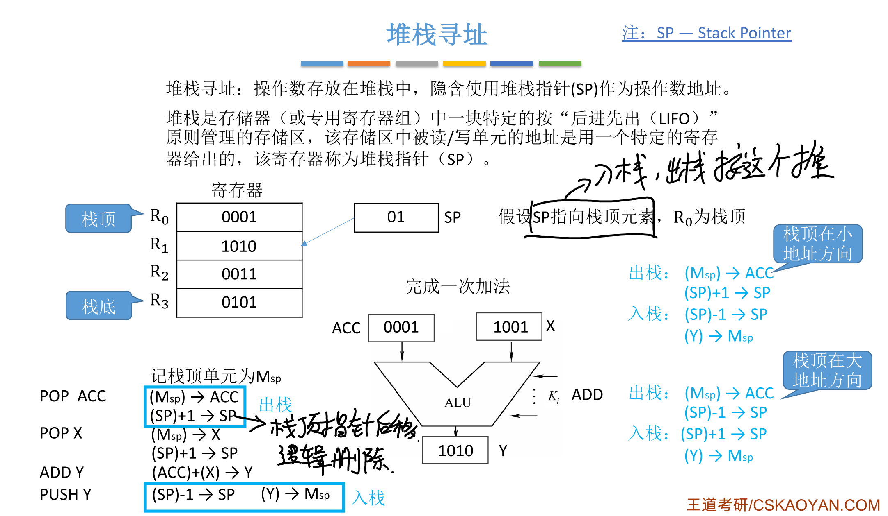
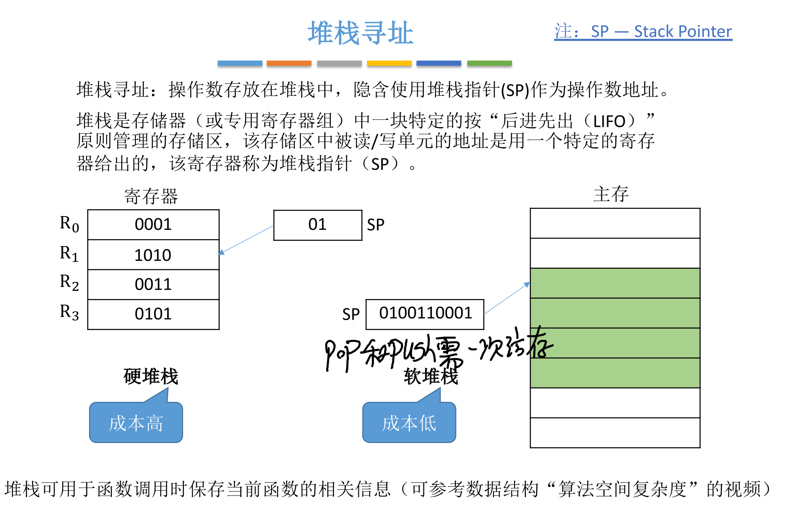
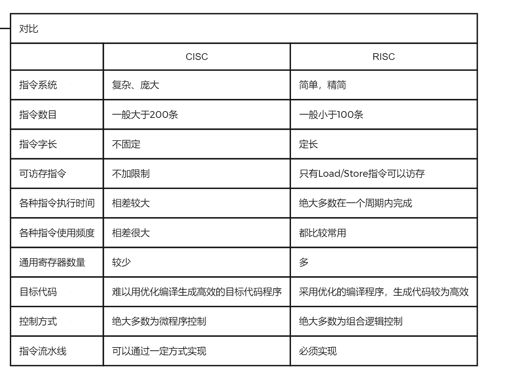
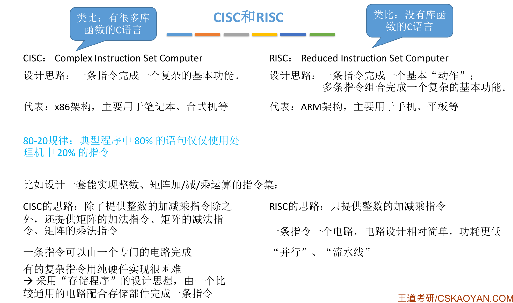

# 指令系统

## 指令格式

指令（又称机器指令）是指示计算机执行某种操作的命令， 是计算机运行的最小功能单位。
一台计算机的==所有指令的集合==构成该机的==指令系统==，也称为==指令集==

### 按地址码数目分类

### 按指令长度分类

### 按操作码长度分类

#### 扩展操作码

### 按操作类型分类

## 寻址

### 指令寻址

#### 顺序寻址

#### 跳跃寻址

### 数据寻址

#### 直接寻址

#### 间接寻址

#### 寄存器寻址

#### 寄存器间接寻址

#### 隐含寻址

#### 立即寻址

#### 基址寻址

#### 变址寻址

#### 基址&变址组合

#### 相对寻址

#### 【补充】硬件如何实现比较大小

#### 堆栈寻址

## CISC & RISC

