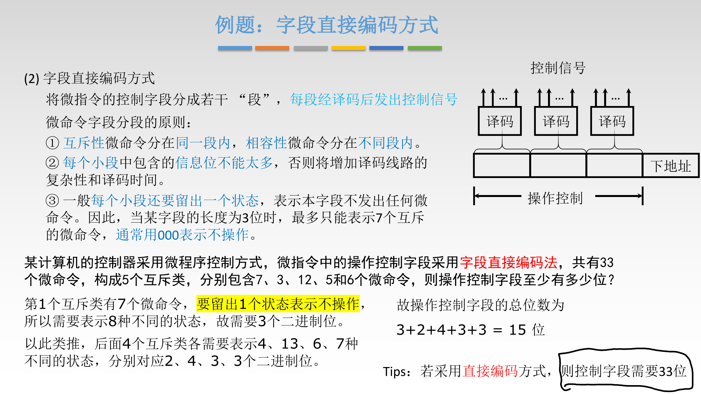

# CPU

## 功能和基本结构

### 功能

### 运算器基本结构

### 控制器基本结构

## 指令执行过程

### 指令周期

### 数据流

#### 取指周期

#### 间址周期

#### 执行周期

#### 中断周期

### 指令执行方案

## 数据通路

### 单总线结构

#### 寄存器之间数据传送

#### 主存与CPU之间

#### 算数或逻辑运算

#### 例题

### 专用数据通路

#### 取指周期

#### 例题

## 控制器的功能和工作原理

### 硬布线控制器

#### 设计

##### 取指周期时序

##### 间址周期时序

##### 执行周期时序

##### 中断周期时序

##### 列表

##### 写逻辑表达式

> 将所有用到该指令的“行”都跳出来，不同行之间“或”，并化简

##### 画电路图

### 微程序控制器

#### 概述

#### 微指令设计

## 指令流水线

### 基本概念与性能指标

#### 概念

#### 表示方法

#### 性能指标

### 影响因素与分类

#### 影响因素

##### 结构相关

##### 数据相关

##### 控制相关

#### 分类

#### 流水线多发技术

### 五段式流水线

#### 运算类指令

#### LOAD指令

#### STORE指令

#### 条件转移指令

#### 无条件转移指令

#### 例题

