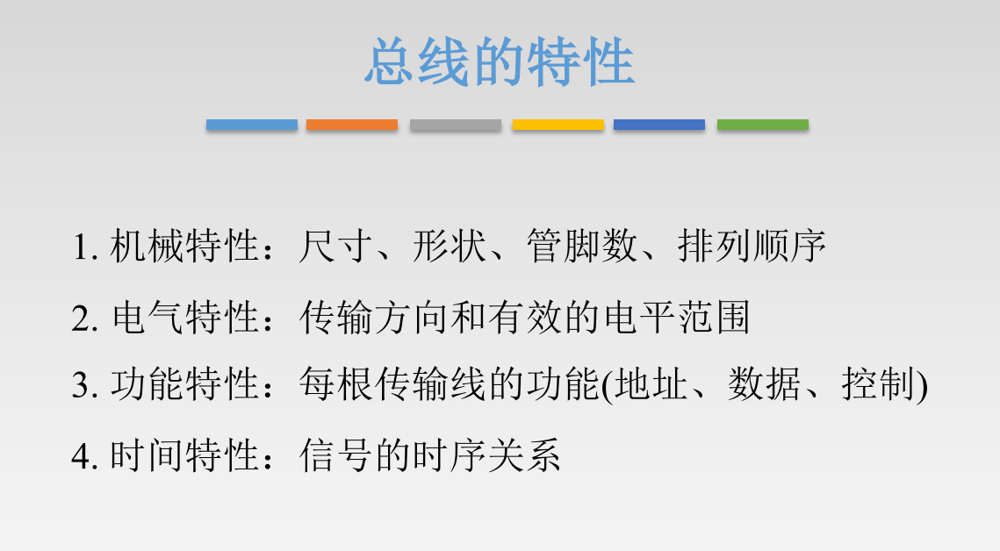
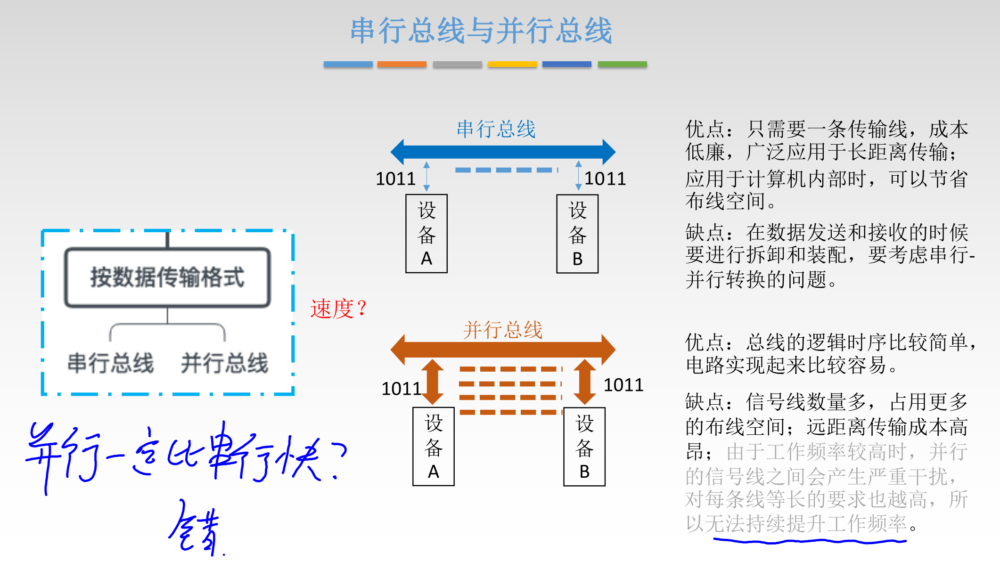

# 概述

## 概念

## 分类与经典结构

### 分类

#### 传输格式分类

#### 功能分类

### 系统总线结构

#### 单总线结构

#### 双总线结构

#### 三总线结构

#### 四总线结构【扩展】

## 性能指标

### 例题

### 回顾按传输方式分类

# 仲裁

## 集中仲裁

### 链式查询方式

### 计数器查询方式

### 独立请求方式

## 分布仲裁

# 操作和定时

## 四个阶段

## 定时

### 同步定时方式

### 异步定时方式

### 半同步【补充】

### 分离式【补充】

# 标准

