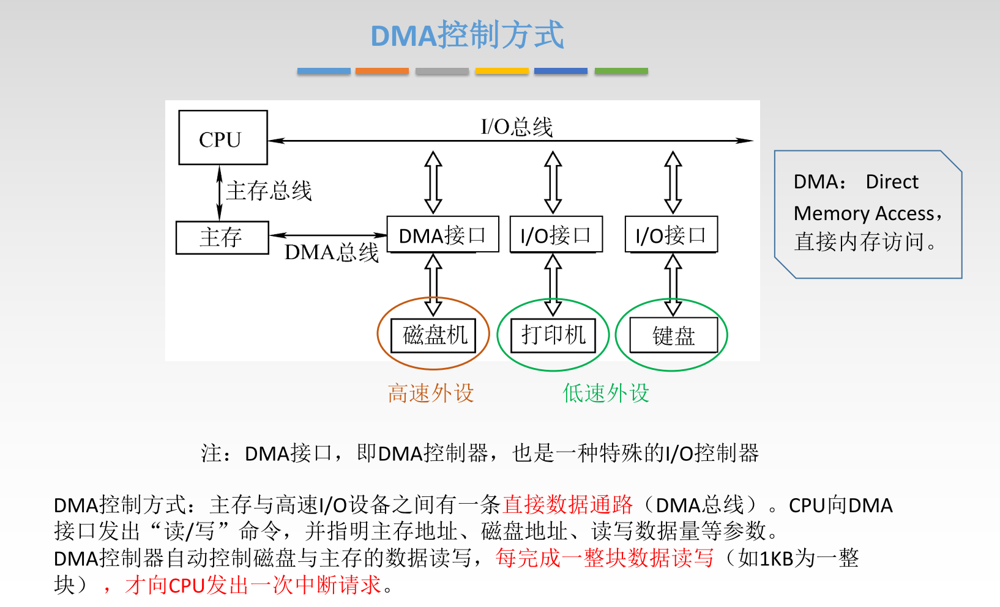
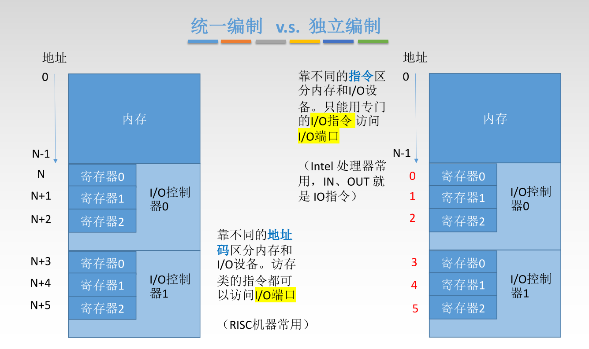
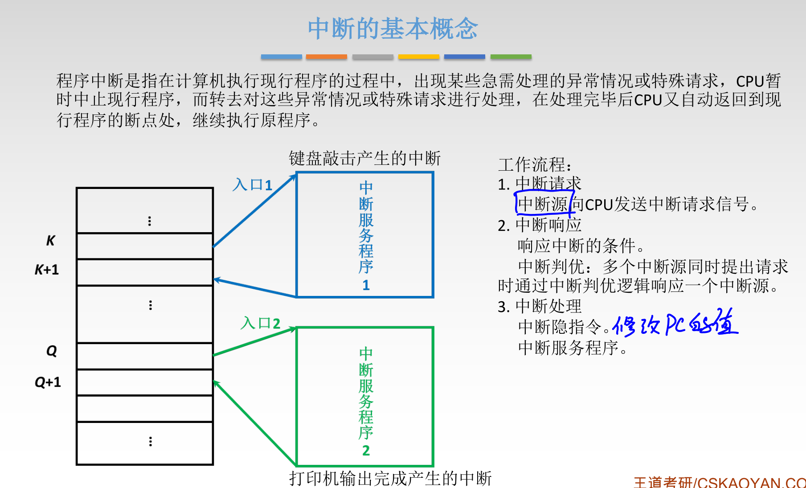
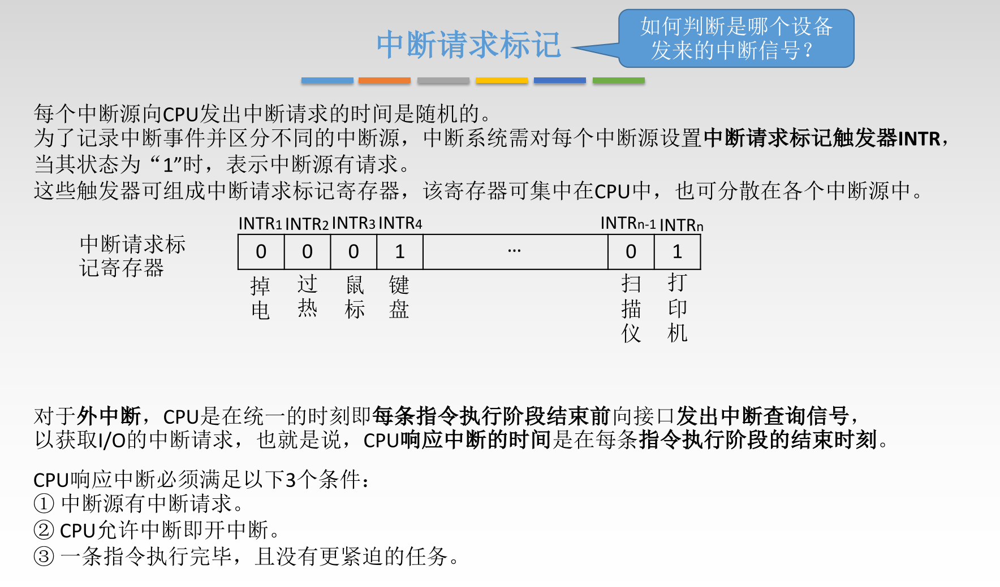
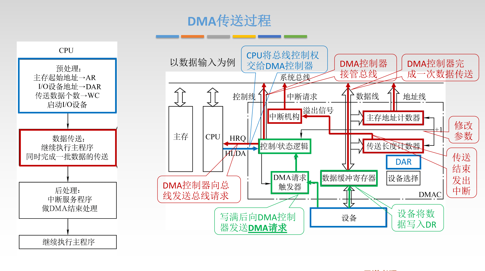

# 概述

# 外部设备

## 输入输出设备

## 外存储器

### 磁盘存储器

### 磁盘阵列

### 光盘存储器

### 固态硬盘

# I/O接口

> I/O接口：又称==I/O控制器==（I/O Controller）、==设备控制器==，负责协调主机与外部设备之间的数据传输

## 作用

## 结构

## 工作原理

## 端口

## 分类

# I/O控制方式

## 程序查询方式

## 程序中断方式

### 例题

### 基本概念

### 分类

### 如何判断是谁发的

### 中断判优

### 优先级策略

### 处理过程

### 多重中断

#### 例题

## DMA 控制方式

### DMA控制器

### DMA传送过程

### DMA 传送方式

### DMA特点

### 与中断方式对比

