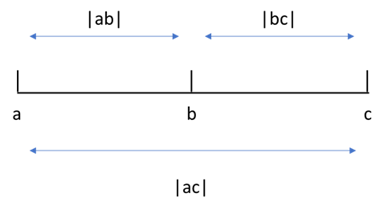
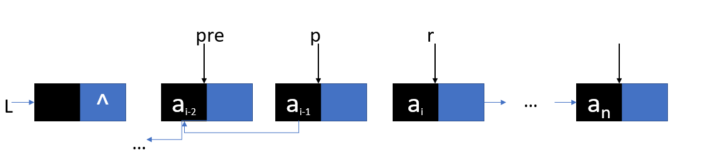
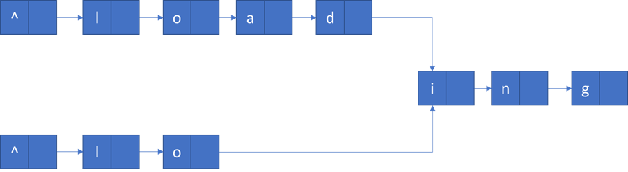

# 线性表

## 1. 中位数
一个长度为`L`(L≥1)的升序序列S，处在⌈L/2⌉个位置的数称为S的中位数。例如，若序列`S1`=(11, 13, 15, 17, 19)，则其中位数为15，两个序列的中位数是含他们所有元素的升序序列的中位数。例如，若`S2`=(2, 4, 6, 8, 20) 则`S1`和`S2`的中位数是11.现在又两个等长的升序序列A和B，试设计一个在时间和空间两方面都尽可能高效的算法，找出两个序列A和B的中位数。要求：
 * 给出算法的基本设计思想。
 * 根据设计思想，若采用C或C++或Java语言描述算法，关键之处给出注释。
 * 说明你所涉及算法的时间复杂度和空间复杂度
 ```c++
 /**
  *分别求两个升序序列A，Ｂ的中位数，设置为ａ和ｂ，求序列Ａ、Ｂ的中位数过程如下：
  * 1. 若a=b，则a或b为所求中位数，算法结束
  * 2. 若a<b，则舍弃A中较小的一半，同时舍弃序列B中较大的一半，要求两次舍弃的长度相等
  * 3. 若a>b，则舍弃A中较大的一半，同时舍弃B中较小的一半，要求两次舍弃的长度相等
  *
  */
int FindMedianSortedArrays(vector<int>& nums1, vector<int>& nums2)
{
	int l1 = 0, m1, h1 = nums1.size() - 1;
	int l2 = 0, m2, h2 = nums2.size() - 1;
	while (l1 != h1 || l2 != h2)
	{
		m1 = (l1 + h1) / 2;
		m2 = (l2 + h2) / 2;
		if (nums1[m1] == nums2[m2])
			return nums1[m1];
		if (nums1[m1] < nums2[m2])
		{
			if ((l1 + h1) % 2 == 0)
			{
				l1 = m1;
				h2 = m2;
			}
			else
			{
				l1 = m1 + 1;
				h2 = m2;
			}
		}
		else
		{
			if ((l2 + h2) % 2 == 0)
			{
				h1 = m1;
				l2 = m2;
			}
			else
			{
				h1 = m1;
				l2 = m2 + 1;
			}
		}
	}
	return min(nums1[l1], nums2[l2]);
}
// 时间复杂度 O(log2n) 空间复杂度 O(1)
 ```

## 2. 众数
已知一个整数序列 A = (a0, a1,..., an-1)，其中0≤ai≤n(0≤i≤n)。若存在x出现的次数大于n/2，则称其为主元素。
A = (0,5,5,3,5,7,5,5) 5为主元素
A = (0,5,5,3,5,1,5,7) 没有主元素
若存在主元素，输出该主元素，否则输出-1
 * 给出算法的基本设计思想。
 * 根据设计思想，若采用C或C++或Java语言描述算法，关键之处给出注释。
 * 说明你所涉及算法的时间复杂度和空间复杂度
```c++
/*
 * 摩尔投票法，选取第一个元素为候选元素，如果接下来的数字一样，则将出现次数++，否则--
 如果出现次数为0，则将count重新置为1，并选择当前元素为候选元素
 最后再判断出现次数是否大于n/2
 */
int FindMajority(vector<int> nums)
{
	int count = 1;
	int t = nums[0];
	for (int i = 1; i < nums.size(); i++)
	{
		if (t == nums[i]) count++;
		else
		{
			if (count > 0)
				count--;
			else
			{
				t = nums[i];
				count = 1;
			}
		}
	}
	if (count > 0)
	{
		count = 0;
		for (int i = 0; i < nums.size(); i++)
			if (nums[i] == t)
				count++;
	}
	if (count > nums.size() / 2) return t;
	else return -1;
}
/*
 * 时间 O(n) 空间 O(1)
 */
```

## 3. 三个数列中选取距离最近的三个元素
定义三元组(a,b,c) (均为整数) 的距离 D = |a-b|+|b-c|+|c-a|。给定3个非空整数集合`S1` `S2` `S3`，按升序分别存储在三个数组中。设计一个尽可能高效的算法，计算并输出所有可能的三元组(a,b,c) (分别来自不同的数组) 的最小距离。例如 S1 = {-1,0,9}, S2 = {-25, -10, 10, 11}, S3 = {2, 9, 17, 30, 41}，则最小距离为2，相应的三元组为(9, 10, 9)。 
### [分析]

有如下结论
* 当a=b=c时，距离最小，
* 其余情况如上图所示，计算的结果其实是最大最小值之间的距离。于是问题可以简化为每次固定c找一个a，使得 |ac| 最小。
```c++
/*
 * 算法思想：
 * 使用 D_min记录所有已经处理的三元组的最小距离，初始值为一个足够大的整数。
 * 集合A，B，C对应三个数组，下标为i，j，k，当三个下标都不越界时
 * 1.计算距离D
 * 2.更新D_min
 * 3.将A[i],B[j],C[k]中最小值的下标+1，类比固定最大值不动，让最小值往上加
 */
#define INT_MAX 0x7ffffff
int Calaulate(int a, int b, int c) //计算D
{
	int res = abs(a - b) + abs(b - c) + abs(c - a);
	return res;
}

bool IsMinOfTriplets(int a, int b, int c)//判断a是否为三个数中的最小值
{
	return (a <= b && a <= c);
}

int FindMinOfTrip(vector<int> A, vector<int> B, vector<int> C)
{
	int i = 0, j = 0, k = 0, D_min = INT_MAX, D;
	while (i < A.size() && j < B.size() && k < C.size() && D_min>0)
	{
		D = Calaulate(A[i], B[j], C[k]);
		if (D < D_min)D_min = D;
		if (IsMinOfTriplets(A[i], B[j], C[k]))i++;
		else if (IsMinOfTriplets(B[j], A[i], C[k]))j++;
		else k++;
	}
	return D_min;
}
/*
 *设n为三个数组长度之和，则时间复杂度为O(n),空间复杂度为O(1)
 */
```

## 4. 逆序打印链表

设L为带头结点的单链表，编写算法实现从尾到头反向输出每个结点的值

```c++
/// <summary>
/// 采用辅助空间逆序打印带头结点单链表
/// </summary>
/// <param name="head">链表头结点</param>
/// <param name="length">链表长度</param>
void PrintListReversely(LinkList head, int length)
{
	ElemType* arr = new ElemType[length];
	int cnt = length;
	Node* cur = head->next;
	while (cur != NULL)
	{
		arr[--cnt] = cur->data;
		cur = cur->next;
	}
	for (int i = 0; i < length; i++)
		cout << arr[i] << " ";
	cout << endl;
}
void PrintListReversely(LinkList head, int length)
{
	ElemType* arr = new ElemType[length];
	int cnt = length;
	Node* cur = head->next;
	while (cur != NULL)
	{
		arr[--cnt] = cur->data;
		cur = cur->next;
	}
	for (int i = 0; i < length; i++)
		cout << arr[i] << " ";
	cout << endl;
}

/// 方法二，考虑到逆序打印与栈的工作原理类似，因此使用递归打印
/// <summary>
/// 递归逆序打印带头结点链表
/// </summary>
/// <param name="head">链表头结点</param>
void ReverselyPrintByRecursion(LinkList head)
{
	if (head->next != NULL)
	{
		ReverselyPrintByRecursion(head->next);
		cout << head->next->data << " ";
	}
}

/// <summary>
/// 递归逆序打印无头结点链表
/// </summary>
/// <param name="head">链表第一个结点</param>
void ReverselyPrintByRecursion(LinkList firstElem)
{
	if (firstElem != NULL)
	{
		ReverselyPrintByRecursion(firstElem->next);
		cout << firstElem->data << " ";
	}
}
```

## 5. 逆置单链表

编写算法将带头结点的单链表就地逆置(空间复杂度O(1))



```c++
/// 常规解法为头插法逆置，这里记录一个新奇的解法
/// 处理时需要注意两点: 
/// 一是将第一个结点next指向NULL,
/// 二是在处理完最后一个结点之后需要让head的next指向它
void ReverseList(LinkList& head)
{
	Node* pre, * p = head->next, * r = p->next;
	p->next = NULL;	//需提前将第一个结点的next域指向NULL,因为在转换之后它就是最后一个结点
	while (r != NULL)
	{
		pre = p;
		p = r;
		r = r->next;
		p->next = pre;
	}
	head->next = p;
}
```

## 6. 查找快慢指针公共结点
存在公共结点即从某一结点开始,他们的next域都指向同一个结点,拓扑结构为Y
>解法: 考虑到如果有一个公共结点,那么这个公共结点之后的所有节点都是重合的, 也就是他们的最后一个结点必然是重合的
>所以考虑让两个链表同时往前遍历, 只要最后一个结是相同的,那么就存在公共结点, 但是链表长度可能不同, 所以想到使用快慢指针, 心里有数了, 接下来写代码
```c++
/// 暴力解决的时间复杂度为 O(mn)
/// 时间复杂度 O(m+n) m,n分别代表两个链表的长度
/// <summary>
/// 查找第一个公共结点
/// </summary>
/// <param name="list1">链表1</param>
/// <param name="list2">链表2</param>
/// <returns>如果存在公共结点则返回第一个公共结点,否则返回NULL</returns>
LinkList SearchCommonNode(LinkList list1, LinkList list2)
{
	int len1 = Length(list1);
	int len2 = Length(list2);
	LinkList lList, sList;
	int dist = 0;
	if (len1 > len2)
	{
		lList = list1->next;
		sList = list2->next;
		dist = len1 - len2;
	}
	else
	{
		lList = list2->next;
		sList = list1->next;
		dist = len2 - len1;
	}

	while ((dist--) > 0)
	{
		lList = lList->next;
	}

	while (lList != NULL)
	{
		if (lList == sList)
			return lList;
		lList = lList->next;
		sList = sList->next;
	}

	return NULL;
}
```
## 7. 删除升序链表中的重复元素
错误原因：没有看到是有序链表，使用了map作为辅助空间，空间复杂度大了
```c++
//使用map的解法,同样适用于无序链表
void DeleteDuplication(LinkList& head)
{
	unordered_map<int, int> mp;
	Node* cur = head->next;
	Node* pre = head;
	while (cur != NULL)
	{
		Node* p = cur;
		cur = cur->next;
		mp[p->data]++;
		if (mp[p->data] > 1)
		{
			pre->next = pre->next->next;
			delete p;
		}
		else
		{
			pre = p;
		}
	}
}

/// <summary>
/// 使用两个指针,一个指向当前遍历到的结点,一个指向当前结点的下一个结点,
/// 如果两个值相等, 就删除当前结点的下一个结点
/// </summary>
/// <param name="head"></param>
void DeleteDuplication(LinkList& head)
{
	Node* cur = head->next;
	Node* next;
	if (cur == NULL) return;
	while (cur->next != NULL)
	{
		next = cur->next;
		if (next->data == cur->data)
		{
			cur->next = next->next;
			delete next;
		}
		else cur = cur->next;
	}
}
```

## 8. 同[查找公共结点]

假定采用带头结点的单链表保存单词, 当两个单词有相同的后缀时, 可共享相同的后缀存储空间, 例如"loading" 和"being" 的存储映像如下图所示


str1和str2分别指向头结点， 链表结点结构为 [data,next], 请设计一个时间上尽可能高效的算法，找出由str1和str2所指向两个链表共同后缀的起始位置

```c++
int Length(List head)
{
	Node* cur = head->next;
	int len = 0;
	while (cur != NULL)
	{
		len++;
		cur = cur->next;
	}
	return len;
}
Node* FindCommonStart(Node* str1, Node* str2)
{
	int len1 = Length(str1);
	int len2 = Length(str2);
	Node* srt, * lng;	//srt for short; lng for long
	int step;
	if (len1 < len2)
	{
		step = len2 - len1;
		srt = str1->next;
		lng = str2->next;
	}
	else
	{
		step = len1 - len2;
		srt = str2->next;
		lng = str1->next;
	}
	while (step--)
		lng = lng->next;
	while (srt != NULL)
	{
		if (srt == lng)return srt;
		srt = srt->next;
		lng = lng->next;
	}
	return NULL;
}
```

