# 树与二叉树

## 1. 一些概念

树是n(n≥0)个结点的有限集合

根结点、分支结点、叶子结点、边。

空树：n=0

非空树的特性：

1. 有且仅有一个根结点
2. 没有后继的结点称为“叶子结点”
3. 有后继的结点称为“分支结点”
4. 除了根结点之外，任何一个结点都有且仅有一个前驱
5. 每个结点可以有0个或多个后继
6. 子树：当n>1时，其余结点可以分为m(m>0)个**互不相交的有限集合**T1,T2, ..., Tm, 其中每个集合本身又是一棵树，称为根结点的子树。
7. 树是一种递归定义的数据结构

## 2. 基本术语

度: 一个结点的孩子个数为该结点的度, 树中结点的最大度数称为`树的度`, 度为0的结点为叶子结点

结点的层次(深度): 从上往下数

结点的高度: 从下往上数

结点之间的路径是有向的，从上往下

树的高度(深度): 层数

有序树: 逻辑上看, 树中结点的各子树从左至右是**有次序的**,不能互换

无序树: 逻辑上看, 树中结点的各子树从左至右是**无次序的**,可以互换

森林: m(m≥0)棵互不相交的树的集合

## 3. 性质

1. 结点数 = 总度数+1
2. 树的度：各结点的度的最大值；m叉树：每个结点最多只能有m个孩子的树

| 度为m的树                        | m叉树                        |
| -------------------------------- | ---------------------------- |
| 任意结点的度≤m(最多m个孩子)      | 任意节点的度≤m (最多m个孩子) |
| 至少有一个结点度 = m (有m个孩子) | 允许所有结点的度都<m         |
| 一定是非空树，至少有m+1个结点    | 可以是空树                   |

3. 度为m的树第 i 层最多有 m^i-1^个结点(i≥1) m叉树第i层至多有 m^i-1^个结点(i≥1)

4. 高度为h的m叉树最多有 $\frac{m^h-1}{m-1}$ 个结点 等比数列求和

5. 高度为h的m叉树最少有h个结点(一条线)；高度为h、度为m的树至少有h+m-1个结点

6. 具有n个结点的m叉树的最小高度为$\lceil log_m(n(m-1)+1)\rceil$ 

   ​	证明：高度最小的情况：所有的结点都有m个孩子

   ​			$\frac{m^{h-1}-1}{m-1}<n\le\frac{m^h-1}{m-1}$ 

   ​	//左边代表前h-1层最多有几个结点，右边代表前h层最多有多少结点

   ​		$m^{h-1}<n(m-1)+1\leq mh$

   ​		$h-1 < log_m(n(m-1)+1)\leq h$

   ​		$h_{min} = \lceil log_m(n(m-1)+1)\rceil$


## 4. 二叉树的概念

二叉树是n($n\geq 0$)个结点的有限集合

每个结点最多有两棵子树，左右子树不能颠倒(有序树)

五种状态：空，只有左，只有右，只有根，左右都有

### 几个特殊的二叉树

1. 满二叉树：一个高度为h，且含有$2^h-1$个结点的二叉树
   1. 只有最后一层有叶子结点
   2. 不存在度为1的结点
   3. 按层序1开始编号，结点i的左孩子为2i，右孩子为2i+1，i的父节点为$\lfloor \frac{i}{2} \rfloor$(如果有的话)

2. 完全二叉树：当且仅当其每个结点都与高度为h的满二叉树中编号为1~n的结点一一对应时，称为完全二叉树
   1. 只有最后两层可能有叶子结点
   2. 最多只有一个度为1的结点
   3. 同1.3
   4. $i\le\lfloor\frac{n}{2}\rfloor$为分支结点，$i>\lfloor \frac{n}{2} \rfloor$ 为叶子结点
   5. 如果某结点只有一个孩子，就只可能时左孩子

3. 二叉排序树
   1. 左子树上所有结点的关键字均小于根结点的关键字
   2. 右子树上所有结点的关键字均大于根结点的关键字
   3. 左右子树各是一棵二叉排序树

4. 平衡二叉树：树上任一结点左子树和右子树深度之差不超过1

## 5. 二叉树性质

1. 设非空二叉树中度为0、1和2的结点个数分别为n~0~、n~1~和n~2~，则n~0~=n~2~+1

   ​	假设树中结点总数为n，则

   ​	n = n~0~+n~1~+n~2~	①

   ​	n = n~1~+2n~2~+1	②	//树的结点数等于总度数+1

   ​	用②-①即可得到结论

2. 二叉树第i层最多有$2^{i-1}$个结点(i≥1)

3. 高度为h的二叉树最多有$2^h-1$个结点(满二叉树)

4. 具有n个(n>0)结点的完全二叉树的高度h为$\lceil log_2(n+1)\rceil$或$\lfloor log_2n\rfloor+1$

   ​		第i个结点所在的层次也满足这个式子

   ​	证明：(1)

   ​				高度为h的满二叉树共有$2^h-1$个结点 (上限)

   ​				高度为h-1的满二叉树共有$2^{h-1}-1$个结点

   ​				=> $2^{h-1}-1<n\le2^h-1$ 

   ​				=> $2^{h-1}<n+1\le2^h$ 

   ​				=> $h-1<log_2(n+1)\le h$

   ​				=> $h=\lceil log_2(n+1)\rceil$

   ​				(2)

   ​				高度为h-1的满二叉树共有$2^{h-1}-1$个结点

   ​				高为h的完全二叉树至少有$2^{h-1}$个结点，最多有$2^{h}-1<2^h$

   ​				$2^{h-1}\le n < 2^h$

   ​				$h-1\le log_2n<h$

   ​				$h=\lfloor log_2n\rfloor+1$

5. 对于完全二叉树，可以由结点数推出度为0，1和2的结点个数为n~0~, n~1~ n~2~

   ​		n~1~ = 0或1	//完全二叉树最多只有一个度为1的结点

   ​		n~0~ = n~2~+1 -> n~0~+n~2~一定是奇数

   ​		=> 若完全二叉树由2k个(偶数)结点，则必有n~1~=1, n~0~=k, n~2~ = k

   ​		=> 若完全二叉树由2k-1个(奇数)结点，则必有n~1~=0, n~0~=k, n~2~ = k-1

## 6. 二叉树存储结构

### 顺序存储

```c++
#define MaxSize 100
typedef struct TreeNode
{
	ElemType value;
	bool isEmpty;
}TreeNode;
TreeNode t[MaxSize];
```

> 几个重要的常考操作 下标从1开始
>
> >i的左孩子 2i
> >
> >i的右孩子 2i+1
> >
> >i的父节点 $\lfloor\frac{i}{2}\rfloor$
> >
> >i所在的层次 $\lceil log_2(n+1)\rceil$ 或 $\lfloor log_2n\rfloor+1$
>
> 若完全二叉树中有n个结点，则
>
> > 判断i是否有左孩子 2i≤n
> >
> > 判断i是否有右孩子 2i+1≤n
> >
> > 判断i是否为叶子结点 $i>\lfloor\frac n 2\rfloor$

### 链式存储

```c++
typedef struct BiTNode
{
	ElemType data;
	struct BiTNode* left, * right;
    //struct BiTNode* parent; //如果需要频繁找父亲节点就可以加上这行，叫三叉链表
}BiTNode,*BiTree;
```

## 7. 二叉树的遍历

### 先序

```c++
void PreOrder(BiTree root)
{
	if (root == NULL)	//越界代偿
		return;
	cout << root->data << endl;
	PreOrder(root->left);
	PreOrder(root->right);
}
```

### 中序

```c++
void InOrder(BiTree root)
{
	if (root == NULL)
		return;
	InOrder(root->left);
	cout << root->data<<endl;
	InOrder(root->right);
}
```

### 后序

```c++
void PostOrder(BiTree root)
{
	if (root == NULL)
		return;
	PostOrder(root->left);
	PostOrder(root->right);
	cout << root->data << endl;
}
```

### 层序遍历

算法思想：

1. 初始化一个队列
2. 根结点入队
3. 若队列非空，则队头结点出队，访问该结点，并将其左右孩子插入队尾(如果有的话)
4. 重复3，直至队列为空

```c++
void LayerByLayer(BiTree root)
{
	if (root == NULL) return;
	queue<BiTNode*> q;
	q.push(root);
	while (!q.empty())
	{
		BiTNode* node = q.front();
		q.pop();
		cout << node->data << endl;
		if (node->left != NULL) q.push(node->left);
		if (node->right != NULL) q.push(node->right);
	}
}
```

### 求树深度

```c++
int TreeDepth(BiTree root)
{
	if (root == NULL)
		return 0;
	else
	{
		int l = TreeDepth(root->left);
		int r = TreeDepth(root->right);
		return l > r ? l + 1 : r + 1;
	}
}
```

## 8. 由遍历序列构造二叉树

### 任意一个序列不能唯一确定二叉树


### 可以确定二叉树的序列


#### 前序+中序


例如 前序序列为：ADBCE 中序序列为：BDCAE

首先看前序序列第一个是A，对应中序，因此树的根结点为A，左子树为BDC右子树为E


继续看前序序列，第一个是D，故左子树的根结点为D


#### 后序+中序


例如：后序序列为：E F A H C I G B D，中序序列为：E A F D H C B G I

首先看后序序列最后一个是D，所以将中序序列以D为根，左右分成两棵子树


然后看后序中的EFA, A在最后,故A为根, 因此将中序序列中的EAF按A为根分为左右两棵子树

依此类推$\cdots$
最终结果为


#### 层序+中序

例如：层序序列为：D A B E F C G H I，中序序列为：E A F D H C B G I

层序序列第一个为D，因此将中序序列以D为根结点分为左右两棵子树


层序序列第二个访问到A，因此以A为根结点，将EAF分为左右子树

依此类推


## 9. 线索二叉树

### 作用

普通二叉树找前驱、后继很不方便；遍历操作必须从根结点开始

### 存储结构

```c++
typedef struct ThreadNode
{
	ElemType data;
	struct ThreadNode* left, * right;
	int lTag, rTag;	//左右线索标志，1时left、right指向前驱/后继
}ThreadNode, *ThreadTree;
```

 ### 线索化

易错点：最后一个结点rtag的处理，先序线索化中会出现死循环的情况

```c++
ThreadNode* pre = NULL;	//全局变量，用于记录当前访问结点的前驱

void Visit(ThreadNode* q)
{
	if (q->left == NULL)	//当前结点左子树为空，建立前驱
	{
		q->left = pre;
		q->lTag = 1;
	}
	if (pre != NULL && pre->right == NULL)	//前驱结点右子树为空，建立后继
	{
		pre->right = q;
		pre->rTag = 1;
	}
	pre = q;
}

#pragma region 中序线索化

void InThread(ThreadTree root)
{
	if (root == NULL)
		return;
	InThread(root->left);
	Visit(root);
	InThread(root->right);
}

void CreateInThread(ThreadTree T)
{
	pre = NULL;
	if (T != NULL)
	{
		InThread(T);
		if (pre->right == NULL)
			pre->rTag = 1;	//处理遍历的最后一个结点
	}
}
#pragma endregion

#pragma region 先序线索化
void PreThread(ThreadTree T)
{
	if (T == NULL) return;
	Visit(T);
	if (T->lTag == 0)	//因为是先visit，所以当遍历到最左边的结点时会让它指向前驱，然后就会产生无线循环
		PreThread(T->left);
	PreThread(T->right);
}

void CreatePreThread(ThreadTree T)
{
	pre = NULL;
	if (T != NULL)
	{
		PreThread(T);
		if (pre->right == NULL)//处理遍历的最后一个结点
			pre->rTag = 1;
	}
}
#pragma endregion

#pragma region 后序线索化
void PostThread(ThreadTree T)	
{
	//因为是先左右孩子，再根结点，因此在visit当前结点创建线索之后不会在访问左右孩子，故不会出现先序中无限循环的情况
	if (T == NULL)
		return;
	PostThread(T->left);
	PostThread(T->right);
	Visit(T);
}

void CreatePostThread(ThreadTree T)
{
	pre = NULL;
	if (T != NULL)
	{
		PostThread(T);
		if (pre->right != NULL)	//处理遍历的最后一个结点
			pre->rTag = 1;
	}
}
#pragma endregion
```

### 找前驱/后继

#### 中序后继

> 分析: 对于一个中序线索化的二叉树而言, 如果现在已经访问到了 p 结点, 此时会有如下情况
>
> 1. p->rTag == 1,  此时p结点的后继就是p->right (因为已经被线索化)
> 2. p->rTag == 0, 因为已经访问到p了, 所以下一个结点一定是在p的右子树中, 将p的右子树拎出来单独分析, 则有这样的结论, 中序遍历的下一个结点就是p的右子树中最左下侧的结点
> 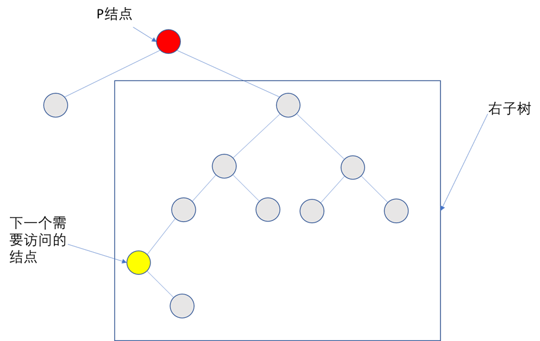

```c++
//找到以root为根的子树中，第一个被中序遍历的结点
ThreadNode* FirstNode(ThreadNode* root)
{
	while (root->lTag == 0)root = root->left;
	return root;
}

//在中序线索二叉树中找到结点cur的后继
ThreadNode* NextNode(ThreadNode* cur)
{
	if (cur->rTag == 0) return FirstNode(cur->right);
	else
		return cur->right;		//rTag==1直接返回后继
}

//对中序线索二叉树进行遍历
void InOrder(ThreadNode* root)
{
	for (ThreadNode* p = FirstNode(root); p != NULL; p = NextNode(p))
		Visit(p);
}
//空间复杂度 O(1)
```

#### 中序前驱

> 分析：方法与找后继类似，对于一个中序线索化的二叉树而言, 如果现在已经访问到了 p 结点, 此时会有如下情况
>
> 1. p->lTag == 1,  此时p结点的后继就是p->left (因为已经被线索化)
> 2. p->rTag == 0, 因为已经访问到p了, 所以p的前驱一定是在p的左子树中, 将p的左子树拎出来单独分析, 则有这样的结论, p的前驱就是左子树中最右下的结点
> 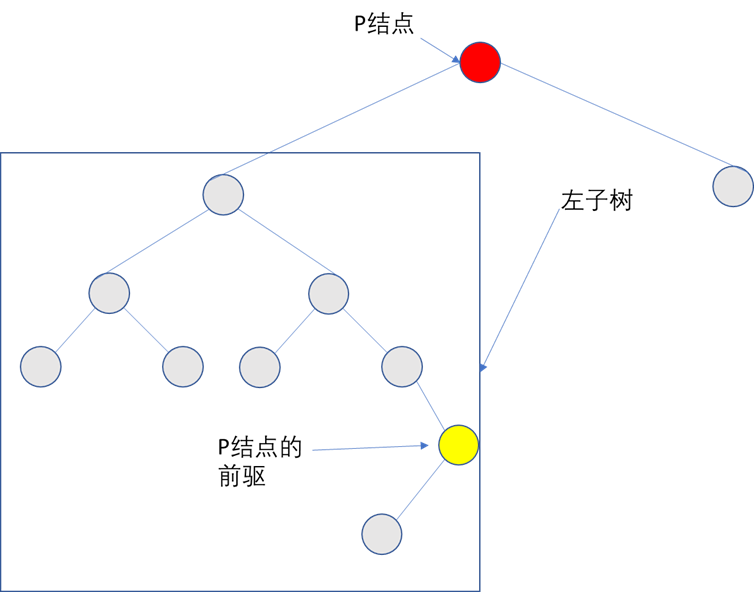

```c++
//找到以root为根的子树中，最后一个被中序遍历的结点
ThreadNode* LastNode(ThreadNode* root)
{
	while (root->rTag == 0) root = root->right;
	return root;
}

//在中序线索二叉树中找到结点p的前驱结点
ThreadNode* PreNode(ThreadNode* p)
{
	if (p->lTag == 0) return LastNode(p->left);
	else
		return p->left;	//lTag == 1，直接返回前驱线索
}

//对中序线索二叉树进行逆向遍历
void RevInOrder(ThreadNode* root)
{
	for (ThreadNode* p = LastNode(root); p != NULL; p = PreNode(p))
		Visit(p);
}
```

 #### 先序后继

> 分析：对于一个先序线索化的二叉树而言, 如果现在已经访问到了 p 结点, 此时会有如下情况
>
> 1. p->rTag == 1，则后继为p->right
> 2. p->rTag == 0，此时p必有右孩子
>     1. 如果p有左孩子，则先序后继为p的左孩子
>     2. 如果p没有左孩子，则先序后继为p的右孩子

//先序前序

> 对于一个没有指向父结点的树结点而言，先序线索化无法直接获得前驱，仍然需要从根节点开始遍历的方法来找
>
> 对于有父结点的树结点而言，可以找到，如果考了，按照先序的顺序分析一下即可。

#### 后序前驱

> 分析：对于一个后序线索化的二叉树而言, 如果现在已经访问到了 p 结点, 此时会有如下情况
>
> 1. p->lTag == 1，则后继为p->left
> 2. p->lTag == 0，此时p必有左孩子
>     1. 如果p有右孩子，则先序后继为p的右孩子
>     2. 如果p没有右孩子，则先序后继为p的左孩子

//后序后继

同先序前驱，需要增加一个指向父结点的指针才能方便地找到，否则只能从头开始遍历

## 10. 一般化的树

### 双亲表示法

```c++

///每个结点中保存指向双亲的"指针"

#define MAX_TREE_SIZE 100
typedef struct
{
	ElemType data;
	int parent;
}PTNode;
typedef struct
{
	PTNode nodes[MAX_TREE_SIZE];
	int n;
}PTree;
```
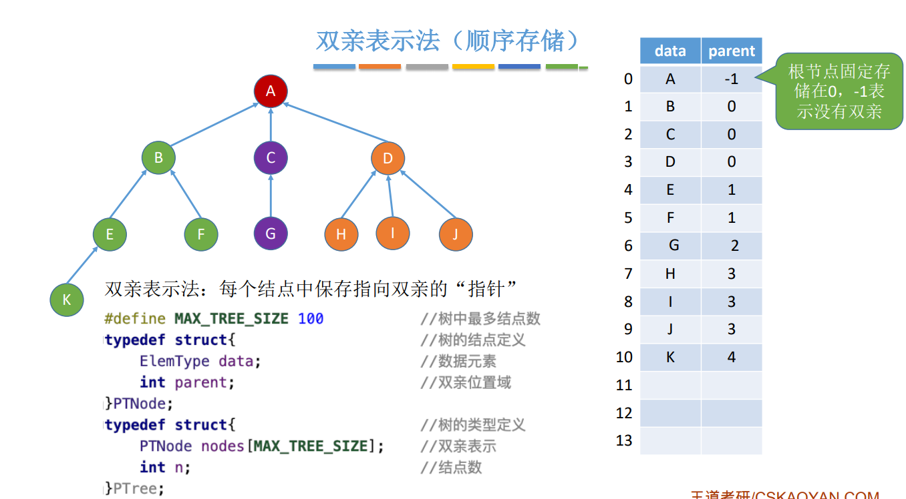

### 孩子表示法(顺序+链式存储)

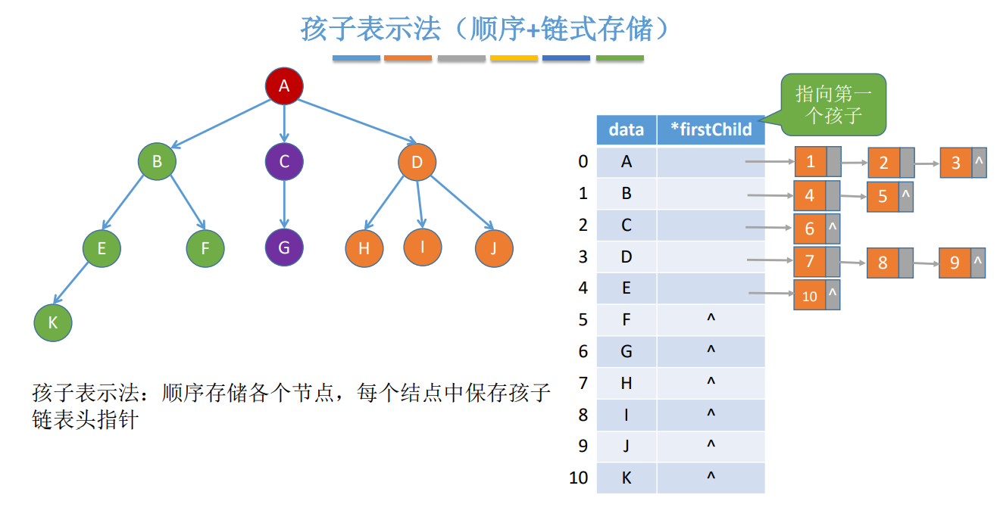

### 孩子兄弟表示法(链式存储)

```c++
typedef struct CSNode
{
	ElemType data;	//数据
	struct CSNode* firstChild, * nextSibling;	//第一个孩子和右兄弟指针
}CSNode, *CSTree;
//与二叉树的定义完全一样，只是字段名不一样！
```

#### 树和二叉树的转换

> 画根结点，然后左孩子为第一个左孩子，右孩子为第二层的剩下结点按顺序一直往右
> 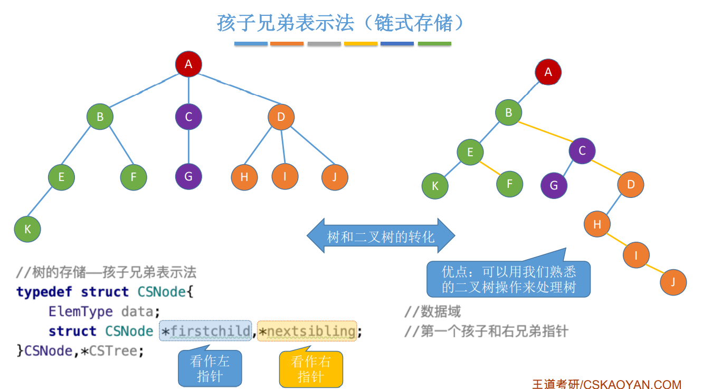
>
> 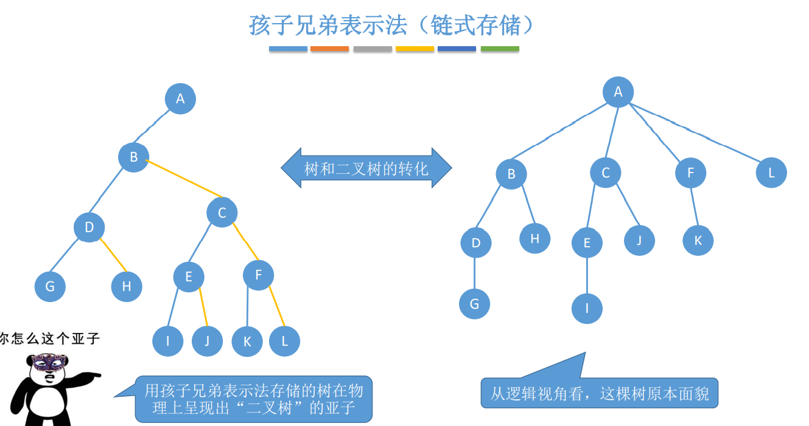

#### 森林和二叉树的转换

森林是m(m≥0)棵互不相交的树的集合，因此可以将每棵树的根结点看作是兄弟结点，然后用树和二叉树的转换做就可以了。
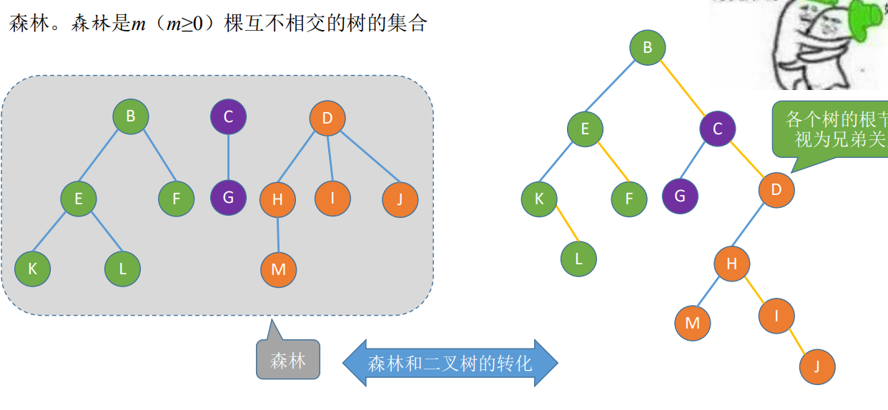

> 森林转换为二叉树时，将每棵树的根结点放在最右边的一列

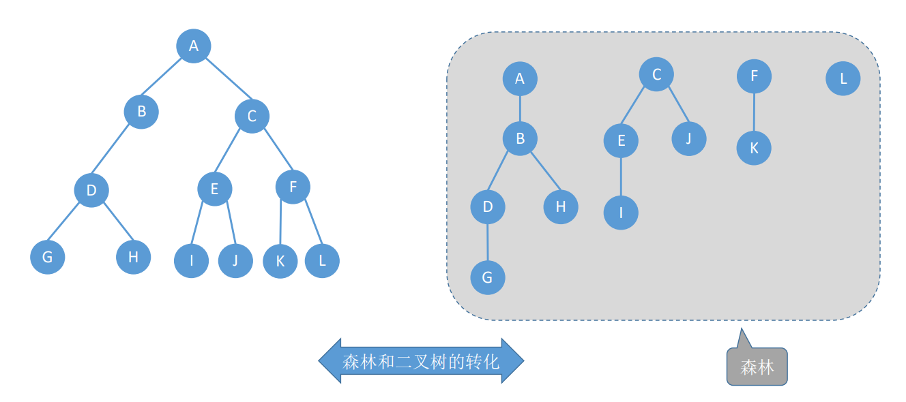

> 二叉树转森林，先将最右边一列全挑出来作为每棵树的根结点

### 树和森林的遍历

#### 树

##### 先根遍历

若树非空，先访问根结点， 再依次对每棵子树进行先根遍历。**树的先根遍历序列与这棵树相应二叉树的 先序序列相同。**

```c++
void PreOrder(TreeNode* root)
{
    if(root!=NULL)
    {
        Visit(root);
        while(root还有下一棵子树T)	//不同定义这里的条件不同
            PreOrder(T);
    }
}
```

##### 后根遍历

若树非空，先依次对每棵子 树进行后根遍历，最后再访问根结点。**树的后根遍历序列与这棵树相应二叉树的 中序序列相同。**

```c++
void PostOrder(TreeNode* root)
{
    if(root!=NULL)
    {
        while(R还有下一棵子树T)
            PostOrder(T);
        Visit(root);
    }
}
```

##### 层次遍历

用队列实现

1. 若树非空，则根节点入队
2. 若队列非空，队头元素出队并访问，同 时将该元素的孩子依次入队
3. 重复②直到队列为空

#### 森林

##### 先序遍历森林

若森林为非空，则按如下规则进行遍历： 访问森林中第一棵树的根结点。 先序遍历第一棵树中根结点的子树森林。 先序遍历除去第一棵树之后剩余的树构成的森林。

**效果等同于依次对各个树进行先根遍历**
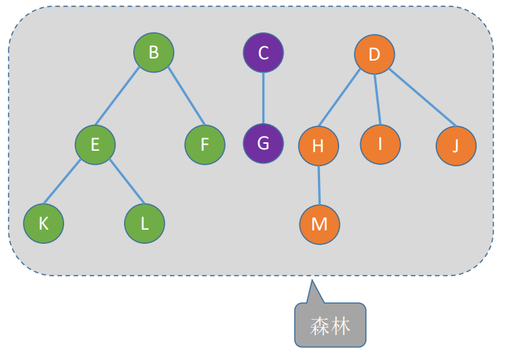
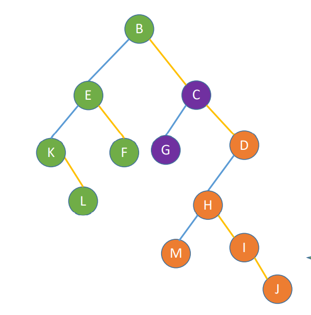
遍历序列：B E K L F C G D H M I J

##### 中序遍历森林

若森林为非空，则按如下规则进行遍历： 中序遍历森林中第一棵树的根结点的子树森林。 访问第一棵树的根结点。 中序遍历除去第一棵树之后剩余的树构成的森林。

**效果等同于依次对各个树进行后根遍历**

上图遍历序列： K L E  F B G C  M H  I J D

| 树       | 森林     | 二叉树   |
| -------- | -------- | -------- |
| 先根遍历 | 先序遍历 | 先序遍历 |
| 后根遍历 | 中序遍历 | 中序遍历 |

##  二叉排序树

定义: 左孩子值<根结点值<右孩子值, 左右子树都是二叉排序树

中序遍历可以得到一个递增的有序序列

### 结点定义

```c++
typedef struct BSTNode
{
	int key;
	struct BSTNode* left, * right;
}BSTNode,*BSTree;
```

### 查找

```c++
//递推查找
BSTNode* BST_Search(BSTree T, int target)
{
	while (T != NULL && target != T->key)
	{
		if (target < T->key)T = T->left;
		else T = T->right;
	}
	return T;
}

//递归查找
BSTNode* BST_SearchRecursion(BSTree T, int target)
{
	if (T->key == target || T == NULL) return T;
	if (target < T->key) return BST_SearchRecursion(T->left, target);
	else return BST_SearchRecursion(T->right, target);
}
```

### 插入

```c++
/*若原二叉排序树为空，则直接插入结点；否则，若关键字k小于根结
点值，则插入到左子树，若关键字k大于根结点值，则插入到右子树*/
int BST_Insert(BSTree& T, int k)
{
	if (T == NULL)
	{
		T = new BSTNode;
		T->key = k;
		T->left = T->right = NULL;
		return 1;
	}
	if (T->key == k)	//树中存在相同的值,插入失败
		return -1;
	else if (T->key < k)
		return BST_Insert(T->left, k);
	else
		return BST_Insert(T->right, k);
}
```

### 构造

```c++
//不同的关键字序列可能得到相同的二叉排序树，也可能得到不同的二叉排序树
void Build_BSTree(BSTree& T, vector<int> elements)
{
	T = NULL;
	for (auto e : elements)
		BST_Insert(T, e);
}
```

### 删除

1.  若被删除结点z是叶结点，则直接删除，不会破坏二叉排序树的性质。
2. 若被删除结点z只有左子树/右子树，则让子树代替z的位置
3.  若结点z有左、右两棵子树，则令z的中序序列的直接后继（或直接前驱）替代z，然后从二叉排序树中删去这 个直接后继（或直接前驱），这样就转换成了第一或第二种情况。
    1. 后继：z的右子树中最左下结点（该节点一定没有左子树）
    2. 前驱：z的左子树中最右下结点（该节点一定没有右子树）

### 查找效率

在查找运算中，需要对比关键字的次数称为查找长度，反映了查找操作时间复杂度

查找成功的平均查找长度ASL为每个结点的查找长度之和取平均值

查找失败的平均查找长度ASL为每一个空姐点的查找长度之和取平均值

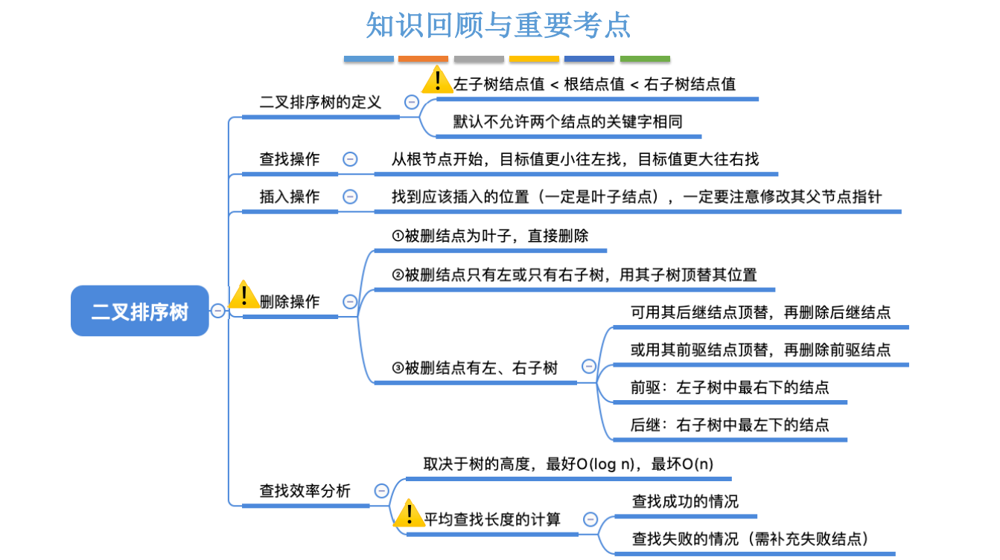

## 平衡二叉树AVL

定义：左右子树高度之差的绝对值不超过1，左右子树也是平衡二叉树

### 插入

插入一个结点之后如果不平衡，则从插入结点开始往上，找第一个不平衡的结点，调整这个“最小不平衡子树”，只要将这个最小不平衡子树调好了，整个树就恢复平衡了。

> 这里有一个只需要调整最小不平衡子树之后整个树就平衡的概念，原因是将最小不平衡子树调整过后，整棵树的高度就又恢复成了原来的高度。
> 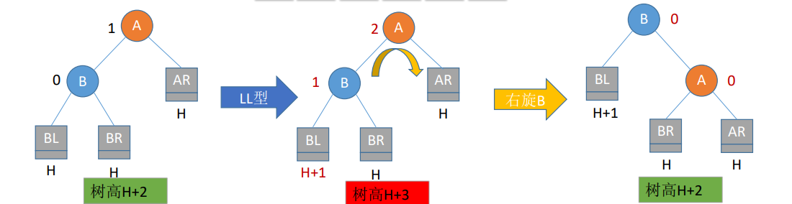

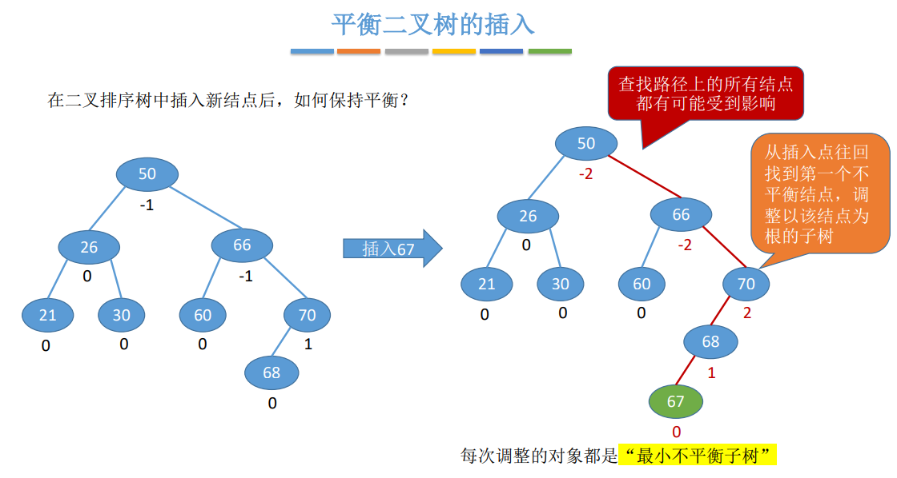

### 调整最小不平衡子树

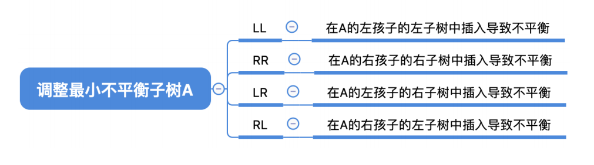

#### LL

LL平衡旋转（右单旋转）。由于在结点A的左孩子（L）的左子树（L）上插入了新结点，A的平衡因子 由1增至2，导致以A为根的子树失去平衡，需要一次向右的旋转操作。将A的左孩子B向右上旋转代替A成 为根结点，将A结点向右下旋转成为B的右子树的根结点，而B的原右子树则作为A结点的左子树。
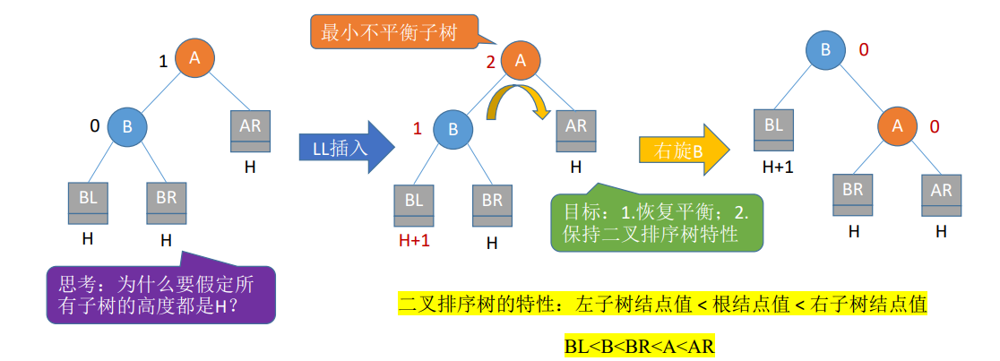

> 为什么要假定所有子树的高度都是H：不妨设AR的高度为H+1，则有A的左右子树高度都为H+1，平衡因子为0，此时往BL中插入一个结点之后A的平衡因子变成了1，不违背平衡二叉树的定义，因此不必调整。其他情况也类似，要么是A不是最小平衡子树，要么就是不需调整。

#### RR

RR平衡旋转（左单旋转）。由于在结点A的右孩子（R）的右子树（R）上插入了新结点，A的平衡因 子由-1减至-2，导致以A为根的子树失去平衡，需要一次向左的旋转操作。将A的右孩子B向左上旋转代替 A成为根结点，将A结点向左下旋转成为B的左子树的根结点，而B的原左子树则作为A结点的右子树

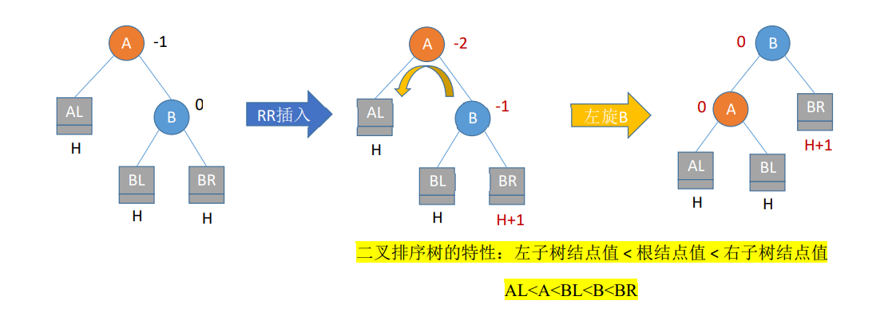

#### 代码思路

实现f向右下旋转，p向右上旋转:
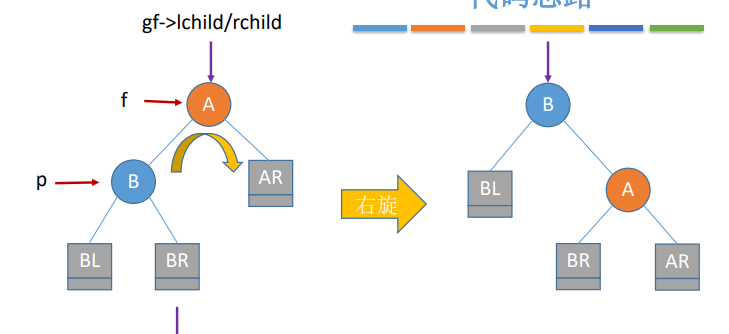

```c++
//f: father
//gf: grandfather
//p: current
f->left = p->right;
p->right = f;
gf->left / right = p;
```

实现 f 向左下旋转， p 向左上旋转：

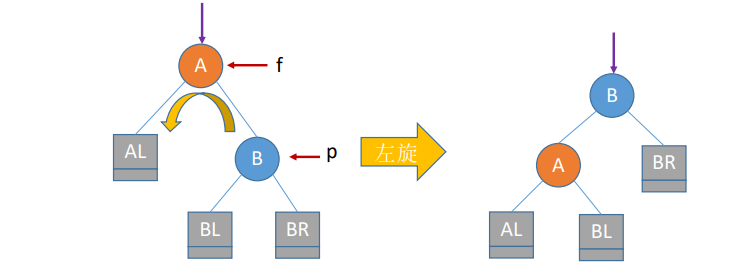

```c++
 f->rchild = p->lchild;
 p->lchild = f;
 gf->lchild/rchild = p;
```

> 总结：如上面两个图所示，调整的时候就是把B放在A的位置，然后再将B的左孩子或者右孩子改成A(根据排序树的概念推就可以)，然后再把多出来的孩子给A，就可以了。
>
> 比如第二张图，是左旋，也就意味着先让B占了A的位置，而A是小于B的，因此将B的左孩子改成A，此时BL没地方去了，而A的右孩子是空出来的，所以把A的右孩子置为BL就行

#### LR

LR平衡旋转（先左后右双旋转）。由于在A的左孩子（L）的右子树（R）上插入新结点，A的平衡因 子由1增至2，导致以A为根的子树失去平衡，需要进行两次旋转操作，先左旋转后右旋转。先将A结点 的左孩子B的右子树的根结点C向左上旋转提升到B结点的位置，然后再把该C结点向右上旋转提升到A结 点的位置
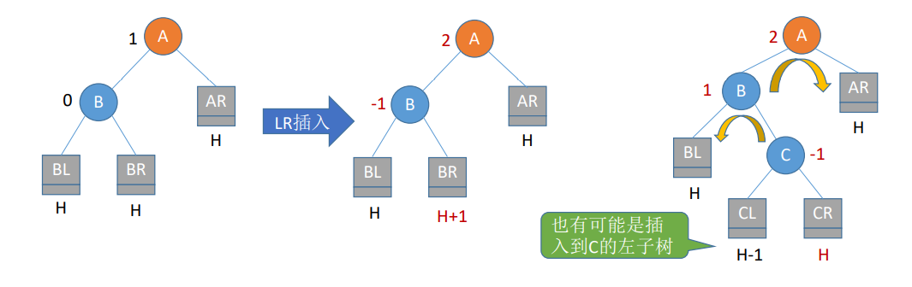

#### RL

RL平衡旋转（先右后左双旋转）。由于在A的右孩子（R）的左子树（L）上插入新结点，A的平衡 因子由-1减至-2，导致以A为根的子树失去平衡，需要进行两次旋转操作，先右旋转后左旋转。先将A 结点的右孩子B的左子树的根结点C向右上旋转提升到B结点的位置，然后再把该C结点向左上旋转提升 到A结点的位置
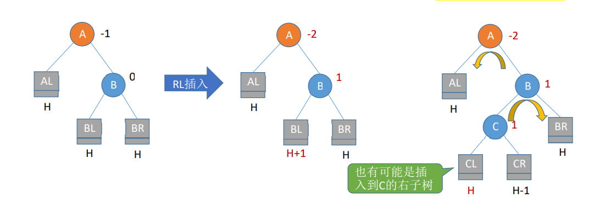

> 总结：对于LR或者RL来说，关键是找到C，也就是LR中的R，RL中的L，然后反着转就可以，比如RL，找到L之后，L先右旋，然后再左旋。

#### 总结
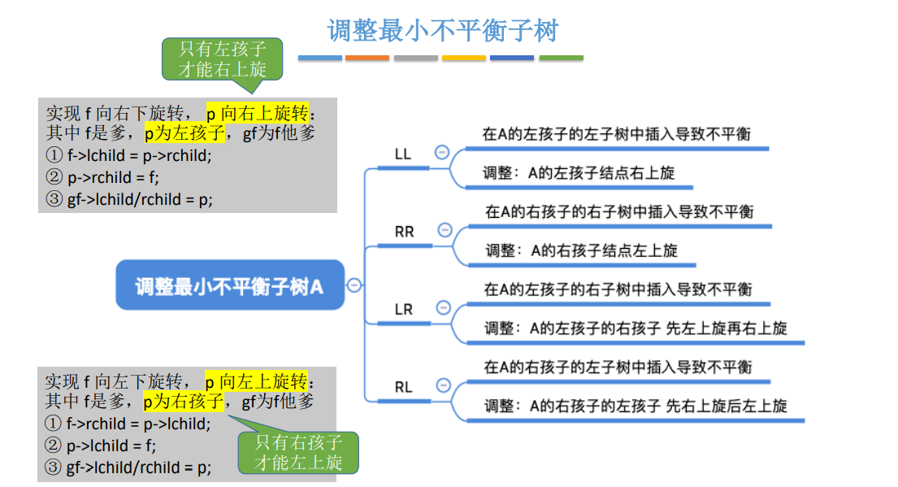

### 查找效率分析

其实就是二分法查找，O(log~2~n)

假设以n~h~表示深度为h的平衡树中含有的最少结点数。 则有n~0~ = 0, n~1~ = 1, n~2~ = 2，

并且有n~h~ = n~h~−1 + n~h~−2 + 1

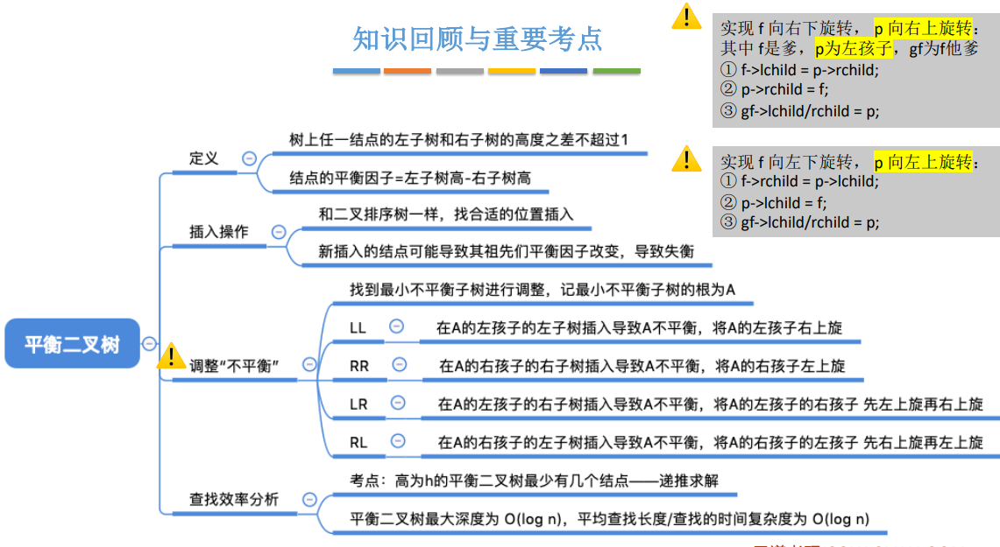

## 哈夫曼树

结点的权：有某种现实含义的数值（如：表示结点的重要性等

结点的带权路径长度：从树的根到该结点的路径长度（经过的边数）与该结点上权值的乘积

树的带权路径长度：树中所有**叶结点**的带权路径长度之和（WPL, Weighted Path Length）

在含有n个带权叶结点的二叉树中，其中带权路径长度（WPL）最小的二叉树称为哈夫曼树，也称最优二叉树

### 构造

1. 选两个权值最小的结点，用一个根结点把它们连接起来，根结点的权值为两个子结点权值的和，再将这个子树看作一个结点继续执行
2. 一直重复，直到构成一个树

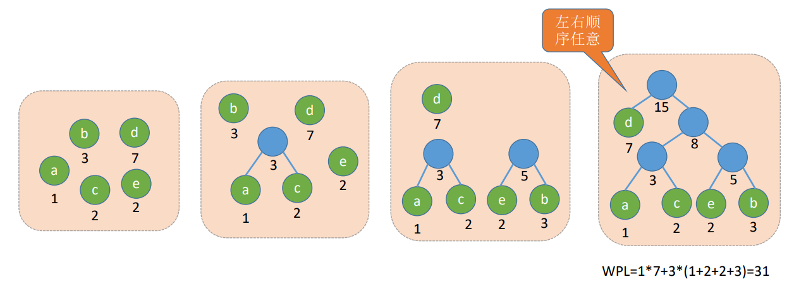

### 哈夫曼编码

若没有一个编码是另一个编码的前缀，则称这样的编码为前缀编码，哈夫曼编码就是前缀编码

非前缀码解码有歧义

由哈夫曼树得到哈夫曼编码——字符集中的每个字符作为一个叶子结点，各个字符出现的频度作为结点 的权值，根据之前介绍的方法构造哈夫曼树

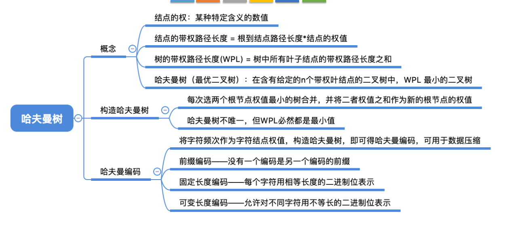
