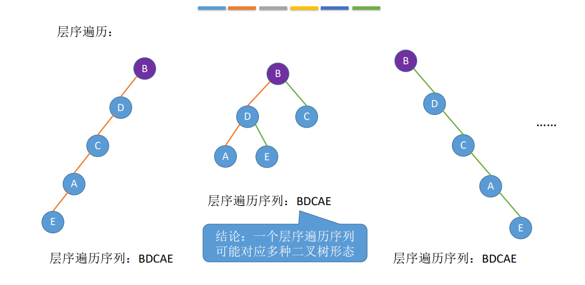

# 树与二叉树

## 一些概念

树是n(n≥0)个结点的有限集合

根结点、分支结点、叶子结点、边。

空树：n=0

非空树的特性：

1. 有且仅有一个根结点
2. 没有后继的结点称为“叶子结点”
3. 有后继的结点称为“分支结点”
4. 除了根结点之外，任何一个结点都有且仅有一个前驱
5. 每个结点可以有0个或多个后继
6. 子树：当n>1时，其余结点可以分为m(m>0)个**互不相交的有限集合**T1,T2, ..., Tm, 其中每个集合本身又是一棵树，称为根结点的子树。
7. 树是一种递归定义的数据结构

## 基本术语

度: 一个结点的孩子个数为该结点的度, 树中结点的最大度数称为`树的度`, 度为0的结点为叶子结点

结点的层次(深度): 从上往下数

结点的高度: 从下往上数

结点之间的路径是有向的，从上往下

树的高度(深度): 层数

有序树: 逻辑上看, 树中结点的各子树从左至右是**有次序的**,不能互换

无序树: 逻辑上看, 树中结点的各子树从左至右是**无次序的**,可以互换

森林: m(m≥0)棵互不相交的树的集合

## 性质

1. 结点数 = 总度数+1
2. 树的度：各结点的度的最大值；m叉树：每个结点最多只能有m个孩子的树

| 度为m的树                        | m叉树                        |
| -------------------------------- | ---------------------------- |
| 任意结点的度≤m(最多m个孩子)      | 任意节点的度≤m (最多m个孩子) |
| 至少有一个结点度 = m (有m个孩子) | 允许所有结点的度都<m         |
| 一定是非空树，至少有m+1个结点    | 可以是空树                   |

3. 度为m的树第 i 层最多有 m^i-1^个结点(i≥1) m叉树第i层至多有 m^i-1^个结点(i≥1)

4. 高度为h的m叉树最多有 $\frac{m^h-1}{m-1}$ 个结点 等比数列求和

5. 高度为h的m叉树最少有h个结点(一条线)；高度为h、度为m的树至少有h+m-1个结点

6. 具有n个结点的m叉树的最小高度为$\lceil log_m(n(m-1)+1)\rceil$ 

   ​	证明：高度最小的情况：所有的结点都有m个孩子

   ​			$\frac{m^{h-1}-1}{m-1}<n\le\frac{m^h-1}{m-1}$ 

   ​	//左边代表前h-1层最多有几个结点，右边代表前h层最多有多少结点

   ​		$m^{h-1}<n(m-1)+1\leq mh$

   ​		$h-1 < log_m(n(m-1)+1)\leq h$

   ​		$h_{min} = \lceil log_m(n(m-1)+1)\rceil$


## 二叉树的概念

二叉树是n($n\geq 0$)个结点的有限集合

每个结点最多有两棵子树，左右子树不能颠倒(有序树)

五种状态：空，只有左，只有右，只有根，左右都有

### 几个特殊的二叉树

1. 满二叉树：一个高度为h，且含有$2^h-1$个结点的二叉树
   1. 只有最后一层有叶子结点
   2. 不存在度为1的结点
   3. 按层序1开始编号，结点i的左孩子为2i，右孩子为2i+1，i的父节点为$\lfloor \frac{i}{2} \rfloor$(如果有的话)

2. 完全二叉树：当且仅当其每个结点都与高度为h的满二叉树中编号为1~n的结点一一对应时，称为完全二叉树
   1. 只有最后两层可能有叶子结点
   2. 最多只有一个度为1的结点
   3. 同1.3
   4. $i\le\lfloor\frac{n}{2}\rfloor$为分支结点，$i>\lfloor \frac{n}{2} \rfloor$ 为叶子结点
   5. 如果某结点只有一个孩子，就只可能时左孩子

3. 二叉排序树
   1. 左子树上所有结点的关键字均小于根结点的关键字
   2. 右子树上所有结点的关键字均大于根结点的关键字
   3. 左右子树各是一棵二叉排序树

4. 平衡二叉树：树上任一结点左子树和右子树深度之差不超过1

## 二叉树性质

1. 设非空二叉树中度为0、1和2的结点个数分别为n~0~、n~1~和n~2~，则n~0~=n~2~+1

   ​	假设树中结点总数为n，则

   ​	n = n~0~+n~1~+n~2~	①

   ​	n = n~1~+2n~2~+1	②	//树的结点数等于总度数+1

   ​	用②-①即可得到结论

2. 二叉树第i层最多有$2^{i-1}$个结点(i≥1)

3. 高度为h的二叉树最多有$2^h-1$个结点(满二叉树)

4. 具有n个(n>0)结点的完全二叉树的高度h为$\lceil log_2(n+1)\rceil$或$\lfloor log_2n\rfloor+1$

   ​		第i个结点所在的层次也满足这个式子

   ​	证明：(1)

   ​				高度为h的满二叉树共有$2^h-1$个结点 (上限)

   ​				高度为h-1的满二叉树共有$2^{h-1}-1$个结点

   ​				=> $2^{h-1}-1<n\le2^h-1$ 

   ​				=> $2^{h-1}<n+1\le2^h$ 

   ​				=> $h-1<log_2(n+1)\le h$

   ​				=> $h=\lceil log_2(n+1)\rceil$

   ​				(2)

   ​				高度为h-1的满二叉树共有$2^{h-1}-1$个结点

   ​				高为h的完全二叉树至少有$2^{h-1}$个结点，最多有$2^{h}-1<2^h$

   ​				$2^{h-1}\le n < 2^h$

   ​				$h-1\le log_2n<h$

   ​				$h=\lfloor log_2n\rfloor+1$

5. 对于完全二叉树，可以由结点数推出度为0，1和2的结点个数为n~0~, n~1~ n~2~

   ​		n~1~ = 0或1	//完全二叉树最多只有一个度为1的结点

   ​		n~0~ = n~2~+1 -> n~0~+n~2~一定是奇数

   ​		=> 若完全二叉树由2k个(偶数)结点，则必有n~1~=1, n~0~=k, n~2~ = k

   ​		=> 若完全二叉树由2k-1个(奇数)结点，则必有n~1~=0, n~0~=k, n~2~ = k-1

## 二叉树存储结构

### 顺序存储

```c++
#define MaxSize 100
typedef struct TreeNode
{
	ElemType value;
	bool isEmpty;
}TreeNode;
TreeNode t[MaxSize];
```

> 几个重要的常考操作 下标从1开始
>
> >i的左孩子 2i
> >
> >i的右孩子 2i+1
> >
> >i的父节点 $\lfloor\frac{i}{2}\rfloor$
> >
> >i所在的层次 $\lceil log_2(n+1)\rceil$ 或 $\lfloor log_2n\rfloor+1$
>
> 若完全二叉树中有n个结点，则
>
> > 判断i是否有左孩子 2i≤n
> >
> > 判断i是否有右孩子 2i+1≤n
> >
> > 判断i是否为叶子结点 $i>\lfloor\frac n 2\rfloor$

### 链式存储

```c++
typedef struct BiTNode
{
	ElemType data;
	struct BiTNode* left, * right;
    //struct BiTNode* parent; //如果需要频繁找父亲节点就可以加上这行，叫三叉链表
}BiTNode,*BiTree;
```

## 二叉树的遍历

### 先序

```c++
void PreOrder(BiTree root)
{
	if (root == NULL)	//越界代偿
		return;
	cout << root->data << endl;
	PreOrder(root->left);
	PreOrder(root->right);
}
```

### 中序

```c++
void InOrder(BiTree root)
{
	if (root == NULL)
		return;
	InOrder(root->left);
	cout << root->data<<endl;
	InOrder(root->right);
}
```

### 后序

```c++
void PostOrder(BiTree root)
{
	if (root == NULL)
		return;
	PostOrder(root->left);
	PostOrder(root->right);
	cout << root->data << endl;
}
```

### 层序遍历

算法思想：

1. 初始化一个队列
2. 根结点入队
3. 若队列非空，则队头结点出队，访问该结点，并将其左右孩子插入队尾(如果有的话)
4. 重复3，直至队列为空

```c++
void LayerByLayer(BiTree root)
{
	if (root == NULL) return;
	queue<BiTNode*> q;
	q.push(root);
	while (!q.empty())
	{
		BiTNode* node = q.front();
		q.pop();
		cout << node->data << endl;
		if (node->left != NULL) q.push(node->left);
		if (node->right != NULL) q.push(node->right);
	}
}
```

### 求树深度

```c++
int TreeDepth(BiTree root)
{
	if (root == NULL)
		return 0;
	else
	{
		int l = TreeDepth(root->left);
		int r = TreeDepth(root->right);
		return l > r ? l + 1 : r + 1;
	}
}
```

## 由遍历序列构造二叉树

### 任意一个序列不能唯一确定二叉树




### 可以确定二叉树的序列


#### 前序+中序


例如 前序序列为：ADBCE 中序序列为：BDCAE

首先看前序序列第一个是A，对应中序，因此树的根结点为A，左子树为BDC右子树为E


继续看前序序列，第一个是D，故左子树的根结点为D


#### 后序+中序


例如：后序序列为：E F A H C I G B D，中序序列为：E A F D H C B G I

首先看后序序列最后一个是D，所以将中序序列以D为根，左右分成两棵子树


然后看后序中的EFA, A在最后,故A为根, 因此将中序序列中的EAF按A为根分为左右两棵子树

依此类推$\cdots$
最终结果为


#### 层序+中序

例如：层序序列为：D A B E F C G H I，中序序列为：E A F D H C B G I

层序序列第一个为D，因此将中序序列以D为根结点分为左右两棵子树


层序序列第二个访问到A，因此以A为根结点，将EAF分为左右子树

依此类推


## 线索二叉树

### 作用

普通二叉树找前驱、后继很不方便；遍历操作必须从根结点开始

### 存储结构

```c++
typedef struct ThreadNode
{
	ElemType data;
	struct ThreadNode* left, * right;
	int lTag, rTag;	//左右线索标志，1时left、right指向前驱/后继
}ThreadNode, *ThreadTree;
```

 ### 线索化

易错点：最后一个结点rtag的处理，先序线索化中会出现死循环的情况

```c++
ThreadNode* pre = NULL;	//全局变量，用于记录当前访问结点的前驱

void Visit(ThreadNode* q)
{
	if (q->left == NULL)	//当前结点左子树为空，建立前驱
	{
		q->left = pre;
		q->lTag = 1;
	}
	if (pre != NULL && pre->right == NULL)	//前驱结点右子树为空，建立后继
	{
		pre->right = q;
		pre->rTag = 1;
	}
	pre = q;
}

#pragma region 中序线索化

void InThread(ThreadTree root)
{
	if (root == NULL)
		return;
	InThread(root->left);
	Visit(root);
	InThread(root->right);
}

void CreateInThread(ThreadTree T)
{
	pre = NULL;
	if (T != NULL)
	{
		InThread(T);
		if (pre->right == NULL)
			pre->rTag = 1;	//处理遍历的最后一个结点
	}
}
#pragma endregion

#pragma region 先序线索化
void PreThread(ThreadTree T)
{
	if (T == NULL) return;
	Visit(T);
	if (T->lTag == 0)	//因为是先visit，所以当遍历到最左边的结点时会让它指向前驱，然后就会产生无线循环
		PreThread(T->left);
	PreThread(T->right);
}

void CreatePreThread(ThreadTree T)
{
	pre = NULL;
	if (T != NULL)
	{
		PreThread(T);
		if (pre->right == NULL)//处理遍历的最后一个结点
			pre->rTag = 1;
	}
}
#pragma endregion

#pragma region 后序线索化
void PostThread(ThreadTree T)	
{
	//因为是先左右孩子，再根结点，因此在visit当前结点创建线索之后不会在访问左右孩子，故不会出现先序中无限循环的情况
	if (T == NULL)
		return;
	PostThread(T->left);
	PostThread(T->right);
	Visit(T);
}

void CreatePostThread(ThreadTree T)
{
	pre = NULL;
	if (T != NULL)
	{
		PostThread(T);
		if (pre->right != NULL)	//处理遍历的最后一个结点
			pre->rTag = 1;
	}
}
#pragma endregion
```

