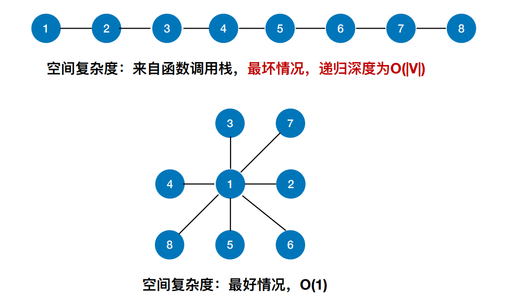

# 图

## 概念


### 图的定义

图G由**顶点集V**和**边集E**组成,记作 G=(V, E); V(G)代表图G中顶点的==有限非空集==；E(G)表示图G中顶点之间的关系(边)集合。若V={v~1~, v~2~, $\cdots$, v~n~}，则用|V|表示图G中顶点的个数，也称作图G的阶; E = {(u, v)| u∈V，v∈V}，用|E|表示图G中边的条数。

注：线性表、树可以为空，但图不可以为空，V一定是非空集

### 分类

#### 有向、无向

若E是无向边（简称$）的有限集合时，则图G为无向图。边 是顶点的无序对，记为(v, w)或(w, v)，因为(v, w) = (w, v)，其 中v、w是顶点。可以说顶点w和顶点v互为邻接点。边(v, w) 依附于顶点w和v，或者说边(v, w)和顶点v、w相关联。


若E是有向边（也称弧）的有限集合时，则图G为有向图。 弧是顶点的有序对，记为<v, w>，其中v、w是顶点，v称为弧尾，w称为弧头，<v, w>称为从顶点v到顶点w的弧，也称 v邻接到w，或w邻接自v。  ==<v, w> ≠ <w, v>==


#### 简单、多重

简单图——① 不存在重复边； ② 不存在顶点到自身的边

多重图——图G中某两个结点之间的边数多于 一条，又允许顶点通过同一条边和自己关联， 则G为多重图


#### 连通图、强连通图

1. 连通图

    若图G中任意两个顶点都是连通的，则称图G为连通图，否则称为非连通图

    > **常见考点：**
    >
    > 对于n个顶点的无向图G
    >
    > 若G是连通图，则最少有n-1条边
    >
    > 若G是非连通图，则最多可能有$C_{n-1}^2$条边(有一个顶点没有相连，剩下n-1个结点两两相连)

    

2. 强连通图

    若图中任何一对顶点都是强连通的，则称此图为强连通图。

    > **常见考点：**
    >
    > 对于n个顶点的有向图G，
    >
    > 若G是强连通图，则最少有 n 条边（形成回路）
    
    

#### 特殊形态的图

1. 无向完全图——无向图中任意两个顶点之间都存在边

    > 若无向图的顶点数|V| = n，则|E| ∈ [0, $C_n^2$] = [0, $\frac{n(n-1)}{2}$]

    

2. 有向完全图——有向图中任意两个顶点 之间都存在方向相反的两条弧

    > 若有向图的顶点数|V| = n，则|E| ∈ [0, $2C_n^2$] = [0, $n(n-1)$]

3. 稀疏图：边数很少的图称为稀疏图

4. 反之为稠密图

    没有绝对的界限，一般来说==|E| < |V|log|V|==时，可以将G视为稀疏图

5. 树：不存在回路，且连通的无向图

    

    n个顶点的树，必有n-1条边。

    > 常见考点：n个顶点的图，若 |E|>n-1，则一定有回路

6. 有向树：一个顶点的入度为0、其余顶点的 入度均为1的有向图，称为有向树。

    

### 度

对于==无向图==：顶点v的度是指依附于该顶点的边的条数，记为TD(v)。
$\sum_{i=1}^{n}TD(v_i)=2|E|$    即无向图的全部顶点的度的和等于边数的2倍

对于==有向图==：

1. 入度是以顶点v为终点的有向边的数目，记为ID(v)；
2.  出度是以顶点v为起点的有向边的数目，记为OD(v)。
3.  顶点v的度等于其入度和出度之和，即TD(v) = ID(v) + OD(v)

在具有n个顶点、e条边的有向图中 $\sum\limits_{i=1}^{n}ID(v_i)=\sum\limits_{i=1}^{n}OD(v_i)=e$

### 边关系描述

1. 路径：顶点v~p~到顶点v~q~之间的一条路径是指顶点序列 ，v~p~, v~i1~, v~i2~, $\cdots$, v~im~, v~q~
2. 回路：第一个顶点和最后一个顶点相同的路径称为回路或环
3. 简单路径：在路径序列中，顶点不重复出现的路径称为简单路径。
4. 简单回路：除第一个顶点和最后一个顶点外，其余顶点不重复出现的回路称为简单回路。
5. 路径长度：路径上边的数目
6. 点到点的距离：从顶点u出发到顶点v的==最短路径==若存在，则==此路径的长度称为从u到v的距离。==若从u到v根本不存在路径，则记该距离为无穷($\infty$)
7. ==无向图==中，若从顶点v到顶点w有路径存在，则称v和w是==连通==的
8. ==有向图==中，若从顶点v到顶点w和从顶点w到顶点v之间都有路径，则称这两个顶点是==强连通==的
9. 边的权：在一个图中，每条边都可以标上具有某种含义的数值，该数值称为该边的权值。
10. 带权图/网：边上带有权值的图称为带权图，也称网。
11. 带权路径长度：当图是带权图时，一条路径上所有边的权值之和，称为该路径的带权路径长度

### 子图

设有两个图G = (V, E)和G' = (V' , E' )，若V' 是V的子集，且E' 是 E的子集，则称G' 是G的子图。

若有满足V(G' ) = V(G)的子图G' ，则称其为G的生成子图	//顶点一样，去掉几个边

并非任意挑几个点、几条边都能构成子图：可能挑出来的就不是个图 (边没有连点)

上述概念对于有向图和无向图都是一样的


### 连通分量、强连通分量

无向图中的==极大连通子图==称为==连通分量==。 //子图必须连通，且包含尽可能多的顶点和边


例如：中国铁路网有3个连通分量：大陆铁路网，台湾铁路网、海南铁路网

有向图中的==极大强连通子图==称为有向图的==强连通分量== //子图必须强连通，同时保留尽可能多的边


### 生成树、生成森林

==连通图==的生成树是==包含图中全部顶点的一个极小连通子图==	//边要尽可能少，但是要保持连通

若图中顶点数为n，则它的生成树含有 n-1 条边。对生成树而言，若砍去它的一条边，则会变成非连通 图，若加上一条边则会形成一个回路。


> 区分极大连通子图和极小连通子图。极大连通子图是无向图的连通分量，极大即要求该连通子图包含其所有的边；极小连通子图是既要保持图连通又要使得边数最少的子图

在==非连通图==中，==连通分量的生成树==构成了非连通图的==生成森林==。


## 图的存储以及基本操作

### 邻接矩阵法

用一个一维数组存储图中顶点信息，用一个二维数组存储图中边的信息(即各个顶点之间的邻接关系)，存储顶点之间的邻接关系的二维数组称为`邻接矩阵`

#### 存储不带权的图

```c++
#define MaxVertexNum 100
typedef struct
{
	char Vex[MaxVertexNum];
	int Edge[MaxVertexNum][MaxVertexNum];
	int vexNum, arcNum;
}MGraph;
```


#### 求度

在无向图中：对应结点的行/列求和，就是度

在有向图中：对应结点行和为出度，列和为入度。度为行和、列和相加

时间复杂度为O(|V|)

#### 存储带权图

```c++
#define MaxVertexNum 100
#define INFINITY INT_MAX
typedef char VertexType;
typedef int EdgeType;
typedef struct
{
	VertexType Vex[MaxVertexNum];
	EdgeType Edge[MaxVertexNum][MaxVertexNum];
	int vexNum, arcNum;
}MGraph;
```

当两个顶点之间有边时，邻接矩阵对应元素值为权值，否则为INFINITY

> 注：主对角线元素可以是无穷也可以是0

#### 性能分析

空间复杂度：O( |V|^2^ ) ——只和顶点数相关，和实际的边数无关

适合用于存储稠密图

无向图的邻接矩阵是对称矩阵，可以压缩存储（只存储上三角区/下三角区）

#### 性质

设图G的邻接矩阵为A（矩阵元素为0/1），则A^n^ 的元素A^n^[i][j]等于由顶点i到顶点j的长度为n的路径的数目


例如上图

$\begin{pmatrix}
0&1&0&0 \\
1&0&1&1 \\
0&1&0&1 \\
0&1&1&0 \\
\end{pmatrix} * 
\begin{pmatrix}
0&1&0&0 \\
1&0&1&1 \\
0&1&0&1 \\
0&1&1&0 \\
\end{pmatrix} => A^2[1][4] =  a_{1,1} a_{1,4} + a_{1,2} a_{2,4} + a_{1,3} a_{3,4} + a_{1,4} a_{4,4} = 1$

其中$a_{1,2}a_{2,4} = 1 * 1 = 1$代表的意思是从A到B有一条边，从B到D有一条边，故从A到D的距离为2的边有一条是A->B->D；如果其中有一条边为0，那么乘积的结果就是0，也就是没有边；

同理可以推算到$A^n[i][j]$就代表从i结点到j结点长度为n的路径的数目

### 邻接表法

#### 结点定义

```c++
typedef struct ArcNode	//边
{
	int adjVex;			//边指向哪个结点
	struct ArcNode* next;	//指向下一条弧的指针
}ArcNode;

typedef struct VNode	//顶点
{
	VertexType data;	
	ArcNode* first;		//第一条边
}VNode, AdjList[MaxVertexNum];

typedef struct			//用邻接表存储的图
{
	AdjList vertices;
	int vexNum, arcNum;
}ALGraph;
```


> 表格中存的是顶点，而链表中的是与顶点相连的边。

#### 性能分析

> 对于无向图而言
>
> 1. 边结点的数量是2|E|， 整体空间复杂度为 O(|V| + 2|E|)
> 2. 求度将对应结点的链表遍历计数即可
>
> 
>
> 对于有向图而言
>
> 1. 边结点的数量是|E|， 整体空间复杂度为 O(|V| + |E|)
> 2. 出度遍历对应结点的链表即可，入度需遍历整个表

#### 与邻接矩阵对比


### 十字链表法和邻接多重表

#### 十字链表法(适用于有向图)

引出：对于有向图而言，如果用邻接表来存储，查顶点的入度不方便；而如果使用邻接矩阵来存储的话空间复杂度又太高，因此就有了十字链表法这种存储方法

```c++
typedef int Weight;

typedef struct CArcNode	//十字链表法弧结点定义
{
	int tailVex;	//弧尾顶点编号
	int headVex;	//弧头顶点编号
	// Weight weight;	//权值
	struct CArcNode* hLink;	//弧头相同的下一条弧
	struct CArcNode* tLink;	//弧尾相同的下一条弧
}CArcNode;

typedef struct CVNode	//十字链表法顶点结点定义
{
	VertexType data;
	CArcNode* firstIn;	//该顶点作为弧头的第一条弧
	CArcNode* firstOut;	//该顶点作为弧尾的第一条弧
}CVNode, CrossList[MaxVertexNum];

typedef struct
{
	CrossList vertices;
	int vexNum, arcNum;
}CrossGraph;
```


> 从一个顶点开始，找所有出边，就是按着绿色的指针一直找。

#### 一些性质

1. 空间复杂度：O(|V|+|E|)
2. 如何找到指定顶点的所有出边？——顺着绿色线路找 
3. 如何找到指定顶点的所有入边？——顺着橙色线路找

#### 邻接多重表(适用于无向图)

引出：对于无向图而言，如果使用邻接表来存储，会导致每条边对应两份冗余信息， 删除顶点、删除边等操作 时间复杂度高；如果使用邻接矩阵来存储，空间复杂度太高。


#### 一些性质

1. 空间复杂度：O(|V|+|E|) //每条边对应一份数据
2. 删除边、删除节点等操作很方便

### 总结


## 遍历

### 需要准备的接口

1. FirstNeighbor(G,x)

    求图G中顶点x的第⼀个邻接点，若有则返回顶点号。 若x没有邻接点或图中不存在x，则返回-1。

2. NextNeighbor(G,x,y)

    假设图G中顶点y是顶点x的⼀个邻接点，返回除y之外 顶点x的下⼀个邻接点的顶点号，若y是x的最后⼀个邻接点，则返回-1

### BFS

#### 要点

1. 找到与⼀个顶点相邻的所有顶点 
2. 标记哪些顶点被访问过
3. 需要⼀个辅助队列

#### 代码

```c++
void BFS(Graph G, int v)
{
	queue<int> q;	//辅助队列
	VisitGraphNode(v);	//访问结点
	visited[v] = true;	//标记已经访问过
	q.push(v);			
	while (!q.empty())
	{
		v = q.front();
		q.pop();
       	//找到与结点相连的所有结点，访问并入队
		for (int w = FirstNeighbor(G, v); w >= 0; w = NextNeighbor(G, v, w))
		{
			if (!visited[w])
			{
				VisitGraphNode(w);
				visited[w] = true;
				q.push(w);
			}
		}
	}
}
```

>  【注】
>
> ​	同⼀个图的邻接矩阵表示⽅式唯⼀，因此⼴度优先遍历序列唯⼀
>
> ​	同⼀个图邻接表表示⽅式不唯⼀，因此⼴度优先遍历序列不唯⼀

#### 完整代码

如果图是非连通图，那么依次BFS不能够完整地遍历整个图，需要增加逻辑


```c++
bool visited[MaxVertexNum];

void BFS(Graph G, int v)
{
	queue<int> q;	//辅助队列
	VisitGraphNode(v);	//访问结点
	visited[v] = true;	//标记已经访问过
	q.push(v);
	while (!q.empty())
	{
		v = q.front();
		q.pop();
        //找到与结点相连的所有结点，访问并入队
		for (int w = FirstNeighbor(G, v); w >= 0; w = NextNeighbor(G, v, w))
		{
			if (!visited[w])
			{
				VisitGraphNode(w);
				visited[w] = true;
				q.push(w);
			}
		}
	}
}

void BFSTraverse(Graph G)
{
	for (int i = 0; i < G.vexNum; i++)
		visited[i] = false;
	for (int i = 0; i < G.vexNum; i++)
	{
        //如果一次BFS没有把图中所有的结点遍历完，则从第一个没有访问过的结点再来一次BFS，直到访问完整个图
		if (!visited[i])	
			BFS(G, i);
	}
}
```

> 结论：对于无向图而言，==调用BFS函数的次数等于连通分量数==

#### 复杂度分析

##### 空间复杂度

最坏情况，辅助队列⼤⼩为 O(|V|)


##### 时间复杂度

1. 邻接矩阵存储的图

    访问 |V| 个顶点需要O(|V|)的时间

    查找每个顶点的邻接点都需要O(|V|)的时间，⽽总共有|V|个顶点

    时间复杂度= O(|V|^2^)

2. 邻接表存储的图

    访问 |V| 个顶点需要O(|V|)的时间

    查找各个顶点的邻接点共需要O(|E|)的时间，	//对于无向图而言其实是 2|E|

    时间复杂度= O(|V|+|E|)

#### 广度优先生成树

在遍历过程中，通过当前结点压入队列的所有结点当作当前结点的孩子，就得到了树(无环)

对于下图而言，从2开始进行广搜的生成树就是右边的结果


> ⼴度优先⽣成树由⼴度优先 遍历过程确定。由于邻接表 的表示⽅式不唯⼀，因此基 于邻接表的⼴度优先⽣成树 也不唯⼀。

#### 广度优先生成森林

对⾮连通图的⼴度优先遍历，可得到⼴度优先⽣成森林


#### 总结


### DFS

#### 代码

```c++
bool visited[MaxVertexNum];

void DFS(Graph G, int v)
{
	VisitGraphNode(v);
	visited[v] = true;
	for (int w = FirstNeighbor(G, v); w >= 0; w = NextNeighbor(G, v, w))
	{
		if (!visited[w])	//优先往深处探索
			DFS(G, w);
	}
}
```

> 【注】
>
> 同⼀个图的邻接矩阵表示⽅式唯⼀，因此深度优先遍历序列唯⼀，深度优先⽣成树也唯⼀
>
> 同⼀个图邻接表表示⽅式不唯⼀，因此深度优先遍历序列不唯⼀，深度优先⽣成树也不唯⼀

#### 完整代码

同样存在与BFS同样的问题，如果图是非连通图，则一次DFS无法访问整个图，处理方法也类似

```c++
bool visited[MaxVertexNum];

void DFS(Graph G, int v)
{
	VisitGraphNode(v);
	visited[v] = true;
	for (int w = FirstNeighbor(G, v); w >= 0; w = NextNeighbor(G, v, w))
	{
		if (!visited[w])	//优先往深处探索
			DFS(G, w);
	}
}

void DFSTraverse(Graph G)
{
	for (int i = 0; i < G.vexNum; i++)
		visited[i] = false;
	for (int i = 0; i < G.vexNum; i++)
		if (!visited[i])
			DFS(G, i);
}
```

#### 复杂度分析

##### 空间复杂度

主要来自递归调用栈



##### 时间复杂度

1. 邻接矩阵存储

    访问 |V| 个顶点需要O(|V|)的时间

    查找每个顶点的邻接点都需要O(|V|)的时间，⽽总共有|V|个顶点

    时间复杂度= ==O(|V|2)==

2. 邻接表存储的图：

    访问 |V| 个顶点需要O(|V|)的时间

    查找各个顶点的邻接点共需要O(|E|)的时间

    时间复杂度= O(|V|+|E|)

#### 深度优先生成树

在遍历过程中，通过当前结点访问到的结点成为当前结点的孩子，也就成了树(无环)

#### 深度优先生成森林

对于非连通图而言，每一个连通分量的生成树共同组成了生成森林

### 总结


## 应用

### 最小生成树

对于一个==带权连通无向图==G=(V,E)，⽣成树不同，每棵树的权（即树中所有边上的权值之和）也可能不同。设R为G的所有⽣成树的集合，若T为R中边的==权值之和最⼩的⽣成树==，则T称为G的最⼩⽣成树（Minimum-Spanning-Tree, MST）。

1.  最⼩⽣成树可能有多个，但边的权值之和总是唯⼀且最⼩的
2.  最⼩⽣成树的边数 = 顶点数 - 1。砍掉⼀条则不连通，增加⼀条边则会出现回路
3.  如果⼀个连通图本身就是⼀棵树，则其最⼩⽣成树就是它本身
4.  只有连通图才有⽣成树，⾮连通图只有⽣成森林

#### Prim

从某⼀个顶点开始构建⽣成树； 每次将代价最⼩的新顶点纳⼊⽣成树，直到所有顶点都纳⼊为⽌

> 维护一个包含所有顶点以及其是否加入最小生成树的的一维数组以及一个lowCost数组，表明当前最小生成树到达对应顶点需要的最低成本。


#### Kruskal

每次选择⼀条权值最⼩的边，使这条边的两头连通（原本已经连通的就不选） 直到所有结点都连通

> 也就是将边按照权值从小到大排序，然后一条一条遍历，使用并查集来判断新边是否连通


#### 对比

| Prim                  | Kruskal                         |
| --------------------- | ------------------------------- |
| 时间复杂度O(\|V\|^2^) | 时间复杂度O(\|E\| log~2~\|E\| ) |
| 适用于边稠密图        | 适用于边稀疏图                  |

### 最短路径

#### 单源最短路径

##### BFS

仅适用于==无权图==

```c++
int d[MaxVertexNum], path[MaxVertexNum];
void BFS_Min_Distance(Graph g, int entry)
{
	//d[i]表示从u到i结点的最短路径
	for (int i = 0; i < g.vexNum; i++)
	{
		d[i] = INFINITY;	//最短路径初始化为∞
		path[i] = -1;		//直接前驱设置为-1
	}

	queue<int> q;
	d[entry] = 0;
	visited[entry] = true;
	q.push(entry);
	while (!q.empty())
	{
		int last = q.front();
		q.pop();
		for (int cur = FirstNeighbor(g, last); cur >= 0; cur = NextNeighbor(g, last, cur))
		{
			if (!visited[cur])		//cur是last的尚未访问到的邻接顶点
			{
				d[cur] = d[last] + 1;	//路径长度+1
				path[cur] = last;		//直接前驱是last
				visited[cur] = true;
				q.push(cur);
			}
		}
	}
}
```

> 从入口开始进行BFS，每次有没有访问过的点都会将直接前驱设置为它的上一层顶点，并将路径长度设置为上一层顶点的路径长度+1，其实也就是求生成树的深度..


##### Dijkstra

适用于带权图以及无权图，不适用于含有负权值的图

> 算法描述：
>
> 维护三个数组
>
> 1. final[]：标记各个顶点是否已经找到到该顶点的最短路径
> 2. dist[]：到达该顶点的最短路径长度
> 3. path[]：到达该顶点的直接前驱
>
> 初始化：
>
> 
>
> 循环处理：
>
> 

时间复杂度O(n^2^)，思路与Prim算法很像

模拟：

初始化三个数组


找到final为false并且dist最小的顶点，将其final值设置为true，并且更新所有final为false的顶点的dist数组以及path数组


依此类推

#### Floyd各个顶点之间最短路径

适用于带权图、无权图

> 算法每一阶段的思想：
>
> 假设从城市A到城市C之间有直达的车，也有经过城市B中转的车，如果取B中转一下反而比直达还快，那就中转一下就好了。
>
> 动态规划，将算法分为多个阶段：
>
> 对于于n个顶点的图G，求任意⼀对顶点 V~i~ -> V~j~ 之间的最短路径可分为如下⼏个阶段：
>
> \#初始：不允许在其他顶点中转，最短路径就是邻接矩阵
>
> \#0：允许在 V~0~ 中转
>
> \#1：允许在 V~0~、V~1~ 中转，只需要在#0的基础上增加可以在V~1~中转即可
>
> ...
>
> #n-1：允许在V~0~、V~1~ $\cdots$ V~n-1~中转
>
> 通式：
>
> $A^{-1}=邻接矩阵, path^{-1}=[-1]$
>
> 若 $A^{k-1}[i][j]>A^{k-1}[i][k]+A^{k-1}[k][j]$
>
> 则 $A^{k}[i][j]=A^{k-1}[i][k]+A^{k-1}[k][j]; path^{k}[i][j] = k$
>
> 否则$A^{k}[][]、path^{k}[][]$保持不变

模拟：


依此类推，最终结果：


核心代码：

```c++
///... 准备工作，A、和path
for (int k = 0; k < n; k++)	//考虑Vk为中转点
{
    //遍历整个矩阵
	for (int i = 0; i < n; i++)	
	{
		for (int j = 0; j < n; j++)
		{
			if (A[i][j] > A[i][k] + A[k][j])	//以Vk为中转点的路径更短
			{
				A[i][j] = A[i][k] + A[k][j];	//更新最短路径
				path[i][j] = k;					//更新直接前驱
			}
		}
	}
}
```

时间复杂度，O(|V|^3^)

空间复杂度，O(|V|^2^)

Floyd 算法不能解决带有“负权回路”的图（有负权值的边组成回路），这种图有可能没有最短路径


##### 总结


#### 有向无环图

有向⽆环图：若⼀个==有向图==中==不存在环==，则称为有向⽆环图，简称==DAG图==（Directed Acyclic Graph）


##### DAG描述表达式

解题步骤：


##### 例题：

$((a+b)*(b*(c+d))+(c+d)*e)*((c+d)*e)$


### 拓扑排序

#### 一些概念

AOV⽹(Activity On Vertex Network，⽤顶点表示活动的⽹)：

⽤DAG图（有向⽆环图）表示⼀个⼯程。顶点表示活动，有向边表示活动Vi必须先于活动Vj进⾏


> 人话：做事情的先后顺序
>
> 过程：依次找到入度为0的结点，打印即可。


#### 代码

```c++
int indgree[MaxVertexNum];	//表示每个顶点当前的入度
int print[MaxVertexNum];	//打印顺序
bool TopologicalSort(ALGraph G)	//使用邻接表存储
{
	stack<int> s;			//用队列或者数组都可以
	for (int i = 0; i < G.vexNum; i++)
	{
		if (indgree[i] == 0)
			s.push(i);		//将所有入度为0的顶点入栈
	}
	int count = 0;			//保存当前已经输出的顶点数
	while (!s.empty())		//栈不空,则表示存在入度为0的顶点
	{
		int cur = s.top();
		s.pop();
		print[count++] = cur;	//输出栈顶元素
		for (ArcNode* p = G.vertices[cur].first; p; p = p->next)
		{
			int v = p->adjVex;
			if (!(--indgree[v]))
				s.push(v);		//入度为0,入栈
		}
	}
	if (count < G.vexNum)
		return false;			//排序失败,有回路
	else
		return true;			//排序成功
}
```

#### 逆拓扑排序


#### 代码

DFS实现逆拓扑排序

```c++
void DFS(Graph G, int v)
{
	VisitGraphNode(v);
	visited[v] = true;
	for (int w = FirstNeighbor(G, v); w >= 0; w = NextNeighbor(G, v, w))
	{
		if (!visited[w])	//优先往深处探索
			DFS(G, w);
	}
	print(v);			//打印顶点V
}

void DFSTraverse(Graph G)
{
	for (int i = 0; i < G.vexNum; i++)
		visited[i] = false;
	for (int i = 0; i < G.vexNum; i++)
		if (!visited[i])
			DFS(G, i);
}
```

#### 总结


### 关键路径

#### AOE网

在带权有向图中，以==顶点表示事件==，以==有向边表示活动==，以边上的权值表示完成该活动的开销（如 完成活动所需的时间），称之为⽤边表示活动的⽹络，简称AOE⽹ (Activity On Edge Network)


在AOE⽹中仅有⼀个⼊度为0的顶点，称为开始顶点（源点），它表示整个⼯程的开始；

也仅有⼀个出度为0的顶点，称为结束顶点（汇点），它表示整个⼯程的结束。

#### 关键路径

从源点到汇点的有向路径可能有多条，所有路径中，具有最⼤路径⻓度的路径称为 关键路径，⽽把关键路径上的活动称为关键活动

完成整个⼯程的最短时间就是关键路径的⻓度，若关键活动不能按时完成，则整个 ⼯程的完成时间就会延⻓

1. 事件v~k~的最早发⽣时间ve(k)——决定了所有从v~k~开始的活动能够开⼯的最早时间
2. 活动a~i~的最早开始时间e(i)——指该活动弧的起点所表⽰的事件的最早发⽣时间
3. 事件v~k~的最迟发⽣时间vl(k)——它是指在不推迟整个⼯程完成的前提下，该事件最迟必须发⽣的时间。
4. 活动a~i~的最迟开始时间l(i)——它是指该活动弧的终点所表示事件的最迟发⽣时间与该活动所需时间之差。
5. 活动a~i~的时间余量d(i)=l(i)-e(i)，表⽰在不增加完成整个⼯程所需总时间的情况下，活动a~i~可以拖延的时间
6. 若⼀个活动的时间余量为零，则说明该活动必须要如期完成，d(i)=0即l(i) = e(i)的活动a~i~是关键活动 由关键活动组成的路径就是关键路径

#### 求关键路径的步骤


3. e(i) = ve(i)


#### 关键活动，关键路径的性质

1. 若关键活动耗时增加，则整个⼯程的⼯期将增⻓
2. 缩短关键活动的时间，可以缩短整个⼯程的⼯期
3. 当缩短到⼀定程度时，关键活动可能会变成⾮关键活动
4. 可能有多条关键路径，只提⾼⼀条关键路径上的关键活动速度并不能缩短整个⼯程的⼯ 期，只有加快那些包括在所有关键路径上的关键活动才能达到缩短⼯期的⽬的。

#### 总结

