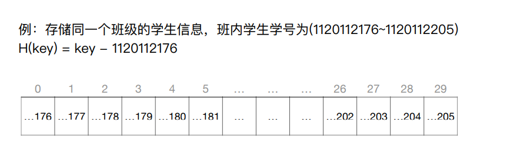

# 查找

## 概念


## 查找算法

### 顺序查找


逐个比对, 通常用于线性表

```c++
typedef struct
{
	ElemType* elems;	//动态数组
	int tableLen;		//length
}SSTable;

int Search_Seq(SSTable ST, ElemType key)
{
	for (int i = 0; i < ST.tableLen; i++)
		if (ST.elems[i] == key) return i;
	return -1;
}
```

#### 优化

##### 有序表

将表中的数据元素递增(递减)排列。不妨假设递增排列，当比对的值大于要查找的值时直接返回查找失败即可。


这就引出了一个查找判定树的概念，用于计算查找成功或失败的时间复杂度。也就是按照线性表的顺序构造二叉排序树。

1. ⼀个成功结点的查找⻓度 = ⾃身所在层数
2. ⼀个失败结点的查找⻓度 = 其⽗节点所在层数
3. 默认情况下，各种失败情况或成功情况都等概率发⽣

##### 根据概率排序

将查找概率大的数据放在查找表的前面，以此减少查找成功的时间。但是同时也就破坏了查找表有序的特点，也就是查找失败的效率又回到了最开始的情况。


### 二分查找


适用于有序的顺序表

```c++
int BinarySearch(SSTable L, ElemType key)	//升序排列
{
	int li = 0, hi = L.tableLen - 1;	//li = low index, hi = high index
	while (li <= hi)
	{
		int mi = (li + hi) / 2;
		if (L.elems[mi] == key) return mi;
		else if (L.elems[mi] < key) li = mi + 1;
		else hi = mi - 1;
	}
	return -1;
}
```

#### 查找判定树

查找判定树就是每次找到mi作为根结点，构造平衡二叉排序树

当mi的计算方式为$\lfloor \frac{li+hi}{2} \rfloor$时，二分查找的查找判定树有如下性质

> ==左子树的结点数目要么比右子树少一个，要么与右子树一样。==
>
> 【分析】当查找表长度为奇数时，mi为正中间的一个，左边和右边的数目相等。
>
> 当查找表的长度为偶数时，mi为靠左边的一个，右边比左边多一个。


> 如果问有n个结点的查找表的二分查找判定树是什么样子的，画的时候按 “优先画右子树，每一个子树画的顺序为‘根->右->左’，当右子树的个数多1的时候就往左子树画“.
> 
>
> 上图结点中的数值为结点编号，也就是当表长为i的时候查找判定树的构造

当mi的计算方法为$\lceil \frac{li+hi}{2} \rceil$时，==左子树的结点数目要么比右子树**多**一个，要么与右子树一样。==

> 画的方法就是 “优先画左子树，每一个子树画的顺序为"根->左->右"，当左子树的个数多1的时候就往右子树画”
> 

### 分块查找


```c++
typedef struct
{
	ElemType maxValue;
	int low, high;
}Index;
ElemType List[100];
```

特点：块内无序，块间有序


#### 查找思想

1. 在索引表中确定待查记录所属的分块（可顺序、可折半）

    > 当采用二分查找时，若索引表中不包含⽬标关键字，则折半查找索引表最终停在 low>high，==要在low所指分块中查找== 如果要查找的值超过索引表中的最大值，则最后low会超上界
    >
    > 【证明】最后low左边一定小于目标关键字，high右边一定大于目标关键字。而分块存储的索引表中保存的是各分块中的最大值。忘了就模拟一下

2. 在块内顺序查找

#### 效率分析


ASL还是求期望，具体问题具体分析比对了几次，最后求期望就行。图中画×的地方是错误的，因为折半查找索引表时，如果查找的关键字(e.g. 27)不在索引表中，那么就是二分查找失败的情况，需要完成整个二分查找，而不是直接找到30，然后就去30的块中进行顺序查找。


> 图中标红的部分是这样来的：对于n个元素，分成b块，每块s个元素，那么就有$n=sb$于是就有$b = \frac{n}{s}$，带入划红线的式子，再对s求导，令导数为0，可以得到极值点。

## B树

### 概念与性质


m阶B树其实就是m叉排序树，同时要附加几个约束：

1. 规定除了根节点外，任何结点⾄少有⌈m/2⌉个分叉，即⾄少含有⌈m/2⌉ − 1 个关键字
2. 所有结点强制平衡：规定对于任何⼀个结点，其所有⼦树的⾼度都要相同。


### m阶B树核心特性

1. 根节点的⼦树数∈[2, m]，关键字数∈[1, m-1]。其他结点的⼦树数∈[ $\lceil m/2 \rceil$, m]；关键字数∈[$\lceil m/2 \rceil-1$, m-1]
2. 对任⼀结点，其所有⼦树⾼度都相同
3. 关键字的值：⼦树0<关键字1<⼦树1<关键字2<⼦树2<…. (类⽐⼆叉查找树 左<中<右)

### 高度计算

问题：含n个关键字的m阶B树，最⼩⾼度、最⼤⾼度是多少？

#### 最小高度

【分析】
$$
最小高度也就是让每个结点尽可能满，有m-1个关键字，m个分叉。\\
于是有，n\le (m-1)(1+m^2+m^3+\cdots+m^{h-1}=m^h-1)，\\所以h\ge log_m(n+1)
$$

#### 最大高度

【分析】
$$
让各层的分叉尽可能的少，即根节点只有2个分叉，其他结点只有\lceil m/2 \rceil个分叉\\
各层结点至少有：第一层1个，第二层2、第三层2\lceil m/2 \rceil\cdots第h层2(\lceil m/2 \rceil)^{h-2}\\
第h+1层共有叶子节点(失败结点)2(\lceil m/2 \rceil)^{h-1}个\\
n个关键字的B树必有n+1个叶⼦结点，于是\\
n+1\ge2(\lceil m/2 \rceil)^{h-1}，也即h\le log_{\lceil m/2 \rceil}\frac{n+1}{2}+1
$$
另一种解法


### 插入与删除


#### 插入


插入80->


插入88->


插入75->


#### 删除

删除60


删除80,用77的结点或者82的结点代替


> 直接前驱：当前关键字左侧指针所指⼦树中“最右下”的元素
>
> 直接后继：当前关键字右侧指针所指⼦树中“最左下”的元素


删除38，则用49代替38的位置，70代替49的位置。


删除90，用88代替90的位置，87代替88的位置


删49，此时左右兄弟都不够借，则将关键字删除后与左（或右）兄弟结点及双亲结点中的关键字进⾏合并


合并之后父亲结点又出问题了


此时继续执行合并


## B+树

### 概念与性质

⼀棵m阶的B+树需满⾜下列条件：


1. 每个分⽀结点最多有m棵⼦树（孩⼦结点）。
2. 非叶根结点⾄少有两棵⼦树，其他每个分⽀结点⾄少有$\lceil m/2 \rceil$棵⼦树。
3. 结点的⼦树个数与关键字个数相等。
4. 所有叶结点包含全部关键字及指向相应记录的指针，叶结点中将关键字按⼤⼩顺序排列，并且相邻叶结点按⼤⼩顺序相互链接起来。=>==叶子结点支持顺序查找==
5. 所有分⽀结点中仅包含它的各个⼦结点中关键字的最⼤值及指向其⼦结点的指针。类比分块查找
6. B+树的查找最终一定会落在叶子结点处。
7. 记录中存放的是对应关键字的信息，比如关键字是id，记录中对应的是学生信息

> 补充知识-为什么要使用B+树：
>
> 在B+树中，非叶结点不含有该关键字对应记录的存储地址。可以使⼀个磁盘块可以包含更多个关键字(读取磁盘块的时间开销很大，因此要尽可能少地读取磁盘块)，使得B+树的阶更⼤，树⾼更矮， 读磁盘次数更少，查找更块

## B树与B+树的对比


|                    | m阶B树                                                       | m阶B+树                                                      |
| :----------------- | ------------------------------------------------------------ | :----------------------------------------------------------- |
| 类比               | ⼆叉查找树的进化->m叉查找树                                  | 分块查找的进化->多级分块查找                                 |
| 根结点关键字个数   | 根节点的关键字数n∈[1, m-1]。                                 | 根节点的关键字数n∈[1, m]                                     |
| 其他结点关键字个数 | 其他结点的关键字数n∈[⌈m/2⌉-1, m-1]                           | 其他结点的关键字数n∈[⌈m/2⌉, m]                               |
| 关键字与分叉       | 结点中的n个关键字对应n+1棵⼦树                               | 结点中的n个关键字对应n棵⼦树                                 |
| 结点包含的信息     | 在B树中，各结点中包含的关键字是不重复的，所有结点中都包含记录的信息 | 叶结点包含全部关键字，非叶结点中出现过的关键字也会出现在叶结点中，只有最下层叶⼦结点才包含记录的信息 |
| 查找方式           | 不⽀持顺序查找。查找成功时，可能停在 任何⼀层结点，查找速度“不稳定” | 支持顺序查找。查找成功或失败都会到达最下⼀层结点，查找速度“稳定” |

相同点：

1. 除根节点外，最少$\lceil m/2 \rceil$个分叉（确保结点不要太“空”）
2. 任何⼀个结点的⼦树都要⼀样⾼（确保“绝对平衡”）

## 散列查找 Hash Table


散列表（Hash Table），⼜称哈希表。是⼀种数据结构，特点是：数据元素的关键字与其 存储地址直接相关


### 处理冲突的方法

#### 拉链法

也就是把每个关键字对应一个链表，将发生冲突的值全部放入这个链表中


#### 拉链法查找效率分析

> 对于指针是否为空的判定不算入查找长度

查找27，查找长度为3

查找20，查找长度为1

查找21，查找长度为0

$ASL_{成功}=\frac{1\times6+2\times4+3+4}{12}=1.75$这个计算方法是将第一层的元素个数*1，第二层乘2，依此类推

同样可以使用将每个元素的查找长度相加最后再除以元素个数的方法来计算，结果一样。

可以得出结论=>==冲突越多，查找效率越低==

$ASL_{失败}=\frac{ 0+ 4 + 0 + 2 + 0 + 0 + 2 + 1 + 0 + 0 + 2 + 1 + 0}{13}=0.92$，这里分母13代表的是散列表的长度。得到的结果是

==装填因子$\alpha=\frac{表中记录数}{散列表长度}$==

装填因子会直接影响查找的效率，对于查找成功的效率而言，装填因子越大，代表冲突越多，查找效率就越低。

#### 开放定址法


##### 线性探测法

 d~i~ = 0, 1, 2, 3, …, m-1；即发⽣冲突时，每次往后探测相邻的下⼀个单元是否为空，如果为空则填入。

需要注意的是

1. 哈希函数值域 [0, 12]		//最大值为模运算获得的值
2. 冲突处理函数值域[0, 15] //整个表

 

###### 查找操作：


例如查找27，先算哈希值为1，然后根据线性探测法的处理方式，依次向后检测。查找长度为4


查找21，算得key为8，依次向后探测，直到出现“空位置”，判定为散列表中无该元素，查找长度为6

因此有结论：==越早遇到空位置，就可以越早确定查找失败==

###### 删除操作：

不能直接删除，例如上图，删除1的话再查找27，27%13=1，往后第2个位置为空，查找失败。

因此在删除时需要进行标记，标记此位置不是真正的“空”，进行逻辑删除

但是这也就引出了另一个问题：


###### 效率分析：


> 线性探测法很容易造成同义词、非同义词的==“聚集（堆积）”现象==，严重影响查找效率
> 产⽣原因——冲突后再探测⼀定是放在某个连续的位置

##### 平方探测法

当$d_i = 0^2, 1^2, -1^2, 2^2, -2^2,\cdots, k^2, -k^2$时，称为平⽅探测法，⼜称⼆次探测法，其中k≤m/2

$d_0 = 0, d_1=1,d_2=-1,d_3=4,d_4=-4\cdots$

⽐起线性探测法更不易产⽣“聚集（堆积）”问题

非重点⼩坑：散列表⻓度m必须是⼀个可以表示成4j + 3的素数，才能探测到所有位置


##### 伪随机序列法


### 常见散列函数

纲领：让不同的关键字冲突尽可能少

#### 除留余数法

 H(key) = key % p

散列表表⻓为m，取⼀个不⼤于m但最接近或等于m的==质数==p

> 质数⼜称素数。指除了1和此整数⾃ 身外,不能被其他⾃然数整除的数
>
> 与质数相对的叫“合数”


#### 直接定址法

 H(key) = key 或 H(key) = a*key + b

其中，a和b是常数。这种⽅法计算最简单，且不会产⽣冲突。它==适合关键字的分布基本连续的情况==，若关键字分布不连续，空位较多，则会造成存储空间的浪费。



#### 数字分析法

选取数码分布较为均匀的若⼲位作为散列地址


#### 平方取中法

取关键字的平⽅值的中间⼏位作为散列地址。

具体取多少位要视实际情况⽽定。==这种⽅法得到的散列地址与关键字的每位都有关系==，因此使得 散列地址分布⽐较均匀，适⽤于关键字的每位取值都不够均匀或均⼩于散列地址所需的位数。

例如1210^2^取中间四位，中间四位与1210中的每一个数字==都有关系==，而结果的第一位与1210中的0没有什么关系。


