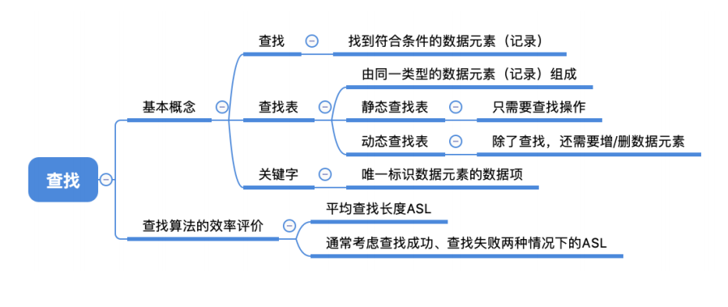
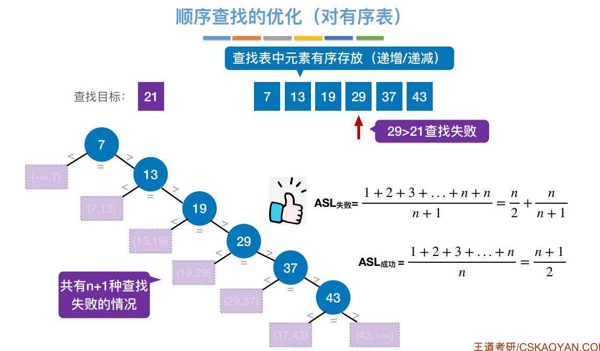

# 查找

## 概念



## 查找算法

### 顺序查找


逐个比对, 通常用于线性表

```c++
typedef struct
{
	ElemType* elems;	//动态数组
	int tableLen;		//length
}SSTable;

int Search_Seq(SSTable ST, ElemType key)
{
	for (int i = 0; i < ST.tableLen; i++)
		if (ST.elems[i] == key) return i;
	return -1;
}
```

#### 优化

##### 有序表

将表中的数据元素递增(递减)排列。不妨假设递增排列，当比对的值大于要查找的值时直接返回查找失败即可。



这就引出了一个查找判定树的概念，用于计算查找成功或失败的时间复杂度。也就是按照线性表的顺序构造二叉排序树。

1. ⼀个成功结点的查找⻓度 = ⾃身所在层数
2. ⼀个失败结点的查找⻓度 = 其⽗节点所在层数
3. 默认情况下，各种失败情况或成功情况都等概率发⽣

##### 根据概率排序

将查找概率大的数据放在查找表的前面，以此减少查找成功的时间。但是同时也就破坏了查找表有序的特点，也就是查找失败的效率又回到了最开始的情况。


### 二分查找


适用于有序的顺序表

```c++
int BinarySearch(SSTable L, ElemType key)	//升序排列
{
	int li = 0, hi = L.tableLen - 1;	//li = low index, hi = high index
	while (li <= hi)
	{
		int mi = (li + hi) / 2;
		if (L.elems[mi] == key) return mi;
		else if (L.elems[mi] < key) li = mi + 1;
		else hi = mi - 1;
	}
	return -1;
}
```

#### 查找判定树

查找判定树就是每次找到mi作为根结点，构造平衡二叉排序树

当mi的计算方式为$\lfloor \frac{li+hi}{2} \rfloor$时，二分查找的查找判定树有如下性质

> ==左子树的结点数目要么比右子树少一个，要么与右子树一样。==
>
> 【分析】当查找表长度为奇数时，mi为正中间的一个，左边和右边的数目相等。
>
> 当查找表的长度为偶数时，mi为靠左边的一个，右边比左边多一个。


> 如果问有n个结点的查找表的二分查找判定树是什么样子的，画的时候按 “优先画右子树，每一个子树画的顺序为‘根->右->左’，当右子树的个数多1的时候就往左子树画“.
> 
>
> 上图结点中的数值为结点编号，也就是当表长为i的时候查找判定树的构造

当mi的计算方法为$\lceil \frac{li+hi}{2} \rceil$时，==左子树的结点数目要么比右子树**多**一个，要么与右子树一样。==

> 画的方法就是 “优先画左子树，每一个子树画的顺序为"根->左->右"，当左子树的个数多1的时候就往右子树画”
> 

### 分块查找


```c++
typedef struct
{
	ElemType maxValue;
	int low, high;
}Index;
ElemType List[100];
```

特点：块内无序，块间有序


#### 查找思想

1. 在索引表中确定待查记录所属的分块（可顺序、可折半）

    > 当采用二分查找时，若索引表中不包含⽬标关键字，则折半查找索引表最终停在 low>high，==要在low所指分块中查找== 如果要查找的值超过索引表中的最大值，则最后low会超上界
    >
    > 【证明】最后low左边一定小于目标关键字，high右边一定大于目标关键字。而分块存储的索引表中保存的是各分块中的最大值。忘了就模拟一下

2. 在块内顺序查找

#### 效率分析


ASL还是求期望，具体问题具体分析比对了几次，最后求期望就行。图中画×的地方是错误的，因为折半查找索引表时，如果查找的关键字(e.g. 27)不在索引表中，那么就是二分查找失败的情况，需要完成整个二分查找，而不是直接找到30，然后就去30的块中进行顺序查找。


> 图中标红的部分是这样来的：对于n个元素，分成b块，每块s个元素，那么就有$n=sb$于是就有$b = \frac{n}{s}$，带入划红线的式子，再对s求导，令导数为0，可以得到极值点。

## B树

### 概念与性质


m阶B树其实就是m叉排序树，同时要附加几个约束：

1. 规定除了根节点外，任何结点⾄少有⌈m/2⌉个分叉，即⾄少含有⌈m/2⌉ − 1 个关键字
2. 所有结点强制平衡：规定对于任何⼀个结点，其所有⼦树的⾼度都要相同。


### m阶B树核心特性

1. 根节点的⼦树数∈[2, m]，关键字数∈[1, m-1]。其他结点的⼦树数∈[ $\lceil m/2 \rceil$, m]；关键字数∈[$\lceil m/2 \rceil-1$, m-1]
2. 对任⼀结点，其所有⼦树⾼度都相同
3. 关键字的值：⼦树0<关键字1<⼦树1<关键字2<⼦树2<…. (类⽐⼆叉查找树 左<中<右)

### 高度计算

问题：含n个关键字的m阶B树，最⼩⾼度、最⼤⾼度是多少？

#### 最小高度

【分析】
$$
最小高度也就是让每个结点尽可能满，有m-1个关键字，m个分叉。\\
于是有，n\le (m-1)(1+m^2+m^3+\cdots+m^{h-1}=m^h-1)，\\所以h\ge log_m(n+1)
$$

#### 最大高度

【分析】
$$
让各层的分叉尽可能的少，即根节点只有2个分叉，其他结点只有\lceil m/2 \rceil个分叉\\
各层结点至少有：第一层1个，第二层2、第三层2\lceil m/2 \rceil\cdots第h层2(\lceil m/2 \rceil)^{h-2}\\
第h+1层共有叶子节点(失败结点)2(\lceil m/2 \rceil)^{h-1}个\\
n个关键字的B树必有n+1个叶⼦结点，于是\\
n+1\ge2(\lceil m/2 \rceil)^{h-1}，也即h\le log_{\lceil m/2 \rceil}\frac{n+1}{2}+1
$$
另一种解法


### 插入与删除


#### 插入


插入80->


插入88->


插入75->


#### 删除

删除60


删除80,用77的结点或者82的结点代替


> 直接前驱：当前关键字左侧指针所指⼦树中“最右下”的元素
>
> 直接后继：当前关键字右侧指针所指⼦树中“最左下”的元素


删除38，则用49代替38的位置，70代替49的位置。


删除90，用88代替90的位置，87代替88的位置


删49，此时左右兄弟都不够借，则将关键字删除后与左（或右）兄弟结点及双亲结点中的关键字进⾏合并


合并之后父亲结点又出问题了


此时继续执行合并

