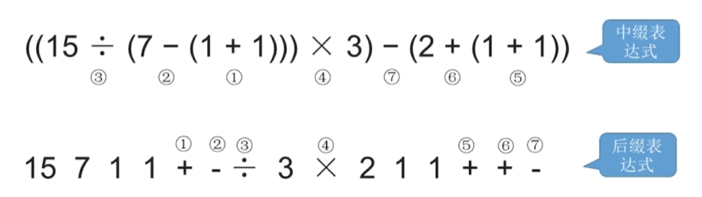
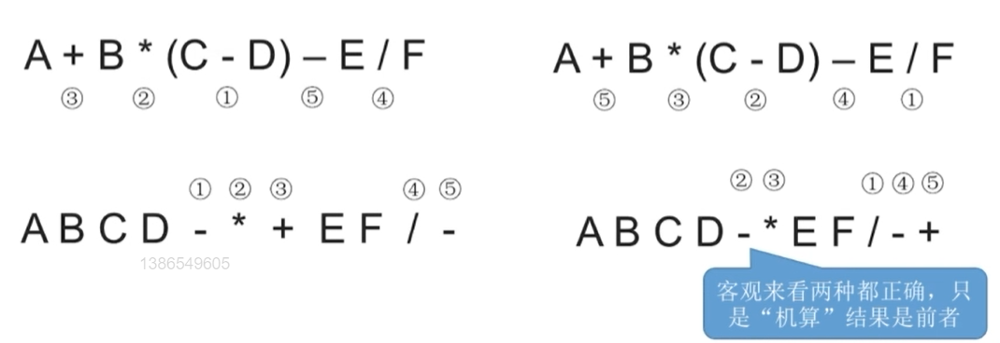
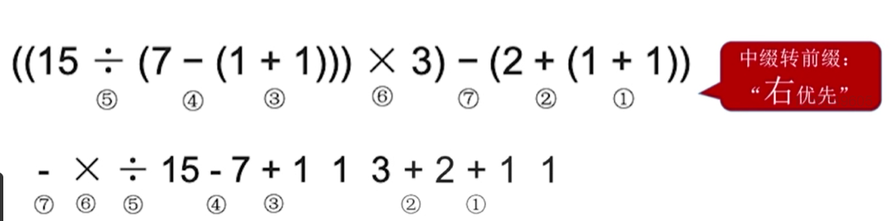
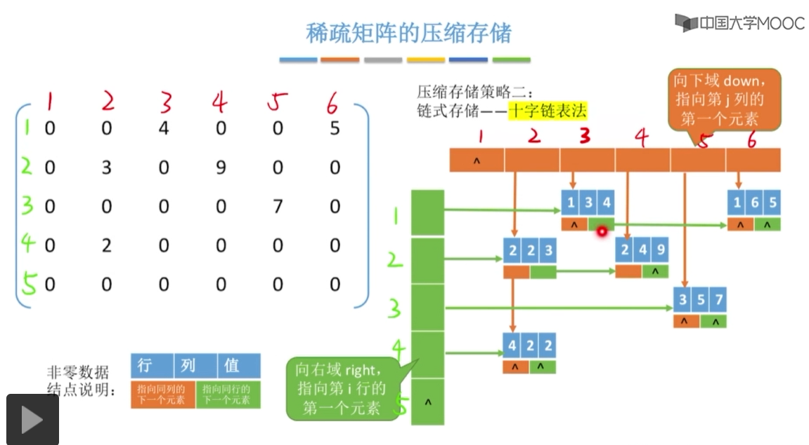

# Stack&Queue

## Stack

### 题型：给定进栈顺序，问合法出栈顺序
n个不同的元素进栈，出栈元素不同排列的个数为 1/(n+1)C 2n n

### 顺序栈

#### 结点定义
```c++
#define MaxSize 10
typedef struct{
    ElemType data[MaxSize];
    int top;
}SqStack;
```

#### 初始化
```c++
void InitStack(SqStack &S)
{
    S.top = -1;
}
```

#### 判断栈空
```c++
bool StackEmpty(SqStack S)
{
    return S.top == -1;
}
```

#### 进栈
```c++
bool Push(SqStack &S, ElemType x)
{
    if(S.top == MaxSize-1)
        return false;
    S.data[++S.top] = x;
    return true;
}
```

#### 出栈
```c++
bool Pop(SqStack &S, ElemType &x)
{
    if(S.top == -1)
        return false;
    x = S.data[S.top--];
    return true;
}
```

#### 读栈顶元素
```c++
bool GetTop(SqStack S, ElemType x)
{
    if(S.top == -1)
        return false;
    x = S.data[S.top];
    return true;
}
```

#### 共享栈
```c++
//设置两个top指针，一个往下减一个往上增
#define MaxSize 10
typedef struct{
    ElemType data[MaxSize];
    int top0;   
    int top1;
}ShStack;

void InitStack(ShStack &S)
{
    S.top0 = -1;
    S.top1 = MaxSize;
}

//栈满的条件：top0 + 1 == top1
```

### 链栈

#### 结点定义
```c++
typedef struct LinkNode{
    ElemType data;
    struct LinkNode *next;
} *LiStack;
```
添加删除相当于仅限制在单链表头部位置的插入和删除

## Queue

### 顺序结构

#### 结点定义
```c++
#define MaxSize 10
typedef struct{
    ElemType data;
    int front, rear;//front指向队头元素,rear指向队尾元素的后一个位置
}SqQueue;
```

#### 初始化

```c++
void InitQueue(SqQueue& Q)
{
	Q.front = Q.rear = 0;
}
```

#### 判断是否为空

```c++
bool QueueEmpty(SqQueue Q)
{
    return Q.rear == Q.front;
}
```

#### 入队

```c++
bool Enqueue(SqQueue& Q, ElemType x)
{
  //如果不浪费这个存储空间，则判断队列满的条件就与判断队空的条件冲突了
	if ((Q.rear + 1) % MaxSize == Q.front) return false;
	Q.data[Q.rear] = x;
	Q.rear = (Q.rear + 1) % MaxSize;
	return true;
}
```

#### 出队

```c++
bool Dequeue(SqQueue& Q, ElemType& x)
{
	if (Q.rear == Q.front)
		return false;
	x = Q.data[Q.front];
	Q.front = (Q.front + 1) % MaxSize;
	return true;
}
```

#### 获取队头元素

```c++
bool GetHead(SqQueue Q, ElemType& x)
{
	if (Q.rear == Q.front) return false;
	x = Q.data[Q.front];
	return true;
}
```

#### 获取元素个数

```c++
int Count(SqQueue& Q)
{
	return (Q.rear - Q.front + MaxSize) % MaxSize;
}
```

#### 避免浪费无法使用的那个空间的结点定义

```c++
#define MaxSize 10
typedef struct{
    ElemType data;
    int front, rear;//front指向队头元素,rear指向队尾元素的后一个位置
    int size;	//队列当前长度
}SqQueue;

typedef struct{
    ElemType data;
    int front, rear;//front指向队头元素,rear指向队尾元素的后一个位置
    int tag; //描述最近进行的是删除还是插入操作，从而判断队空还是队满	
}SqQueue;
```

### 链式

#### 结点定义

```c++
typedef int ElemType;

typedef struct LinkNode {
	ElemType data;
	struct LinkNode* next;
}LinkNode;

typedef struct {
	LinkNode* front, * rear;
}LinkQueue;
//带头结点版本，front指向头节点；不带头结点的版本，front指向第一个元素
```

#### 初始化

```c++
void InitQueue(LinkQueue& Q)
{
	//初始化时,front,rear都指向头节点
	Q.front = Q.rear = new LinkNode;
	Q.front->next = NULL;
}

//不带头结点
void InitQueue(LinkQueue& Q)
{
	Q.front = NULL;
	Q.rear = NULL;
}
```

#### 判空

```c++
bool IsEmpty(LinkQueue Q)
{
	return Q.front == Q.rear;
	//return Q.front->next == NULL;
}

//不带头结点
bool IsEmpty(LinkQueue Q)
{
	return Q.front == NULL;
}
```

#### 入队

```c++
void Enqueue(LinkQueue& Q, ElemType x)
{
	LinkNode* s = new LinkNode;
	s->data = x;
	s->next = NULL;
	Q.rear->next = s;
	Q.rear = s;
}

//不带头结点
void Enqueue(LinkQueue& Q, ElemType x)
{
	LinkNode* s = new LinkNode;
	s->data = x;
	s->next = NULL;
	if (Q.front == NULL)	//在空队列中插入第一个元素，不带头结点需要特殊处理
	{
		Q.front = s;
		Q.rear = s;
	}
	else
	{
		Q.rear->next = s;
		Q.rear = s;
	}
}
```

#### 出队

```c++
//带头结点
bool DeQueue(LinkQueue& Q, ElemType& x)
{
	if (Q.front == Q.rear) return false;	//空队
	LinkNode* p = Q.front->next;
	x = p->data;
	Q.front->next = p->next;
	if (Q.rear == p) Q.rear = Q.front;	//删除的结点时最后一个结点需要特殊处理
	delete p;
	return true;
}

//带头结点
bool DeQueue(LinkQueue& Q, ElemType& x)
{
	if (Q.front == NULL) return false;	//空队
	LinkNode* p = Q.front;
	x = p->data;
	Q.front = p->next;
	if (Q.rear == p)	//删除的是最后一个结点，需要特殊处理
	{
		Q.front = NULL;	//这句话可以不要，因为如果删除的是最后一个结点，他本身的next就指向NULL
		Q.rear = NULL;
	}
	delete p;
	return true;
}
```

## 栈与队列的应用

### 栈 -- 括号匹配


```c++
bool BracketMatch(char str[], int length)
{
	stack<char> S;
	for (int i = 0; i < length; i++)
	{
		if (str[i] == '(' || str[i] == '[' || str[i] == '{')//左括号,入栈
			S.push(str[i]);
		else
		{
			if (S.empty())	//扫描到右括号且栈空
				return false;

			char topElem;
			topElem = S.top();
			S.pop();
			if (str[i] == ')' && topElem != '(')
				return false;
			if (str[i] == ']' && topElem != '[')
				return false;
			if (str[i] == '}' && topElem != '{')
				return false;
		}
	}

	return S.empty();	//检索玩全部括号后,栈空说明匹配成功
}
```

### 栈 -- 表达式求值

| 中缀表达式    | 后缀表达式               | 前缀表达式    |
| ------------- | ------------------------ | ------------- |
| a + b         | a b +                    | + a b         |
| a + b - c     | a b + c -    (a b c - +) | - + a b c     |
| a + b - c * d | a b + c d * -            | - + a b * c d |

#### 中缀表达式转后缀表达式方法：

1. 确定中缀表达式中各个运算符的运算顺序
2. 选择下一个运算符，按照 `左操作数 右操作数 运算符`的方式组合成一个新的操作数
3. 如果还有运算符没有被处理，就继续 2






**保持与机算结果一致: 遵循"左优先原则" 只要左边的运算符能优先计算, 就优先算左边的**

#### 后缀表达式手算方法：

> 从左往右扫描，每遇到一个运算符，就让运算符前面最近的两个操作数执行对应运算，合并为一个操作数， 先弹出栈的是**右操作数**

#### 中缀转前缀的方法

1. 确定中缀表达式中**各个运算符的运算顺序**
2. 确定下一个运算符，按照 `运算符 左操作数 右操作数`的方式组合成一个新的操作数
3. 如果还有运算符没被处理，就继续 2

右优先原则：只要右边的运算符能先计算，就优先算**右边**的



#### 前缀表达式计算

1. 从右往左扫描下一个元素，直到处理完所有元素
2. 若扫描到操作数则压入栈，并回到1；否则执行3
3. 若扫描到运算符，则弹出两个栈顶元素，执行相应运算，运算结果压回栈顶，回到1 (先弹出的是“左操作数”)

### 栈 --递归

### 队列 --层次遍历&BFS

### 队列 --操作系统中的应用

多个进程争抢有限系统资源　FCFS是一种常用策略(可用队列实现)

打印数据缓存区，用队列存放暂时还不能处理的数据。当一个还没有打印完的时候，将请求打印的放入队列。可缓解主机域打印机速度不匹配的问题

## 矩阵压缩

普通矩阵存储可以使用二维数组

某些特殊矩阵可以压缩存储空间

### 对称阵

上下三角区的内容完全相同，因此有压缩策略：只存储主对角线和上/下三角区

#### 策略：主对角线+下三角区

按行优先原则将各个元素存入一维数组中 => 数组大小 = 1+2+3+...+n = (1+n)*n/2

如何将矩阵下标映射到一维数组的下标?

> a[i,j] 是第几个元素？( i>=j )
>
> [分析] 第i行有i个元素 (i∈1,2,3,...n)
>
> 因此a[i,j]对应的位置就是前i-1行的元素加上j
>
> 由于一维数组下标从0开始，因此对应的一维数组下标 ` k = i(i-1)/2 + j -1`

> a[i,j] 是第几个元素？( i<j ) 也可根据字母轮换对等性直接得到结果，将上述结果中i，j互换即可
>
> [分析] 第j列有j个元素 (j∈1,2,3,...n)
>
> 因此a[i,j]对应的位置就是前j-1列的元素加上i
>
> 由于一维数组下标从0开始，因此对应的一维数组下标 ` k = j(j-1)/2 + i -1`

### 三角矩阵

#### 下三角矩阵

除了主对角线和下三角区，其余元素都相同(常量)

压缩策略：按`行优先`原则将主对角线以及下三角区存入一位数组中，并在最后一个位置存储常量

> 矩阵中 a[i,j]对应在一维数组中的下标是怎样的？
>
> 与之前推导过程一样，只是访问上三角区域的常量时改变
>
> > k = i(i-1)/2 +j -1  i≥j (下三角以及主对角线)
> >
> > k = n(n+1)/2      i<j (上三角区域)

#### 上三角矩阵

除了主对角线和上三角区，其余元素都相同(常量)

压缩策略：按`行优先`原则将主对角线以及上三角区存入一位数组中，并在最后一个位置存储常量

> 矩阵中 a[i,j]对应在一维数组中的下标是怎样的？ ( i ≤ j )
>
> a[i,j]之前有 `i-1`行，第1行道第`i-1`行的元素个数为 n + (n-1) + ... + (n-i+2) = (i-1)(2n-i+2)/2
>
> 在第`i`行，第`j`个位置之前有j-i个元素
>
> 因此a[i,j]对应的元素下下标为 (i-1)(2n-i+2)/2 + (j - i)
>
> > k = (i-1)(2n-i+2)/2 + (j - i)  i ≤ j (上三角以及主对角线)
> >
> > k = n(n+1)/2      i > j (下三角区域)

### 三对角矩阵

当 | i - j | > 1 时，a[i,j] = 0，异爪型(两个外爪子都并到主对角线旁边的那种)

每一行有三个元素，第一行和最后一行有两个元素，故数组长度为 `3n-2`

> 映射关系 按行优先
>
> 前 i - 1 行一共有 3(i - 1) - 1 个元素
>
> a[i,j] 是第i行第 j - i + 2 个元素
>
> a[i,j] 是第 2i + j - 2 个元素
>
> 数组下标从0开始 => k = 2i + j - 3
>
> 
>
> 已知k，怎么对应 i 和 j
>
> 显然，是第k+1个元素，前i-1行共有 3(i-1) - 1 个元素
>
> 显然，3(i-1) - 1 < k+1 ≤ 3i - 1
>
> => i ≥ (k+2)/3  用编程语言描述就是 i = ⌈(k+2)/3⌉  //向上取整
>
> 由 k = 2i + j - 3 => j = k - 2i + 3

 ### 稀疏矩阵

非零元素远远少于矩阵元素的个数

策略：

1. 顺序存储 -- 三元组<行，列，值>
2. 十字链表法


### 易错点

1. 存储上三角？下三角？
2. 行优先？列优先？//行优先就是一行一行存，列优先就是一列一列存
3. 矩阵元素的下标从0开始还是从1开始
4. 数组下标从0开始还是从1开始