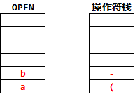
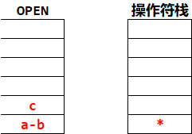
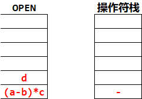

# 栈与队列

## 0. 总结

## 1. 选择题

### 1.1 栈

> 设链表不带头结点且所有操作均在表头进行，则下列最不适合作为链栈的是( C )
>
> A. 只有表头结点指针，没有表尾指针的双向循环链表
>
> B. 只有表尾结点指针，没有表头指针的双向循环链表
>
> C. 只有表头结点指针，没有表尾指针的单向循环链表
>
> D. 只有表尾结点指针，没有表头指针的单向循环链表
>
> > 解析：对于双向循环链表，不管是表头指针还是表尾指针，都可以方便地找到表头结点，方便在头部做插入删除操作。而单循环链表通过尾指针可以方便的找到表头，而且很方便删除，但是通过表头指针找到尾指针从而删除头指针是比较烦琐的，需要O(n)，错选了D，没仔细看题目。

### 1.2 栈

> 一个栈的入栈序列为 1, 2, 3, ..., n，出栈序列是 P1, P2, P3, ..., Pn. 若P2 = 3，则P3可能取值的个数为( C )
>
> A. n - 3     B. n - 2     C. n - 1     D. 无法确定
>
> > 解析：显然，3之后的4到n都是可以取的数。接下来分析1和2，P1可以是3之前入栈的数( 1和2 )，也可以是4，当P1为1时，P3可以取2，当P1为2时，P3可以取1，当P1为4时，P3可以取除了1, 3, 4 之外的所有数。故P3可能的取值个数为 n-1

### 1.3 队列

> 循环队列存储在数组A[0, ..., n]中, 入队时的操作为(D)
>
> A. rear = rear+1					B. rear = (rear + 1) mod (n - 1)
>
> C. rear = (rear + 1) mod n    D. rear = (rear + 1) mod (n + 1)
>
> > 草率了，没细看

###  1.4 队列

> 已知循环队列存储在一维数组A[0, ... , n-1]中，且队列非空时front和rear分别指向队头元素和队尾元素。若初始时队列为空，且要求第一个进入队列的元素存储在A[0]处，则初始front和rear的值分别是(  B  )
>
> A. 0, 0			B. 0, n-1			C. n-1, 0			D. n-1, n-1
>
> > 数组模拟循环队列有两种情况，一种是rear指向队尾元素后一个位置，还有一种是rear指向队尾元素，两种情况判满判空有所不同。本题对应的是第二种
> >
> > 根据题意，第一个元素进入队列后会存储在A[0]处，此时front 和 rear 的值都是0。入队时由于需要执行(rear + 1)%n的操作，所以若入队后指针指向0，则rear初值为n-1，而由于第一个元素在A[0]，插入操作只改变rear指针，所以front = 0 不变。

### 1.5 队列

> 假设一个循环队列Q[MaxSize]的队头指针为front，队尾指针为rear，队列的最大容量为 MaxSize，除此之外，该队列再没有其他数据成员，则判断该队的列满条件是( C )
>
> A. Q.front == Q.rear
>
> B. Q.front + Q.rear >= MaxSize
>
> C. Q.front == (Q.rear+1)%MaxSize
>
> D. Q.rear = (Q.front+1)%MaxSize
>
> > 牺牲一个存储单元来区分是队空还是队满，约定以“队列头指针在队尾指针的下一位置作为队满标志”。
> >
> > 喝高了，选的D

### 1.6 队列

> 最适合用作链队的链表是( B )
>
> A. 带队首指针和队尾指针的循环单链表
>
> B. 带队首指针和队尾指针的非循环单链表
>
> C. 只带队首指针的非循环单链表
>
> D. 只带队首指针的循环单链表
>
> > 由于队列需要在双端进行操作，选项C和D显然不适合链队。选项A的链表在完成进队和出队之后还要修改为循环的，对于队列来讲是多余的(画蛇添足)。<= 就nm离谱

### 1.7 队列

> 用链式存储方式的队列进行删除操作时需要( D )
>
> A. 仅修改头指针									B. 仅修改尾指针
>
> C. 头尾指针都要修改							 D. 头尾指针可能都要修改
>
> > 队列用链式存储时，删除元素从表头删除，通常仅需要修改头指针，但若队列中仅有一个元素，则尾指针也需要被修改，当仅有一个元素时，删除后若队列为空，需修改尾指针为 rear = front

### 1.8 栈与队列的应用

> 下列说法中，正确的是( A )
>
> A. 消除递归不一定需要使用栈
>
> B. 对同一输入序列进行两组不同的合法入栈和出栈组合操作，所得的输出序列相同
>
> C. 通常使用队列来处理函数调用或过程调用
>
> D. 队列和栈都是运算受限的线性表，只允许在表的两端进行运算。
>
> > 使用栈可以模拟递归的过程，以此来消除递归，**但对于单项递归和尾递归而言，可以用迭代的方式来消除递归。**A对；不同的进栈和出栈组合操作，会产生许多不同的输出序列，B错；通常使用栈来处理函数或过程调用，C错；队列和栈都是操作受限的线性表，但只有队列允许在表的两端进行运算，而栈只允许在栈顶方向进行操作，D错。

### 1.9 中缀表达式转后缀表达式

操作符优先级

| 操作符 | #    | (    | * /  | + -  | )    |
| ------ | ---- | ---- | ---- | ---- | ---- |
| 栈内   | 0    | 1    | 5    | 3    | 6    |
| 栈外   | 0    | 6    | 4    | 2    | 1    |

将中缀表达式转换为后缀表达式的算法思想如下：

1. 从左到右扫描中缀表达式；
2. 遇到数字时，加入后缀表达式

遇到运算符

1. 若为 ' ( '，入栈
2. 若为 ' ) '，依次把栈中的运算符加入后缀表达式，直到出现' ( '，从栈中删除' ( '
3. 若为除括号外的其他运算符，当其优先级高于除了 ' ( ' 以外的栈顶运算符时，直接入栈。否则从栈顶开始，以此弹出比当前处理的运算符优先级高和优先级相等的运算符，直到遇到一个比它优先级低的或者遇到一个左括号为止。

> 高入低出，出到自己最高为止。

### 1.10 中缀表达式求值

如果题目考察使用栈求中缀表达式的值的栈深度，将中缀表达式转后缀表达式中的弹栈看作是进行运算即可，在没有进行运算之前，表达式中的操作数和操作符需要使用两个栈来维护。

> 例题：利用栈求表达式的值时，设立运算数栈OPEN。假设OPEN只有两个存储单元，则在下列表达式中，不会发生溢出的是：(B)
>
> A. a-b*(c-d)				B. (a-b) * c - d			C. (a-b*c)-d			D. (a-b) * (c-d)
>
> > 例如正确答案B，
> > 遇到 ' ) '时两个栈的内容如下图，遇到 ' ) '之后弹栈进行运算
> >  此时OPEN的元素个数为2
> > 遇到 ' * '，入栈，遇到 c 入栈，遇到 ' - '
> > 
> > 此时操作符栈中为乘号，弹出两个数字进行运算，然后将运算结果压入栈中
> > 遇到 d 压入操作数栈 扫描结束
> > ，取出运算即可得到结果。
> >
> > A，C，D对应的最大栈深度分别为 4，3，3，可自行模拟

## 2. 判断序列是否中心对称

假设单链表的表头指针为L，结点结构为 [data, next]，其中data域为字符型，设计算法判断该链表的全部n个字符是否中心对称。例如xyx，xyyx都是中心对称。

> [分析] 拿到这道题的疑惑点：表头指针是否代表有头结点。如果带头结点的话我的思路就可以用。看了答案之后是带头结点的。
>
> 我的思路：快慢指针，找到中间节点`(见C2线性表笔记中总结的使用快慢指针查找中间节点有何不同)`，然后将后半部分逆置，slow最终指向Round(n/2)，然后再从第一个元素开始与后半部分进行比较。时间复杂度，找到中间节点 O(n/2) 逆置O(n/2)，比较O(n/2)
>
> 答案思路：题目给出了元素的个数n，因此用一个数组和一个下标变量模拟栈，将前n/2个字符放入模拟的栈中，然后继续遍历链表，与每次弹栈的元素进行比较。当元素个数为奇数的时候需要先将指针后移一位，再与弹栈的元素相比。

```c++
bool SymmetryString(LinkList L, int n)
{
	int i;
  //这里使用new是因为 char s[n/2]的语法在vs中过不去，但是答案上是这样写的，感觉用vector也可以。
  //考试的话自己应该会用vector
	char* s = new char[n / 2];		
	Node* p = L->next;
	for (i = 0; i < n / 2; i++)
	{
		s[i] = p->data;
		p = p->next;
	}
	i--;								//让i指向栈顶元素
	if (n % 2 == 1)		//元素个数为奇数
		p = p->next;
	while (p != NULL && s[i] == p->data)
	{
		i--;
		p = p->next;
	}
	return i == -1;
}
```

## 3. 利用一个栈实现以下递归函数的非递归计算

$$
\left\{\begin{array}{lr}
1 ,  &  n=0\\
2x,& n=1\\
2xP_{n-1}(x)-2(n-1)P_{n-2}(x), &n>1
\end{array}
\right.
$$

> 【分析】其实不用栈，只需要先算出第0项和第1项之后用一个循环从n开始循环计算，维护两个数字就好了，但是题目要求用栈，就把需要使用的信息：n，当前层数的运算结果放入栈中，然后依次弹栈就可以了。

```c++
typedef struct
{
	int n, val;
}Node;
int CalculateByStack(int n, int x)
{
	stack<Node> st;				//这里使用了STL中的stack，需#include<stack>
	int first = 1, second = 2 * x;	//first 代表fn-2(x) second　代表 fn-1(x) 
	for (int i = n; i >= 2; i--)
	{
		Node t;
		t.n = i;				//将每一层的n放入栈中
		st.push(t);
	}
	while (!st.empty())
	{
		st.top().val = 2 * x * second - 2 * (st.top().n - 1) * first;
		first = second;
		second = st.top().val;
		st.pop();
	}
	return second;
}
```

## 4. 队列应用题

某汽车轮渡口，过江渡船能载10辆车过江。过江车辆分为客车类和货车类，上渡船有如下规定：同类船先到先上船；客车先于货车上船，且每上４辆客车，才允许上一辆货车；若等待的客车不足４辆，则以货车代替；若无货车等待，允许客车都上船。试设计一个算法模拟渡口管理。

> 【分析】放上来的原因不是因为算法难度很大，而是刚看的时候有一会没理解懂这个题目在表达什么。。
>
> 翻译：两个队列，一个货车队列，一个客车队列，客车队列上４个货车才能上，如果有一个队列是空的，另一个就一直上。直到上到10个为止。参考答案给的代码感觉没有自己写的简洁，所以放自己的代码。

```c++
void LoadManagement(queue<char>& buses, queue<char>& trucks, vector<char>& load)
{
  //使用了STL中的　queue vector 需#include<queue> #include<vector>
	int busCnt = 0;		//当前上了几辆客车了
	int cnt = 0;		//船上有几辆车了
	while (cnt < 10)
	{
		while (!buses.empty())
		{
			load.push_back(buses.front());
			buses.pop();
			busCnt++;
			cnt++;
			if (busCnt == 4)
			{
				busCnt = 0;
				break;
			}
		}
		if (!trucks.empty())
		{
			load.push_back(trucks.front());
			cnt++;
			trucks.pop();
		}
		if (buses.empty() && trucks.empty()) break;	//队列都空了，但是还没上够10辆车
	}
}
```

