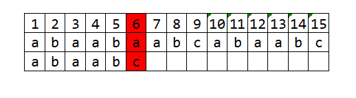
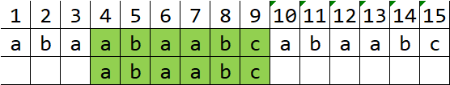

# 串
## 1. KMP
> 设主串T = "abaabaabcabaabc", 模式串 S = "abaabc", 采用KMP算法进行模式匹配，到匹配成功时截止，再匹配过程中进行的单个字符之间的比较次数是()
> A. 9      B. 10       C.12        D.15
>> [分析]：第一次匹配在第６个位置失配
>> 
>> 根据其next值=2可知下一次移动的情况
>> 
>> 匹配成功，由此可计算出总共的匹配次数为10次
>> **需要注意的是失配的那一次容易忘记计算。**

## 2. 子串

> 若串 S = 'software', 其子串数目为__ __ __
>
> A. 8
>
> B. 37
>
> C. 36
>
> D. 9
>
> 字符串的子串就是某一个连续片段。空串也算一个
>
> 含有n个不同字符的字符串的非空子串个数为 $C_{n+1}^2 = \frac{n\times(n+1)}{2}$
>
> 子串(包括空串)个数为：$C_{n+1}^2 = \frac{n\times(n+1)}{2}+1$
>
> 非空真子串(不包括空串和自己一样的子串)个数为$C_{n+1}^2 = \frac{n\times(n+1)}{2}-1$

## 计算next值的方法
这里的所有next值以1为起始值，如果题目中以0为起始值则全部减一即可

> 例如 "abac" 这个串
>
> 1. 首先：第一个位置为0，第二个位置为1，这是适用于所有串的。
> 2. 然后看第三个字母，它之前的子串为"ab"，最长的相等的前后缀长度为0，故用它的长度减去这个0，得到了2, 然后因为a是第3个字母，故next = 3-2 = 1
>    同理，看第四个字母, 它之前的子串为 "aba"，最长的相等的前后缀长度为1，故用它的长度减去这个1, 也就是Length("aba")-1 = 2，因为c是第4个字母，因此next = 4-2 = 2