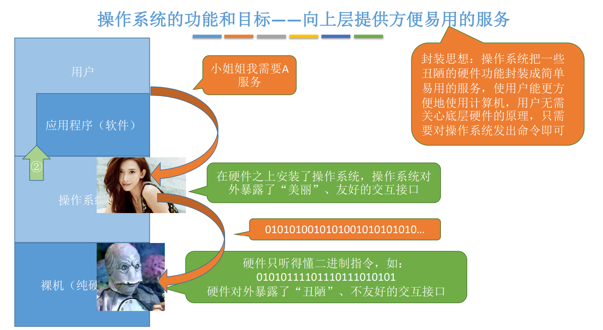
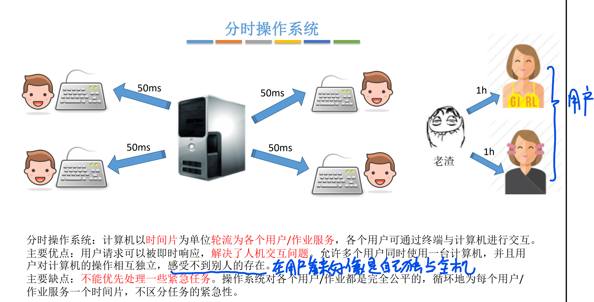

# 计算机系统概述

## 基本概念

### 功能和目标

## 特征

## 发展与分类

### 手工操作阶段

### 批处理阶段-单道批处理

### 批处理阶段-多道批处理

### 分时操作系统

### 实时操作系统

### 其他操作系统

## 运行机制

“指令”是处理器（CPU）能识别、执行的最基本命令

CPU 有两种状态，“==内核态==”和“==用户态==”

处于内核态时，说明此时正在==运行的是内核程序==，此时==可以执行特权指令== 

处于用户态时，说明此时正在==运行的是应用程序==，此时==只能执行非特权指令==

### 如何判断此时执行的是内核程序还是应用程序

### 如何切换两种状态

### 两种指令、状态、程序

### 内核

> 原语是一种特殊的程序，具有原子性。也就是说这段程序的运行必须一气呵成，不可被中断。

## 中断

“中断”是让操作系统内核夺回CPU使用权的唯一途径

### 中断的分类

### 中断的基本原理

## 系统调用

是操作系统提供给应用程序（程序员/编程人员）使用的接口，可以理解为一种可供应用 程序调用的特殊函数，==应用程序可以通过系统调用来请求获得操作系统内核的服务==

### 与库函数的区别

库函数中的一些函数涉及系统调用

### 什么功能需要系统调用

> 如果没有系统调用的话，各个应用程序都可以同时访问共享资源，会导致一些不希望的后果。
>
> 有了系统调用，这些共享资源就可以由操作系统进行统一调配

### 系统调用的过程

## 回顾

