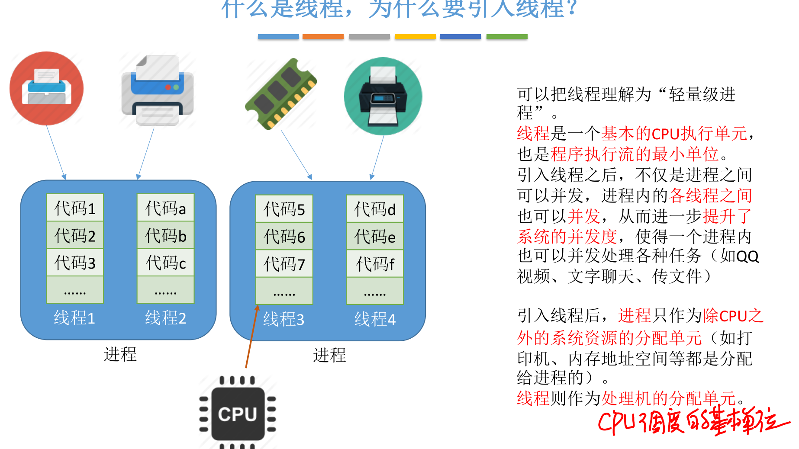
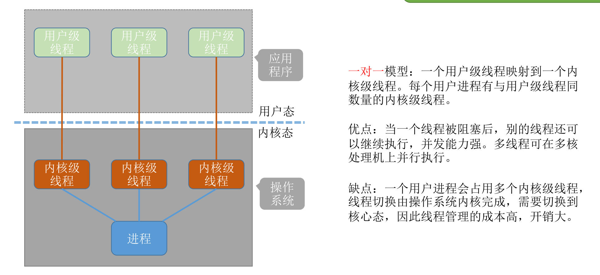

# 进程管理

[TOC]

## 进程的概念、组成、特征

### 概念

程序：==静态的==，就是放在磁盘里的可执行文件，例如QQ.exe

进程：==动态的==，是程序(进程实体)的一次执行过程

同一个程序多次执行会对应不同的进程

### 组成

### 特征

## 进程的状态与转换、进程的组织

### 状态

### 转换/丁字裤模型

### 组织方式

## 进程控制

### 基本概念

进程控制就是要实现进程状态转换

> 为什么进程控制要用原语来实现：
>
> 

### 相关原语

1. 更新PCB中的信息 

   ​	a. 所有的进程控制原语一定都会修改进程状态标志 

   ​	b. 剥夺当前运行进程的CPU使用权必然需要保存其运行环境 

   ​	c. 某进程开始运行前必然要恢复期运行环境

2. 将PCB插入合适的队列

3. 分配/回收资源

#### 创建

#### 终止

#### 阻塞、唤醒

#### 切换

#### 总览

## 进程通信

> 为什么进程通信需要操作系统支持：
>
> 为了保证安全，一个进程不能直接访问另 一个进程的地址空间

### 共享存储

为了避免出错，各个进程对共享空间的==访问==是==互斥==的

### 消息传递

#### 直接通信

#### 间接通信

### 管道通信

> 写进程往管道写数据，即便管道没被写满，==只要管道没空，读进程就可以从管道读数据==
>
> 读进程从管道读数据，即便管道没被读空，==只要管道没满，写进程就可以往管道写数据==

## 线程的概念与特点

### 为什么要引入线程

### 引入线程带来的变化

### 线程的属性

### 线程的实现方式

#### 用户级线程

#### 内核级线程

### 多线程模型

#### 一对一

#### 多对一

#### 多对多

## 调度的概念

> 简单理解：
>
> 高级调度：进程创建/销毁
>
> 中级调度：进程放到外存，放回内存
>
> 低级调度：进程分配处理机

## 进程调度

### 进程调度的时机

### 进程调度的方式

### 进程的切换与过程

## 调度算法的评价指标

> 所有周转时间都是越小越好

## 调度算法

### 先来先服务

### 短作业优先

#### 抢占式

#### 非抢占式

#### 注意

### 高响应比优先

==FCFS 算法==是在每次调度的时候选择一个等待时间最长的作业（进程）为其服务。但是没有考虑到作业的运行时间，因此导致了对==短作业不友好==的问题

==SJF 算法==是选择一个执行时间最短的作业为其服务。但是又完全不考虑各个作业的等待时间，因 此导致了对==长作业不友好==的问题，甚至还会造成==饥饿问题==

高响应比优先既考虑到各个作业的等待时间，也兼顾运行时间

### 时间片轮转

#### 时间片小

#### 时间片大

### 优先级调度

#### 非抢占式

#### 抢占式

### 多级反馈队列调度

## 进程同步、互斥

### 同步

### 互斥

