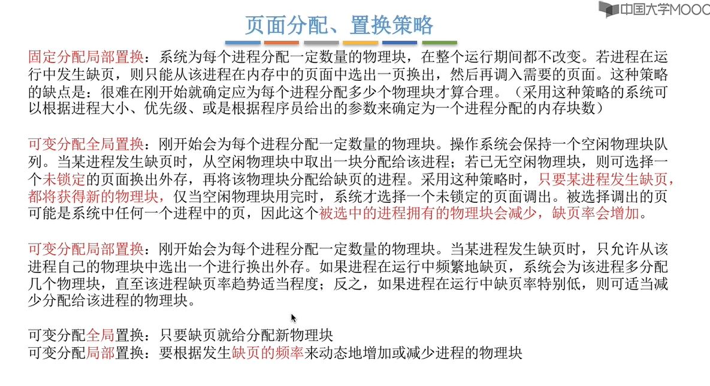
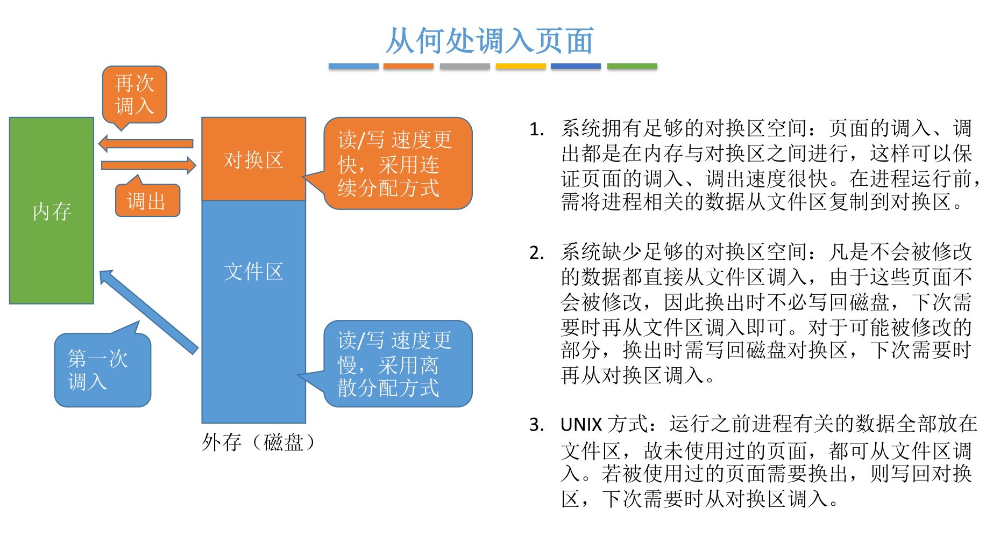

# 内存管理

[TOC]

## 内存基础知识

### 逻辑地址 vs 物理地址

### 从写程序到运行

### 三种链接方式

### 三种装入方式

## 内存管理的概念

### 内存空间的分配与回收

### 内存空间的扩充（虚拟性）

### 地址转换(装入方式)

### 内存保护

> 操作系统需要提供==内存保护==功能。保证==各进程在各自存储空间内运行，互不干扰==

## 覆盖与交换=>扩充内存空间

### 覆盖

### 交换技术

## 连续分配管理

### 单一连续分配

### 固定分区分配

### 动态分区分配

> ==动态分区分配（可变分区分配）==这种分配方式==不会预先划分内存分区==，而是在进程装入内存时， ==根据进程的大小动态地建立分区==，并使分区的==大小正好适合==进程的需要。因此系统分区的大小和数目是可变的。（eg：假设某计算机内存大小为64MB，系统区8MB，用户区共 56 MB…）
>
> 

#### 采用什么数据结构用来记录

#### 分配算法

##### 首次适应

##### 最佳适应

##### 最坏适应(最大适应)

##### 临近适应

#### 如何回收

## 基本分页存储管理概念

### 什么是分页存储

### 页表

### 如何得到页号与页内偏移量

## 基本地址变换机构

## 具有快表的地址变换机构

### 什么是快表

### 访存流程

### 局部性原理

## 两级页表

### 单级页表存在的问题

### 页表过大解决方案

### 常驻内存解决方案

### 如何实现地址转换

### 细节

## 基本分段存储管理

### 分段

### 段表

### 地址变换

### 分段与分页的对比

## 段页式管理

### 分段+分页

### 段表、页表

### 地址变换

## 虚拟内存的基本概念

### 传统存储管理的特征、缺点

### 局部性原理

### 虚拟内存的定义和特征

### 如何实现

## 请求分页管理方式

### 与基本分页的区别

### 页表机制

### 缺页中断机构

### 地址变换机构

## 页面置换算法

### 最佳置换OPT

> 际上，只有在进程执行的过程中才能知道接下来会访问到 的是哪个页面。操作系统无法提前预判页面访问序列。因此，最佳置换算法是无法实现的。

### 先进先出FIFO

### 最近最久未使用

### 时钟置换CLOCK

### 时钟置换升级版

## 页面分配策略

### 何时调入页面

### 从何处调入

### 抖动（颠簸）、工作集

