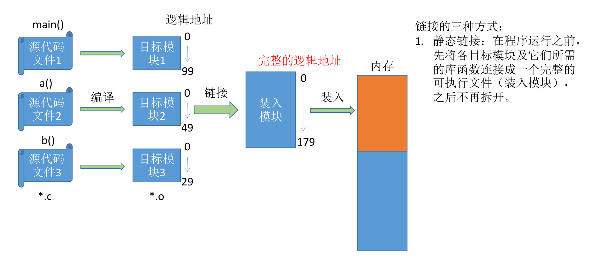

# 内存管理

[TOC]

## 内存基础知识

### 逻辑地址 vs 物理地址

### 从写程序到运行

### 三种链接方式

### 三种装入方式

## 内存管理的概念

### 内存空间的分配与回收

### 内存空间的扩充（虚拟性）

### 地址转换(装入方式)

### 内存保护

> 操作系统需要提供==内存保护==功能。保证==各进程在各自存储空间内运行，互不干扰==

## 覆盖与交换=>扩充内存空间

### 覆盖

### 交换技术

## 连续分配管理

### 单一连续分配

### 固定分区分配

### 动态分区分配

> ==动态分区分配（可变分区分配）==这种分配方式==不会预先划分内存分区==，而是在进程装入内存时， ==根据进程的大小动态地建立分区==，并使分区的==大小正好适合==进程的需要。因此系统分区的大小和数目是可变的。（eg：假设某计算机内存大小为64MB，系统区8MB，用户区共 56 MB…）
>
> 

#### 采用什么数据结构用来记录

#### 分配算法

##### 首次适应

##### 最佳适应

##### 最坏适应(最大适应)

##### 临近适应

#### 如何回收

