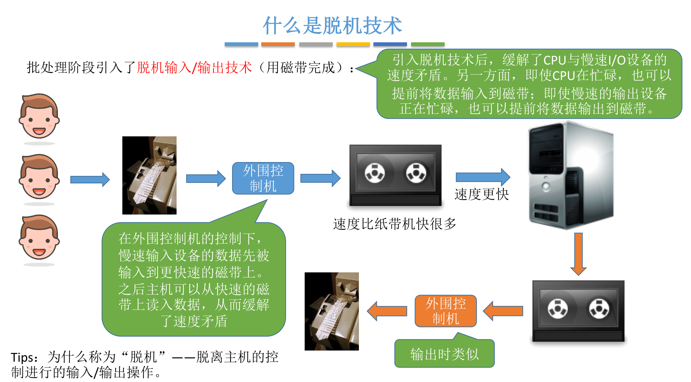
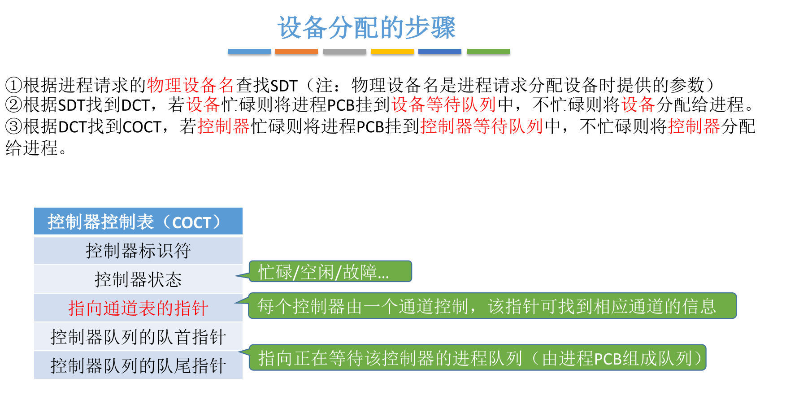
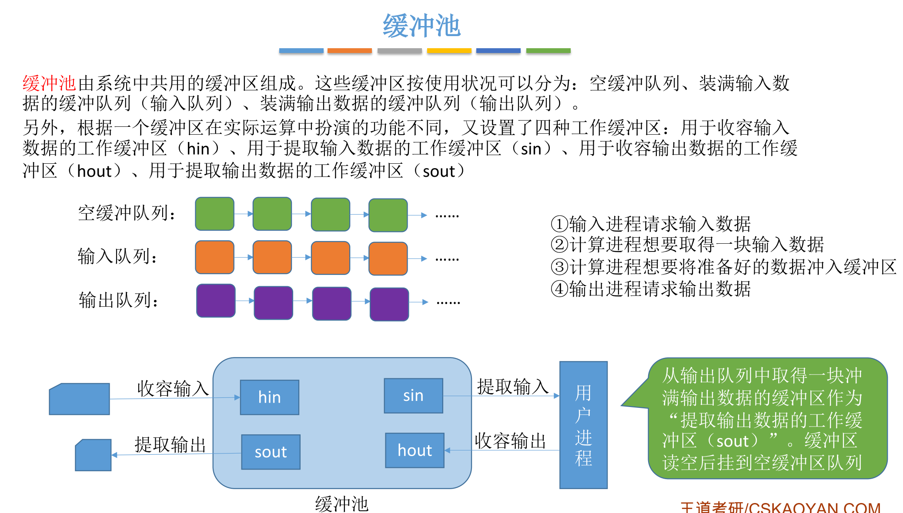

# I/O 管理

## I/O设备的基本概念与分类

## I/O控制器

## I/O控制方式

### 程序直接控制

### 中断驱动方式

### DMA

### 通道控制方式

## IO软件层次结构

### 用户层软件

### 设备独立性软件

为什么不同类型IO设备需要不同的驱动程序？

答：设备不同，内部的电子部件（IO控制器）可能也不同，各式各样的参数不统一

### 设备驱动程序

### 中断处理程序

## IO核心子系统

## SPOOLing技术

## 设备的分配与回收

### 应该考虑的因素

### 静态分配与动态分配

### 设备分配管理中的数据结构

### 设备分配的步骤

### 设备分配步骤的改进

## 缓冲区管理

### 什么是缓冲区

### 单缓冲

### 双缓冲

### 循环缓冲区 

### 缓冲池

