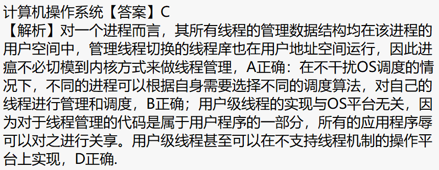
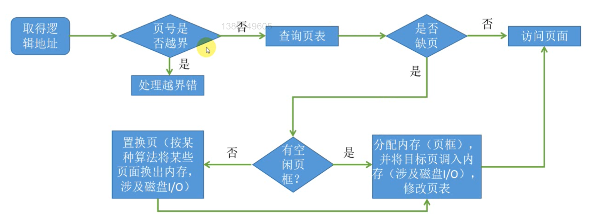

# 概述

# 进程管理

> 与内核态线程相比，用户态线程的优点不包括      （中国科学院大学 2017年）
>
> A.  线程切换不需要转换到内核空间
>
> B.  可以采用定制的调度算法
>
> C.  可以避免系统调用引起进程阻害
>
> D.  实现与操作系统平台无关
>
> > 

# 内存管理

## 访存流程

【解】：

处理越界只可能在==发生缺页之前==，故选B；

> 只要发生缺页，分配内存一定会发生

# 文件管理

# I/O管理

