# 线性表

## 顺序表

顺序表定义

```c++
typedef struct
{
	int len;
	int arr[100];
}SeqList;
```

数组类的题目，有几个固定的套路，如果考试考这种套路题，就按照思路写代码就行了。也可以出的很难（数学题），自己分析规律，如果碰到数学题，直接暴力解就行了，没什么好说的

### 常用接口

#### 逆置

```c++
void Reverse(SeqList& list, int from, int to)
{
	while (from < to)
	{
		int t = list.arr[from];
		list.arr[from] = list.arr[to];
		list.arr[to] = t;
		from++;
		to--;
	}
}
//可以用for循环，但是可读性不高=>难记
```

#### 二分查找

```c++
int BinarySearch(SeqList list, int key)
{
	if (list.len <= 0) return -1;
	int li = 0, hi = list.len - 1, mi;	//low index; high index; mid index
	while (li <= hi)
	{
		mi = (li + hi) / 2;
		if (list.arr[mi] == key) return mi;
		else if (list.arr[mi] < key)
			li = mi + 1;
		else
			hi = mi - 1;
	}
	return -1;
}
```

### 类型

#### 删除操作

> 删除操作分成几个类型
>
> 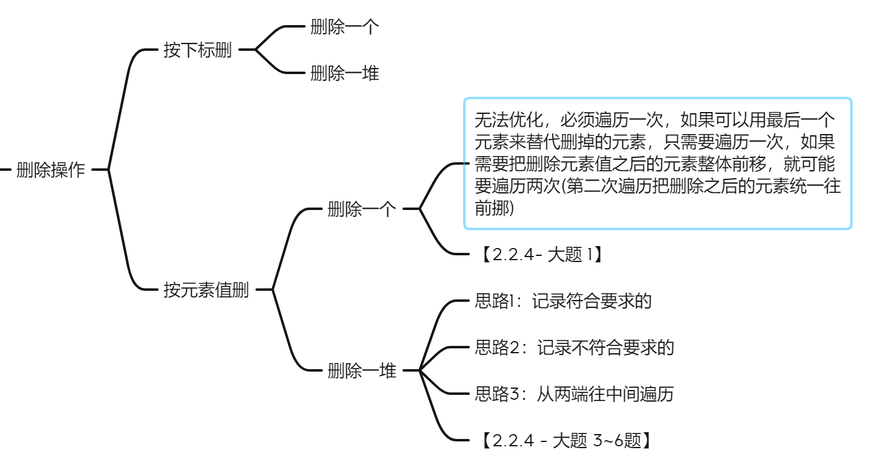
>
> 按下标的删除最多考个选择题，问删除一个元素移动多少个元素
>
> 按元素值删除可能会考大题？有比较固定的解题思路，一般就是一边删的同时记录删除的个数，然后让当前遍历到的元素往前偏移这个个数。
>
> > 记录符合删除要求的思路：
> >
> > 遍历的过程中，设置一个变量cnt用来记录当前已经被删除的元素个数，如果当前遍历的元素符合删除的要求，就让cnt++，否则就让当前的元素往前偏移cnt位，arr[i-cnt]=arr[i]

```c++
//下面两个思路都属于“记录符合删除要求的”
//删除所有值为x的元素
bool DeleteDuplication(SeqList& list, int x)
{
	if (list.len <= 0) return false;
	int cnt = 0;
	for (int i = 0; i < list.len; i++)
	{
		if (list.arr[i] == x)	//如果符合删除要求
			cnt++;
		else
			list.arr[i - cnt] = list.arr[i];	//不删的元素就往前挪
	}
	list.len -= cnt;			//更改长度
	return true;
}

//删除值属于[s,t]的元素
bool DeleteRange(SeqList& list, int s, int t)
{
	if (s >= t || list.len <= 0) return false;
	int cnt = 0;
	for (int i = 0; i < list.len; i++)
	{
		if (list.arr[i] >= s && list.arr[i] <= t)	//符合删除要求
			cnt++;
		else list.arr[i - cnt] = list.arr[i];		//不删的元素就往前挪
	}
	list.len -= cnt;
	return true;
}
```

同样也可以记录不符合要求的个数，关键在这句话：**不符合要求的个数就是接下来的一个元素应该放置的位置**

```c++
//删除所有值为x的元素
bool DeleteDuplication(SeqList& list, int x)
{
	if (list.len <= 0) return false;
	int cnt = 0;
	for (int i = 0; i < list.len; i++)
	{
		if (list.arr[i] != x)			//如果当前元素不是x，就把它放在应该放的地方
		{
			list.arr[cnt] = list.arr[i];
			cnt++;
		}
	}
	list.len = cnt;
	return true;
}
//删除区间内的元素值一个道理，只是判断条件改了，剩下的都不用动
```

设置两个迭代变量往中间“挤”碰到左端符合删除条件的，就用右端的不符合删除条件的代替

```c++
//删除所有值为x的元素
//代码就是一个大致的思路，只测了几个边界情况，考试不建议这种思路
bool DeleteDuplication(SeqList& list, int x)
{
	if (list.len <= 0) return false;
	int left = 0, right = list.len - 1;
	while (left < right)
	{
		while (list.arr[left] != x && left < list.len)	//找左边第一个符合删除条件的
			left++;
		while (list.arr[right] == x && right >= 0)		//找右边第一个不符合删除条件的
			right--;

		if (left >= list.len)	//仅发生在所有元素都不符合删除条件的情况下
			break;
		if (right < 0)			//仅发生在所有情况都满足删除条件的情况下
		{
			list.len = 0;
			break;
		}

		list.arr[left] = list.arr[right];			//用右边的值填到左边待删除的位置
		left++;
		right--;
		list.len--;
	}
	return true;
}
```


> 如果序列是有序的，删除符合要求的元素（比如值在某个区间内）也用前面两个思路做就行了，王道书上的代码有点反人类。强行把遍历三次做完的事情糅合到一次从头到尾的遍历里面。【2.2.3 大题第4题】


大题第6题是一种特殊的情况，这种情况下哈希可能是第一想法，但是因为题目给了有序的条件，因此遍历过程中记录当前元素应该放的位置（书上做法）算是最优解，哈希虽然简单，但是应该要扣掉一分到两分。

#### 用逆置做

> 题目给定序列的初始状态，要求把序列变成另一种状态。
>
> 分析方法：抓住关键的位置，看看把结果序列从关键位置分开，两端逆置一下会怎么样？

> 例题：
>
> 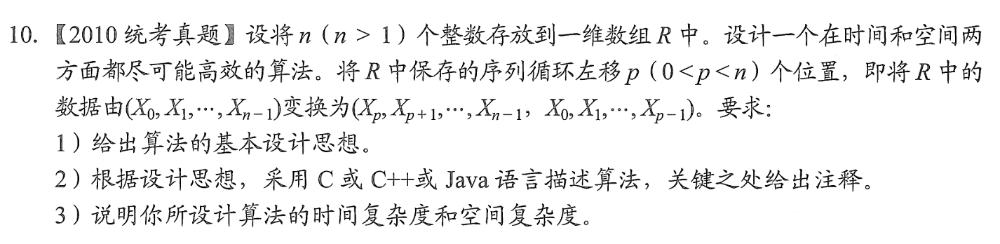
>
> 找关键点p这个位置，然后把结果序列两端逆置一下，发现变成了$(X_{n-1},X_{n-2}\cdots,X_p,X_{p-1},\cdots,X_0)$
>
> 就是最初的序列逆置之后的结果。因此这道题就翻译成了，把原始序列整体先逆置一下，然后再两端逆置一下

#### 哈希/开数组

> 对于一个数组而言，有下标和元素值两个部分组成，可以用下标来表示一部分信息，用元素值来表示遍历过程中记录到的信息。
>
> 简单来说就是用下标代表值，然后用数组元素的值来代表某种信息（一般是出现的次数）。有了这个辅助数组，题目上要求的序列里面的特定值，或者序列里面某个值的出现次数就很好求了。
>
> 题目暗示：
>
> 1. 给了每个元素值的大小
> 2. 请设计一个时间上尽可能高效的算法（空间换时间）
>
> 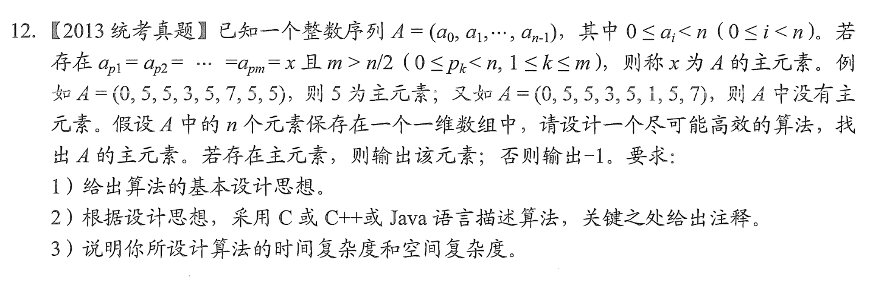
>
> 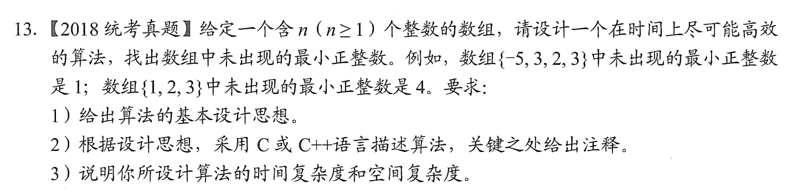

12题“摩尔投票法”是最优解，但是用哈希的话应该是第二档的答案。

13题数组元素的值其实是相对固定的，因为是在n个数里面求最小正整数，所以开一个长度n的数组，大于n的值不记录，小于0的值也不记录。另一层暗示就是说时间上尽可能高效

```c++
int Minimum(int nums[], int n)
{
	int* arr = new int[n];				//辅助数组，值代表当前下标在nums序列中出现了几次
	memset(arr, 0, sizeof(arr));		//初始化辅助数组全为0
	for (int i = 0; i < n; i++)
		if (nums[i] > 0 && nums[i] < n)	//大于0并且小于n才会记录进数组，记录不符合这个条件的没意义，而且还会越界
			arr[nums[i] - 1]++;			//这样a0就代表1出现的次数，可以让n个元素全用上
	for (int i = 0; i < n; i++)
		if (!arr[i]) return i + 1;		//如果辅助数组中某个元素是0，代表这个下标没有出现过，也就是最小正整数
	return n + 1;						//辅助数组里面所有的元素都出现过了，那最小的就是n+1
}
```

其实删除所有重复的元素也可以用开数组的方法来解决，但是空间复杂度就变成O(n)了，并且因为值的范围不确定，所以必须用map

```c++
bool DeleteDuplication(SeqList& list, int x)
{
	if (list.len <= 0) return false;
	unordered_map<int, int> mp;
	for (int i = 0; i < list.len; i++)
		mp[list.arr[i]]++;
	list.len = mp.size();
	int i = 0;
	for (auto e : mp)
		list.arr[i++] = e.first;
	return true;
}
```

#### 二分

二分使用有前提，就是序列一定要按照某种要求有序，也算是一种触发条件，看到有序，就想想是否能用二分来让速度更快一点

正常二分基本不可能考代码，就考个选择题分析分析查找长度之类的，如果老头真的犯病考了，可能就是别的题太难了，用这个送点分

大题如果考二分的话一般就是要在二分的基础上稍微改进一下

##### 细节1，插入位置

当查找失败的时候，left值就是当前元素应该在的位置，如果让在有序序列里面插入一个之前没有的元素，就往二分的left插就行.

> 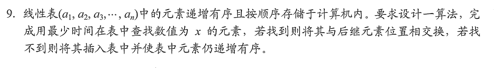

```c++
//思路：在二分基础上稍微改一下，然后分查找成功和查找失败两种情况

/// <summary>
/// 用返回值来表示查找结果，true为查找成功，false为查找失败
/// </summary>
/// <param name="list">待查找序列</param>
/// <param name="key">查找的元素值</param>
/// <param name="id">如果查找成功，就返回对应下标，查找失败就返回li</param>
/// <returns></returns>
bool BinarySearch(SeqList list, int key, int& id)
{
	if (list.len <= 0) return false;
	int li = 0, hi = list.len - 1, mi;	//low index; high index; mid index
	while (li <= hi)
	{
		mi = li + (hi - li) / 2;
		if (list.arr[mi] == key)
		{
			id = mi;
			return true;
		}
		else if (list.arr[mi] < key)
			li = mi + 1;
		else
			hi = mi - 1;
	}
	id = li;
	return false;
}

void SearchAndThen(SeqList& list, int x)
{
	int id;
	bool res = BinarySearch(list, x, id);
	if (res && id != list.len - 1)	//如果查找成功，并且对应的元素下标不是最后一位
	{
		int t = list.arr[id];
		list.arr[id] = list.arr[id + 1];
		list.arr[id + 1] = t;
	}

	if (!res)						//如果查找失败
	{
		for (int i = list.len; i > id; i--)	//从left开始，都往后挪一位
			list.arr[i] = list.arr[i - 1];
		list.arr[id] = x;
		list.len++;
	}
}
```

##### 二分应用——双调序列

> 题目描述：给定一个序列，先递减再递增，输入一个整数，判断这个数是否在序列中
>
> 例如 A = {10, 7, 6, 3, 5, 8, 9}，key=5，返回true；key=2，返回false
>
> > 【分析】一种简单的思路就是设置两个迭代变量，从两边往中间找。但是时间复杂度和从头到尾的时间复杂度一样，都是O(n)。对于有序的序列查找，能想到的最快的方法就是二分，但是这道题的转折点不知道在哪里，所以一般的二分不能用。需要改进一下。
> >
> > 函数名设置为 Binotic(seq, left, right, key) 同样设置`left`, `right`, `mid`三个变量，$mid = \frac{left+right}{2}$ 
> >
> > 考虑三种情况
> >
> > 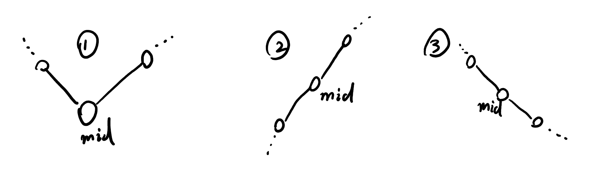
> >
> > 对于情况①，只需要在mid的左右两侧都用二分查找就可以了；
> >
> > 对于情况②，只需要在mid的左侧递归调用Binotic，右侧调用二分查找
> >
> > 对于情况③，只需要在mid的左侧调用二分查找，右侧递归调用Binotic

```c++
//isIncremental参数代表序列是否是单调递增的，如果递增采用一套逻辑查找，递减采用另一套逻辑，
//考试写的话可以把递归的二分换成迭代的代码，空间复杂度会小一点，或者直接不写二分，只写主要逻辑
bool BinarySearch(int arr[], int left, int right, int key, bool isIncremental)
{
	if (left > right) return false;

	int mid = left + (right - left) / 2;
	if (isIncremental)
	{
		if (arr[mid] < key)
			return BinarySearch(arr, mid + 1, right, key, isIncremental);
		else if (arr[mid] == key)
			return true;
		else
			return BinarySearch(arr, left, mid - 1, key, isIncremental);
	}
	else
	{
		if (arr[mid] < key)
			return BinarySearch(arr, left, mid - 1, key, isIncremental);
		else if (arr[mid] == key)
			return true;
		else
			return BinarySearch(arr, mid + 1, right, key, isIncremental);
	}
}

bool Binotic(int arr[], int left, int right, int key)
{
	int mid = left + (right - left) / 2;
	if (arr[mid] < arr[mid - 1] && arr[mid] < arr[mid + 1])	//情况1
		return BinarySearch(arr, left, mid - 1, key, false)
		|| BinarySearch(arr, mid, right, key, true);
	if (arr[mid] > arr[mid - 1] && arr[mid] < arr[mid + 1]) //情况2
		return Binotic(arr, left, mid - 1, key)
		|| BinarySearch(arr, mid, right, key, true);
	if (arr[mid]<arr[mid - 1] && arr[mid]>arr[mid + 1])		//情况3
		return BinarySearch(arr, left, mid - 1, key, false)
		|| Binotic(arr, mid, right, key);
}
```


## 链表

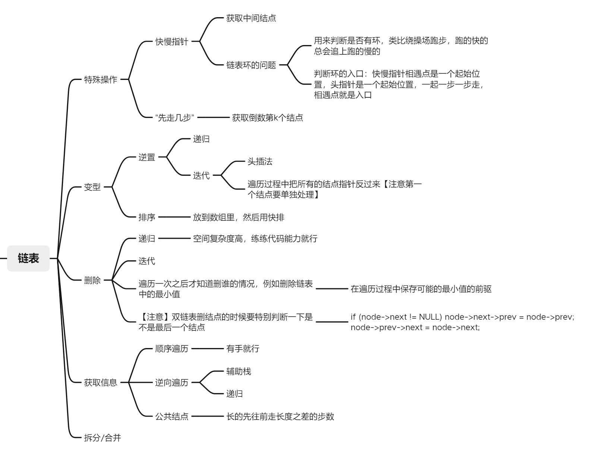

结点定义：

```c++
typedef struct SLNode
{
	int data;
	struct SLNode* next;
}SLNode, * SingleList;
```

### 常用接口

#### 逆置——头插法

```c++
void Reverse(SingleList& head)
{
	if (head->next == nullptr) return;	//链表为空
	SLNode* cur = head->next;			//首结点
	SLNode* t;
	head->next = nullptr;
	while (cur != nullptr)
	{
		t = cur;
		cur = cur->next;
		t->next = head->next;
		head->next = t;
	}
}
```

#### 逆置——掰指针

```c++
void Reverse(SingleList& head)
{
	if (head->next == nullptr) return;	//链表为空
	SLNode* pre = head->next;
	SLNode* cur = pre->next;
	SLNode* t;
	pre->next = nullptr;				//首结点特殊处理
	while (cur != nullptr)
	{
		t = cur;						//保存当前指针
		cur = cur->next;
		t->next = pre;					//把当前的指针“掰到前面”
		pre = t;
	}
	head->next = pre;					//头结点指向最后一个结点
}
```

#### 获取中间结点，偶数偏左

```c++
//例如序列为{1,2,3,4}获得的是2，{1,2,3}获得的是2
SLNode* GetMidNodeL(SingleList head)
{
	if (!head->next) return NULL;
	SLNode* slow = head, * fast = head;
	while (fast->next)
	{
		slow = slow->next;
		fast = fast->next;
		if (fast->next) fast = fast->next;
	}
	return slow;
}
```

#### 获取中间结点，偶数偏右

```c++
//例如序列为{1,2,3,4}获得的是3，{1,2,3}获得的是2，区别就在于快慢指针都从首结点出发
SLNode* GetMidNodeR(SingleList head)
{
	if (!head->next) return NULL;
	SLNode* slow = head->next, * fast = head->next;
	while (fast->next)
	{
		slow = slow->next;
		fast = fast->next;
		if (fast->next) fast = fast->next;
	}
	return slow;
}
```

#### 找倒数第k个结点

```c++
SLNode* GetDaoShuDikGe(SingleList head, int k)
{
	if (head->next == nullptr) return nullptr;	//空表
	SLNode* fast = head;
	SLNode* slow = head;

	while (k--)
	{
		if (!fast) return nullptr;	//链表长度小于k
		fast = fast->next;
	}
	while (fast)
	{
		fast = fast->next;
		slow = slow->next;
	}
	return slow;
}
```

# 栈和队列

## 栈

### 入栈出栈序列是否合法

> 考代码的概率为0，但不是不可能事件
>
> 要求：`I`代表入栈`O`代表出栈，初始时栈为空，要求执行序列结束后栈仍然为空

```c++
bool IsValidSeq(string seq)
{
    //思路：碰到I就加，碰到O就减，过程中变复数了就不合法，最后结果不为0也不合法
    int cnt = 0;		
    for (auto c : seq)
    {
        c == 'I' ? cnt++ : cnt--;
        if (cnt < 0) return false;
    }
    return cnt == 0;
}
```

### 括号匹配问题

> 应该不会直接考括号匹配，换一个马甲，能想起来用栈套就行

```c++
bool IsMatch(string seq)
{
    // 用switch也可以，但是switch里面表达左括号全部入栈的语法有点不好看
    /*	好像是这么写的？
      switch (c)
		{
		case '{':
		case '[':
		case '(':
			st.push(c);
			break;
		}
     */
	stack<char> st;
	for (auto c : seq)
	{
		if (c == '{' || c == '(' || c == '[')	//左括号全部入栈
			st.push(c);
		else if (c == ')')
		{
			if (st.top() != '(')				//不匹配
				return false;
			st.pop();							//把匹配的弹出来
		}
		else if (c == ']')
		{
			if (st.top() != '[')
				return false;
			st.pop();
		}
		else
		{
			if (st.top() != '{')
				return false;
			st.pop();
		}
	}
	return st.empty();							//最后栈不空说明左括号多了
}
```

### 实现递推式

> 408大纲里面有一个栈和队列的应用，队列的应用肯定就是指树和图的BFS那里，栈的应用也就那几个，让写中缀表达式求值或者转成后缀表达式感觉不像是408的题，那能考的也就模拟递归程序和实现递推式了，但是其实也有点强行考的意思
>
> 还有一种考法，就是让设计一个链式的栈或者顺序的栈，链式循环队列已经考过了，栈还会远吗

#### 递推式1

>  王道【3.3大题第3题】
> $$
> P_n(x) = 
>     \begin{cases}
>         1,&n=0\\
>         2x,&n=1\\
>         2xP_{n-1}(x)-2(n-1)P_{n-2}(x),&n>1
>     \end{cases}
> $$

```c++
//这个递推式很像斐波那契数列，是递下去，再归回来的一种
//最底层状态有两个，所以设置两个变量
//先看王道书上的代码
typedef struct Node
{
	int n, val;			//n代表层数，val代表当前层数的值
	Node(int n, int x)	//用于初始化
	{
		this->n = n;
		this->val = x;
	}
}Node;
int Calculate(int x, int n)
{
	stack<Node> st;
	int first = 1, second = 2 * x;		//最底层的两个状态
	while (n >= 2)						//自顶向下，获取每一层的形参
	{
		Node t = Node(n, x);			//等价于Node t;  t.n=n; t.val = x;
		st.push(t);
		n--;
	}
    //到这里为止，递归已经"递"到了倒数第三层，或者可以理解为已经"递"到了最后一层，并且"归"到了倒数第三层
	while (!st.empty())					//归的过程
	{
		st.top().val = 2 * x * second - 2 * (st.top().n - 1) * first;//根据本层的形参计算出自己的值
		//更新上一层需要的前两层变量,类比计组强化讲汇编的时候说的函数调用结束恢复当前函数的PC值(有点强行)
        /*可以这样理解，
        当前处于第i层，现在已经算出来了我这一层的结果，我现在的任务是返还给上一层(i+1)它需要的结果
        现在first 里记录的是第 i-2 层里的计算结果，second里面记录的是第 i-1 层的结果，现在我已经计算出来
        了第i层的结果，然后要返还给上一层了，我要做的就是把second里面的结果(i-1)放到first里面，把我的计
        算结果(i)，放到second里面
        这样相对于我的上层 i+1，first和second里面仍然保存的是它的下一层和下下一层的结果...
         */
        first = second;					
		second = st.top().val;
		st.pop();
	}
	return second;	//最顶层的计算结果
}


//上面的方法是模拟计算机的运行，如果题目只是要求让用栈来实现，没有说非要模拟传参过程，就可以用别的方法来做
//因为x对于我们来说在函数体里面是一直可见的，对于计算机而言他每次都要传递一个x的新副本，才能保证看得见x
//所以就没必要声明结构体，直接计算就行了
int Calculate(int x, int n)
{
	stack<int> st;
	int first = 1, second = 2 * x;
	int cur = -1;
	while (n >= 2)
		st.push(n--);
	while (!st.empty())
	{
		cur = 2 * x * second - 2 * (st.top() - 1) * first;
		first = second;
		second = cur;
		st.pop();
	}
	return second;
}
```

#### 递推式2,斐波那契

```c++
int Fibonacci(int n)
{
	if (n == 0 || n == 1) return n;

	int first = 0, second = 1;
	stack<int> st;
	while (n > 1)
		st.push(n--);
	while (!st.empty())
	{
		st.top() = first + second;
		first = second;
		second = st.top();
		st.pop();
	}
	return second;
}
```

#### 递推式3,阶乘

```c++
int Factorial(int n)
{
	if (n == 0 || n == 1)return 1;
	int base = 1;
	stack<int> st;
	while (n > 1)
		st.push(n--);
	while (!st.empty())
	{
		st.top() *= base;
		base = st.top();
		st.pop();
	}
	return base;
}
```

#### 递推式4 只递不归

$$
Sqrt(A,p,e) = 
    \begin{cases}
        p,& |p^2 -A|<e\\
        Sqrt(A,\frac{p+\frac{A}{p}}{2},e),&|p^2 -A|\ge e\\
    \end{cases}
$$

> 其中p是近似二次方根，e是允许的误差

```c++
/* 开方递推公式
 *					p							|p^2 - a| < e
 *	sqrt(a,p,e) =
 *					sqrt(a, (p+ a / p) / 2, e)	|p^2 - a| >= e
 * p是a的近似二次方根，e是允许的误差范围
 * 例如 sqrt(2, 1.4, 0.001);
 */
 //递归实现开方
double SqrtByRecursion(double a, double p, double e)
{
	if (abs(pow(p, 2) - a) < e) return p;
	return SqrtByRecursion(a, (p + a / p) / 2, e);
}

//用栈模拟实现开方, 其实只维护几个变量就行了，这里是强行转化一下
double SqrtByRecurrence(double a, double p, double e)
{
	stack<double>st;
	st.push(p);
	while (abs(pow(st.top(), 2) - a) >= e)
	{
		double cur = (st.top() + a / st.top()) / 2;
		st.push(cur);
	}
	return st.top();	//没有归的过程，因为最后一层就是结果
}
```

### 模拟递归程序

> 复杂的题目往往只需要最简单的语言描述
>
> 树：非递归后序遍历
>
> 图：非递归DFS？408应该不存在

```c++
/*
王道书上的代码只用了一个栈，但是实在太难理解了，这个方法用两个栈，但是时间复杂度仍然是O(n)，因此考试应该不
会扣分。
思路：从根开始，放到第一个栈里面(然后开始跟BFS一样)，只要第一个栈还有结点
1. 弹出栈顶结点
2. 把当前栈顶结点放到第二个栈里面
3. 判断当前结点是不是有左孩子，有就压到第一个栈
4. 判断当前节点是不是有右孩子，有就压到第二个栈
结束之后依次弹出第二个栈的结点，序列就是后序序列
原因? 模拟一下就清楚了，只可意会
*/
void PostorderByRecurrence(TreeNode* root)
{
	stack<TreeNode*> st1, st2;
	st1.push(root);
	while (!st1.empty())
	{
		TreeNode* node = st1.top();
		st1.pop();
		st2.push(node);
		if (node->left)
			st1.push(node->left);
		if (node->right)
			st1.push(node->right);
	}
	while (!st2.empty())
	{
		cout << st2.top()->data << " ";
		st2.pop();
	}
}
```

## 队列

> BFS，有手就行？

# 树

```c++
typedef struct TreeNode
{
	int data;
	struct TreeNode* left, * right;
	struct TreeNode(int d) :data(d), left(nullptr), right(nullptr) {}
	struct TreeNode() :data(-1), left(nullptr), right(nullptr) {}
}TreeNode;
```


## 非递归遍历

```c++
//非递归后序
void PostorderByRecurrence(TreeNode* root)
{
	stack<TreeNode*> st1, st2;
	st1.push(root);
	while (!st1.empty())
	{
		TreeNode* node = st1.top();
		st1.pop();
		st2.push(node);
		if (node->left)
			st1.push(node->left);
		if (node->right)
			st1.push(node->right);
	}
	while (!st2.empty())
	{
		cout << st2.top()->data << " ";
		st2.pop();
	}
	cout << endl;
}

//非递归前序
void PreorderByRecurrence(TreeNode* root)
{
	stack<TreeNode*> st;
	TreeNode* t;
	st.push(root);
	while (!st.empty())
	{
		t = st.top();
		st.pop();
		cout << t->data << " ";
		if (t->right)				//先右子树，很重要
			st.push(t->right);
		if (t->left)
			st.push(t->left);
	}
	cout << endl;
}

//非递归中序
void InorderByRecurrence(TreeNode* root)
{
	stack<TreeNode*> st;
	TreeNode* cur = root;
	while (cur || !st.empty())
	{
		while (cur)
		{
			st.push(cur);
			cur = cur->left;
		}
		cur = st.top();
		st.pop();
		cout << cur->data << " ";
		cur = cur->right;
	}
	cout << endl;
}
```

## 树高

```c++
/// <summary>
/// 非递归计算树高
/// </summary>
typedef struct TreeNodeWithLayer
{
	int level;
	TreeNode* node;
	struct TreeNodeWithLayer(TreeNode* node, int level)
	{
		this->level = level;
		this->node = node;
	}
}LayerAndNode;
int GetTreeHeight(TreeNode* root)
{
	if (!root) return 0;
	queue<LayerAndNode*> q;
	LayerAndNode* node = new LayerAndNode(root, 1);
	LayerAndNode* cur;
	int res = 0;
	int level = 0;
	q.push(node);
	while (!q.empty())
	{
		cur = q.front();
		q.pop();
		level = cur->level;
		res = max(res, level);
		if (cur->node->left)
			q.push(new LayerAndNode(cur->node->left, level + 1));
		if (cur->node->right)
			q.push(new LayerAndNode(cur->node->right, level + 1));
	}
	return res;
}

//递归计算树高, #include<algorithm>
int GetTreeHeightByRecursion(TreeNode* root)
{
	if (!root) return 0;
	return max(GetTreeHeight(root->left) + 1, GetTreeHeight(root->right) + 1);
}
```

## 当前层数

```c++
void GetLevel(TreeNode* root, int level)
{
    if(!root) return;
    cout<<level<<endl;
    GetLevel(root->left, level+1);
    GetLevel(root->right, level+1);
}
```

## 树宽

```c++
//获取树的最大宽度
int width[10];
void GetWidthArr(TreeNode* root, int level)
{
	if (!root) return;
	width[level]++;
	GetWidthArr(root->left, level + 1);
	GetWidthArr(root->right, level + 1);
}
int MaxWidth(TreeNode* root)
{
	GetWidthArr(root, 0);
	int res = width[0];
	for (auto w : width)
		res = max(res, w);
	return res;
}
```

## BST、AVL

### 判断是否是BST

```c++
//判断是否是BST
bool IsBST(TreeNode* root, bool turnLeft, int last)
{
	if (!root) return true;
	if ((turnLeft && root->data < last) || (!turnLeft && root->data > last))	//当前结点可以作为BST的孩子
		return true && IsBST(root->left, true, root->data) && IsBST(root->right, false, root->data);	//以自己为根也是BST
	else return false;
}
bool IsBST(TreeNode* root)
{
	return IsBST(root, true, INT_MAX);
}
//TODO：BST插入删除
```

### 是否是AVL

```c++
//判断二叉排序树是否是平衡二叉树, 
//题目要求的是判断二叉树是不是平衡二叉树，if里面多写两个条件就行了
//或者前面先调一个判断是不是二叉排序树的算法就好了
//时间 O(n^2) 空间 O(n)
bool IsAVL(TreeNode* root)
{
	if (!root) return true;
	//当前结点平衡因子小于等于1，且孩子都是平衡二叉树	GetTreeHeight是之前写过的一个获取树高的模板
	return abs(GetTreeHeight(root->left) - GetTreeHeight(root->right)) <= 1 && IsAVL(root->left) && IsAVL(root->right);
}

//上面的方法是自顶向下递归，因此对于同一个结点GetTreeHeight方法会被重复调用，从而导致时间复杂度较高
//如果采用自底向上的做法，则对于每一个结点，GetHeight就只会调用一次
//类似后序遍历，改写GetTreeHeight，对于当前遍历到的结点，先递归判断左右子树是否平衡，在判断以当前结点为根的树是否平衡
//如果子树平衡，则返回其高度，否则返回-1，因为如果存在一棵子树不平衡，则整个树就不平衡
//时间O(n)，空间O(n)
int GetHeight(TreeNode* root)
{
	if (!root) return 0;
	int leftHeight = GetHeight(root->left);
	int rightHeight = GetHeight(root->right);
	if (leftHeight == -1 || rightHeight == -1 || abs(leftHeight - rightHeight) > 1)	//左子树不平衡或右子树不平衡或自己不平衡
		return -1;
	else
		return max(leftHeight, rightHeight) + 1;
}
bool IsAVLShengJiBan(TreeNode* root)
{
	return GetHeight(root) != -1;
}
```

## 打印根到所有叶子的路径

```c++
//输出根到所有叶子的路径
vector<int> path(10);					//int path[MAXNUM];
int curN = 0;							//用于逻辑删除
void PrintAllPath(TreeNode* root)
{
	if (!root) return;					//越界代偿
	path[curN++] = root->data;			//加入路径
	if (!root->left && !root->right)	//是叶子
	{
		for (int i = 0; i < curN; i++)	//输出路径
			cout << path[i] << " ";
		cout << endl;
	}
	PrintAllPath(root->left);			//向左递归
	PrintAllPath(root->right);			//向右递归
	curN--;								//回溯
}
```

## 并查集

### 是什么

并查集是一种用来表示集合关系的数据结构，采用的存储结构是树的双亲表示法，也就是使用一个数组（静态链表），数组的下标代表结点的值，数组元素代表自己父亲的值以及它的下标。

> 这种情况是比较简单的情况，408第一年估计最多也就考个这种情况。如果是元素是其他类型，则需要使用map来进行映射，不像是408的风格

比如这样的情况，存在一个全集为{1,2,3,4,5,6}，里面又分成了奇数集合S~1~和偶数集合S~2~，用树的形式来表示就是下面这张图

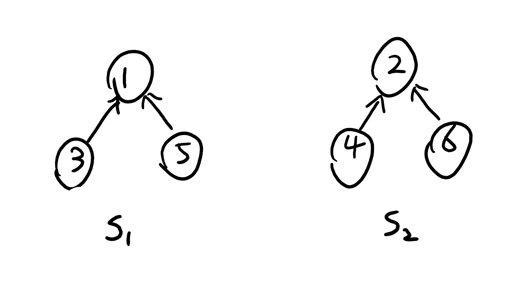

> 值得注意的有几点
>
> 1. 这里的结点都只有一个指针域，所有的指针都是指向自己的父亲
> 2. 最顶层的根结点，比如S~1~中的数字1，我把这个记作这个集合的“`代表元素`”，所有属于这个集合的元素（包括它自己）都可以说成是由这个代表元素所代表的

### 原理

有了一个初步的认识，接下来就是搞明白为什么并查集可以用来表示集合关系

首先，属于同一个集合的元素都有一个相同的“代表”，也就是说对于不同的元素而言，只要能找到相同的代表，它们就是属于同一个集合的；反之就不属于同一个集合。而找代表的过程也很简单，只要顺着自己的“指针域”一直往上寻找，一定能寻找到自己的“代表”。

从图上来看可以表达为：属于同一棵树的元素都是一个集合的，而这个判断它们在同一个集合的关键就在于它们有没有**相同的最顶层的根节点**

有了这样的认识，就知道了代码应该写些什么，我们要解决的有两个问题

1. 找某一个元素的代表——查

   > 有了这个接口之后，我们能做到的就是判断两个元素是否在同一个集合里面

2. 将两个元素所在的集合进行“并”的操作，就是概率论里面的求并集，没什么神奇的

>  还需要搞清楚一个约定俗成的东西，就是当数组的元素值为负数（一般是-1）的时候代表这个结点已经是根了，考试的时候碰到题目如果没有写要求应该这个就是默认的，如果写要求了就按要求来。
>
>  > 在静态链表、FAT里面，一般值是-1都是代表这个链结束了

这是王道书上给的两个基本操作，还给了一个初始化，没啥卵用 memset(set, -1, sizeof(set)) 一句话的事情

### 代码

```c++
//并查集
typedef int UFSet[100];

//查找元素所在集合的“代表”
int Find(UFSet set, int target)
{
	while (set[target] >= 0)
		target = set[target];
	return target;
}

//并集
void Union(UFSet set, int root1, int root2)
{
	int p1 = Find(set, root1);	//找到各自的代表
	int p2 = Find(set, root2);
	if (p1 == p2) return;		//已经隶属于同一集合
	set[p2] = p1;
}
//王道书上的并操作是直接把传进来的两个元素当成了各自的代表，我这段逻辑是如果传进来的不是自己集合的
//代表，就找到代表，并把代表合并

int main
{
    UFSet set;
	memset(set, -1, sizeof(set));
	//{0,6,7,8}, {1,4,9}, {2,3,5} 0、1、2为各集合的代表
	set[3] = 2;
	set[4] = 1;
	set[5] = 2;
	set[6] = 0;
	set[7] = 0;
	set[8] = 0;
	set[9] = 1;

	Union(set, 0, 4);	//将0、4所在的集合并起来
	cout << Find(set, 4) << endl;
	cout << Find(set, 1) << endl;
	cout << Find(set, 9) << endl;
	cout << Find(set, 6) << endl;
    return 0;
}
```

### 考法

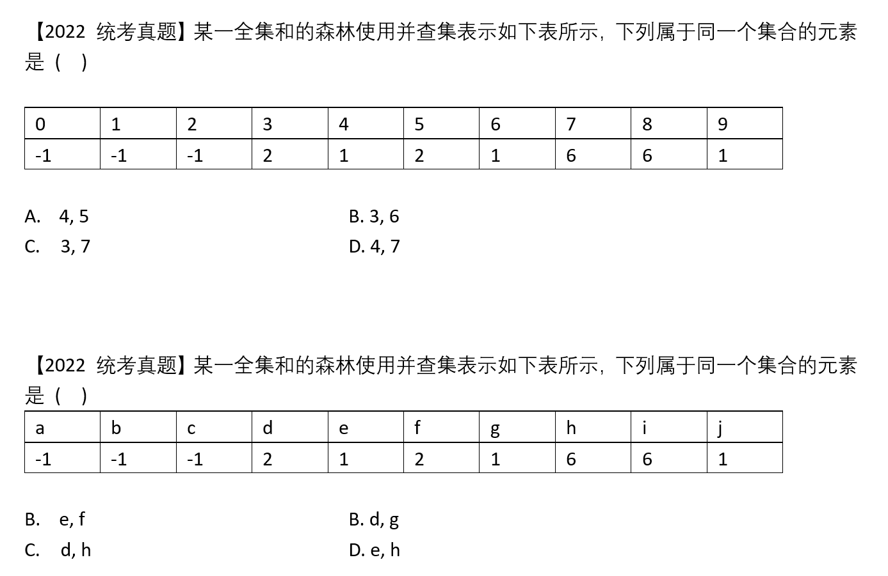

> 两个答案都是D，如下图
>
> 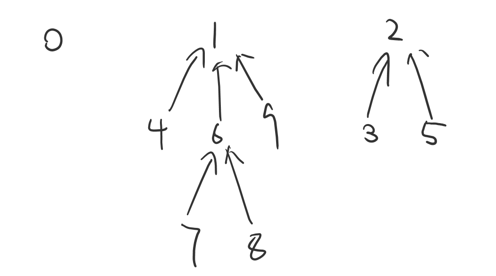
>
> 这种题出着也很好出，写一段代码，随机并几下就出来几个集合了，然后打印一下值啥的，也有一定计算量，猜中了血赚😄
>
> 还有一些就是概念性的了
>

比如这样

> 下列属于并查集的应用的是( )
>
> A. 判断元素间的集合关系 					B. 奇怪的东西
>
> C. 奇怪的东西									  D. 奇怪的东西
>
> > 要这样出只能说老头太温柔了

还有一个小细节

> 下列算法中使用到并查集的是( )
>
> A. Kruskal最小生成树算法
>
> B. Prim最小生成树算法
>
> C. Dijkstra单源最短路径算法
>
> D. Floyd最短路径算法
>
> > 选不出来的立即复习到两点奥
> >
> > 答案：A，判断新加入的边两个顶点是否已经连通
> >
> > 【更小的细节】Kruskal算法里面每次选取最短的边用的数据结构是`小根堆`，每次取的操作时间是O(log|E|)

还可以这样

> 并查集可以用于 ( )
>
> A. 判断两条边是否属于同一连通分量
>
> B. 奇怪的东西
>
> C. 奇怪的东西
>
> D. 奇怪的东西
>
> > 这道题其实就有点刻意了

# 图

```c++
#define MaxVertexNum 20
typedef int VType;		//顶点信息类型

/// <summary>
/// 邻接矩阵定义
/// </summary>
typedef struct MGraph
{
	VType vertices[MaxVertexNum];
	int edge[MaxVertexNum][MaxVertexNum];
	int vexNum, arcNum;
	struct MGraph()
	{
		vexNum = 0;
		arcNum = 0;
		for (int i = 0; i < MaxVertexNum; i++)
		{
			vertices[i] = 0;
			for (int j = 0; j < MaxVertexNum; j++)
				edge[i][j] = 0;
		}
	}
}MGraph;

/// <summary>
/// 邻接表定义
/// </summary>
typedef struct ArcNode
{
	int to;					//弧头顶点编号
	int weight;				//权值
	struct ArcNode* next;	//下一条边
	//构造器
	struct ArcNode() : to(-1), weight(-1), next(nullptr) {};
	struct ArcNode(int t) : to(t), weight(-1), next(nullptr) {};
	struct ArcNode(int t, int w) : to(t), weight(w), next(nullptr) {};
}ArcNode;
typedef struct Vertex
{
	VType data;			//顶点信息
	ArcNode* first;		//边表第一个结点
}Vertex, AdjList[MaxVertexNum];
typedef struct Graph
{
	AdjList vertices;
	int vexNum, arcNum;
}Graph;	  //邻接表

//将邻接表转换成邻接矩阵
MGraph TransformAdjListToMatrix(Graph graph)
{
	MGraph g;
	g.arcNum = graph.arcNum;
	g.vexNum = graph.vexNum;
	for (int i = 0; i < graph.vexNum; i++)
	{
		g.vertices[i] = graph.vertices[i].data;
		ArcNode* node = graph.vertices[i].first;
		while (node)
		{
			g.edge[i][node->to] = 1;
			node = node->next;
		}
	}
	return g;
}
//用一个二维数组构造一个邻接表
Graph BuildGraph(vector<vector<int>> matrix)
{
	Graph graph;
	graph.vexNum = matrix.size();
	int arcNum = 0;
	for (int i = 0; i < matrix.size(); i++)
	{
		graph.vertices[i].data = i;
		graph.vertices[i].first = nullptr;
		for (int j = 0; j < matrix[i].size(); j++)
		{
			if (matrix[i][j])
			{
				arcNum++;
				ArcNode* node = new ArcNode(j);
				if (!graph.vertices[i].first)
					graph.vertices[i].first = node;
				else
				{
					node->next = graph.vertices[i].first;
					graph.vertices[i].first = node;
				}
			}
		}
	}
	graph.arcNum = arcNum;
	return graph;
}

//打印邻接矩阵
void PrintMatrix(MGraph m)
{
	cout << "\n******************************邻接矩阵************************************" << endl;
	for (int i = 0; i < m.vexNum; i++)
	{
		cout << "                            ";
		for (int j = 0; j < m.vexNum; j++)
		{
			cout << m.edge[i][j] << " ";
		}
		cout << endl;
	}
	cout << "********************************邻接矩阵************************************\n\n\n" << endl;
}
//打印邻接表
void PrintAdjList(Graph graph)
{
	for (int i = 0; i < graph.vexNum; i++)
	{
		cout << "                " << graph.vertices[i].data << " ";
		if (graph.vertices[i].first)
		{
			cout << " --> " << graph.vertices[i].first->to;
			ArcNode* node = graph.vertices[i].first;
			while (node->next)
			{
				cout << " --> " << node->next->to;
				node = node->next;
			}
		}
		cout << endl;
	}
}
```

## BFS和DFS

### 提前准备的接口

```c++
//获取顶点x的第一个邻接点
int FirstNeighbor(MGraph g, int id)
{
	if (id >= g.vexNum)					//越界
		return -1;
	for (int i = 0; i < g.vexNum; i++)
		if (g.edge[id][i])				//找到了存在的边
			return i;					//返回指向的顶点编号
	return -1;
}
int FirstNeighbor(Graph g, int id)
{
	if (id >= g.vexNum) return -1;
	if (g.vertices[id].first)			//顶点有边
		return g.vertices[id].first->to;
	return -1;
}

//获取顶点下一个邻接点
int NextNeighbor(MGraph g, int id, int curNeighbor)
{
	if (id >= g.vexNum) return -1;
	for (int i = curNeighbor + 1; i < g.vexNum; i++)
		if (g.edge[id][i])
			return i;
	return -1;
}
int NextNeighbor(Graph g, int id, int curNeighbor)
{
	if (id >= g.vexNum) return -1;
	ArcNode* node = g.vertices[id].first;
	while (node && node->to != curNeighbor)
	{
		node = node->next;
	}
	if (!node) exit(0);
	return node->next == nullptr ? -1 : node->next->to;
}
```

### BFS

```c++
bool visited[MaxVertexNum];
void BFS(MGraph graph, int entry)		//邻接矩阵
{
	cout << graph.vertices[entry] << " ";
	queue<int> q;
	q.push(entry);
	visited[entry] = true;
	while (!q.empty())
	{
		int t = q.front();
		q.pop();
		for (int i = FirstNeighbor(graph, t); i != -1; i = NextNeighbor(graph, t, i))
		{
			if (!visited[i])
			{
				cout << graph.vertices[i] << " ";
				visited[i] = true;
				q.push(i);
			}
		}
	}
}
void BFS(Graph graph, int entry)	//邻接表
{
	cout << graph.vertices[entry].data << " ";
	queue<int> q;
	q.push(entry);
	visited[entry] = true;
	while (!q.empty())
	{
		int t = q.front();
		q.pop();
		for (int i = FirstNeighbor(graph, t); i != -1; i = NextNeighbor(graph, t, i))
		{
			if (!visited[i])
			{
				cout << graph.vertices[i].data << " ";
				visited[i] = true;
				q.push(i);
			}
		}
	}
}
```

### DFS

```c++
bool visited[MaxVertexNum];
void DFS(MGraph graph, int entry)
{
	cout << graph.vertices[entry] << " ";
	visited[entry] = true;
	for (int i = FirstNeighbor(graph, entry); i != -1; i = NextNeighbor(graph, entry, i))
		if (!visited[i])
			DFS(graph, i);
}
void DFS(Graph graph, int entry)
{
	cout << graph.vertices[entry].data << " ";
	visited[entry] = true;
	for (int i = FirstNeighbor(graph, entry); i != -1; i = NextNeighbor(graph, entry, i))
		if (!visited[i])
			DFS(graph, i);
}
```

### 回溯找路径

```c++
bool visited[MaxVertexNum];
//打印entry到target的所有路径
void FindAllPath(Graph graph, int entry, int target, int path[], int cur)
{
	path[++cur] = entry;
	visited[entry] = 1;
	if (entry == target)
	{
		for (int i = 0; i <= cur; i++)
			cout << path[i] << " ";
		cout << endl;
	}
	for (int i = FirstNeighbor(graph, entry); i != -1; i = NextNeighbor(graph, entry, i))
		if (!visited[i])
			FindAllPath(graph, i, target, path, cur);
	visited[entry] = 0;
}
```

## 应用

### Dijkstra不能构造最小生成树的反例

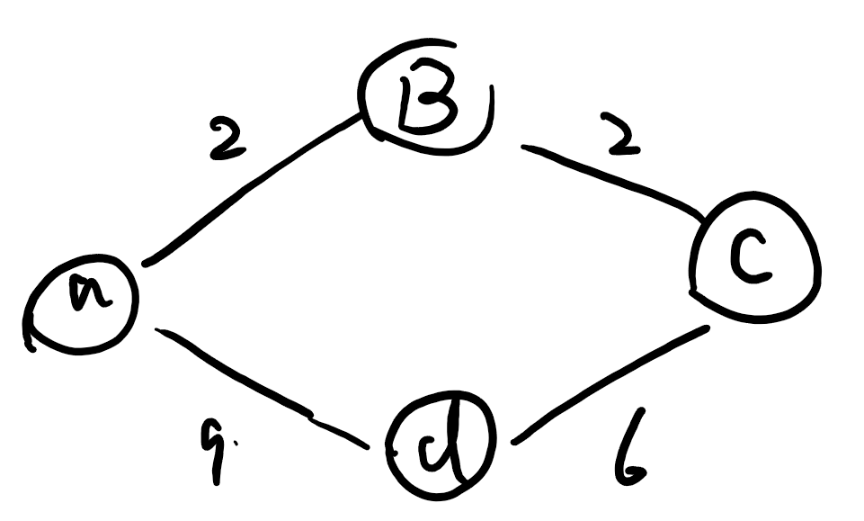

> 在上面这个图里面，从a出发，找最短路径，则最终选的边是2，2，9
>
> 而最小生成树应该是2，2，6
>
> 原因：因为单个边的长度小于几条边加起来的长度了

# 查找

## 顺序、二分、分块

```c++
int BinarySearch(int nums[], int len, int key)
{
	if (len < 0) return-1;
	int li = 0;
	int hi = len - 1;
	int mi;
	while (li <= hi)
	{
		mi = li + (hi - li) / 2;	//更好的写法
		if (nums[mi] == key) return mi;
		else if (nums[mi] < key)
			li = mi + 1;
		else
			hi = mi - 1;
	}
	return -1;
}

//递归版
int BinarySearch(int nums[], int li, int hi, int key)
{
	if (li > hi) return -1;
	int mi = li + (hi - li) / 2;
	if (nums[mi] == key) return mi;
	else if (nums[mi] < key)
		return BinarySearch(nums, mi + 1, hi, key);
	else
		return BinarySearch(nums, li, mi - 1, key);
}
```


## B树

问题：含n个关键字的m阶B树，最⼩⾼度、最⼤⾼度是多少？

#### 最小高度

【分析】
$$
最小高度也就是让每个结点尽可能满，有m-1个关键字，m个分叉。\\
于是有，n\le (m-1)(1+m^2+m^3+\cdots+m^{h-1}=m^h-1)，\\所以h\ge log_m(n+1)
$$

#### 最大高度

【分析】
$$
让各层的分叉尽可能的少，即根节点只有2个分叉，其他结点只有\lceil m/2 \rceil个分叉\\
各层结点至少有：第一层1个，第二层2、第三层2\lceil m/2 \rceil\cdots第h层2(\lceil m/2 \rceil)^{h-2}\\
第h+1层共有叶子节点(失败结点)2(\lceil m/2 \rceil)^{h-1}个\\
n个关键字的B树必有n+1个叶⼦结点，于是\\
n+1\ge2(\lceil m/2 \rceil)^{h-1}，也即h\le log_{\lceil m/2 \rceil}\frac{n+1}{2}+1
$$

## Hash

### 拉链法

```c++
#define MAXNUM 20
typedef struct LaLianNode
{
	int data;
	struct LaLianNode* next;
}LaLianNode;

typedef struct HashNode
{
	LaLianNode* head;
}HashNode, HashTable[MAXNUM];

//上面的方法有点强行...
//其实用一个单链表结点的数组就可以实现拉链法，它只是画出来图看起来像邻接表，跟邻接表还是有区别的
//像这样
SLNode hashTable[MAXNUM];	//把每个数组元素当成头结点就可以了，剩下的各种操作都是单链表操作
```

# 排序

## 各类排序

### 插入排序

```c++
//直接插入排序
void InsertSort(vector<int>& nums)
{
	int temp;
	int j;
	for (int i = 1; i < nums.size(); i++)
	{
		if (nums[i] < nums[i - 1])
		{
			temp = nums[i];
			j;
			for (j = i; j > 0 && nums[j - 1] > temp; j--)
				nums[j] = nums[j - 1];
			nums[j] = temp;
		}
	}
}

//折半插入排序
void BinaryInsertSort(vector<int>& nums)
{
	int temp;
	int li, hi, mi, j;
	for (int i = 1; i < nums.size(); i++)
	{
		if (nums[i] < nums[i - 1])
		{
			li = 0, hi = i - 1;
			temp = nums[i];
			while (li <= hi)
			{
				mi = li + (hi - li) / 2;
				if (nums[mi] > temp) hi = mi - 1;
				else li = mi + 1;
			}
			for (j = i; j > li; j--)
				nums[j] = nums[j - 1];
			nums[j] = temp;
		}
	}
}

//希尔排序
void ShellSort(vector<int>& nums)
{
	int j;
	for (int d = nums.size() / 2; d >= 1; d /= 2)
	{
		for (int i = d; i < nums.size(); i++)
		{
			if (nums[i] < nums[i - d])
			{
				int temp = nums[i];
				for (j = i - d; j >= 0 && temp < nums[j]; j -= d)
					nums[j + d] = nums[j];
				nums[j + d] = temp;
			}
		}
	}
}

//另一种写法，每次都先将一个子表插入排序完毕之后再加工下一个子表
/* 解释：考虑到增量d会将整个序列分成d个子序列。比如数组{1,2,3,4,5,6,7,8}长度为8，增量为4
 * 此时子表分别为 {1,5}, {2,6}, {3,7}, {4,8}
 * 共有4个子表，而进行希尔排序的时候是从第一个子表的最后一个元素开始执行插入排序的
 * 例如第一个子表，我们会从元素5开始往前进行比较....
 * 
 * 知道了这个之后假设这样一个序列{20,30,10,50,60,40,70,80}
 * 假设现在的d为2,那么分成的子表就是{20,10,60,70}, {30,50,40,80}
 *
 * 第一轮循环k=0，i=d+0=d=2，也就是指向10这个元素，然后向前进行比较，符合交换的条件，
 * 子表变为{10,20,60,70}
 * 然后执行i+=d，在之前的代码中子表交错执行是i++，这里是i+=d，
 * 也就是i现在指向了60这个元素，然后向前比较，不符合交换条件...
 *
 * 第二轮循环k=1，i=d+1=3，也就是指向50这个元素...依此类推。
 */

void ShellSort(vector<int>& nums)
{
	for (int d = nums.size() / 2; d > 0; d /= 2)
	{
		for (int k = 0; k < d; k++)	//这里的k代表的就是进行到第k+1个子表
		{
			for (int i = d + k; i < nums.size(); i += d)
			{
				if (nums[i] < nums[i - d])
				{
					int j, temp = nums[i];
					for (j = i - d; j >= 0 && nums[j] > temp; j -= d)
						nums[j + d] = nums[j];
					nums[j + d] = temp;
				}
			}
		}
	}
}
```

### 交换排序

```c++
//冒泡排序
void BubbleSort(vector<int>& nums)
{
	bool flag;
	for (int i = 0; i < nums.size() - 1; i++)
	{
		flag = false;
		for (int j = i; j < nums.size() - 1; j++)
		{
			if (nums[j] > nums[j + 1])
			{
				swap(nums[j], nums[j + 1]);
				flag = true;
			}
		}
		if (!flag)return;
	}
}

//快速排序
int Partition(vector<int>& nums, int li, int hi)
{
	int pivot = nums[li];
	while (li < hi)
	{
		while (li < hi && nums[hi] >= pivot)
			hi--;
		nums[li] = nums[hi];
		while (li < hi && nums[li] <= pivot)
			li++;
		nums[hi] = nums[li];
	}
	nums[li] = pivot;
	return li;
}
void QuickSort(vector<int>& nums, int li, int hi)
{
	if (li >= hi) return;
	int pivotPos = Partition(nums, li, hi);
	QuickSort(nums, pivotPos + 1, hi);
	QuickSort(nums, li, pivotPos - 1);
}
```

### 选择排序

```c++
//选择排序
void SelectSort(vector<int>& nums)
{
	for (int i = 0; i < nums.size() - 1; i++)
	{
		int minId = i;
		for (int j = i + 1; j < nums.size(); j++)
			minId = nums[j] < nums[minId] ? j : minId;
		swap(nums[i], nums[minId]);		//就算min值就是nums[i]，也直接交换就行了
	}
}
void SelectSort(SingleList& head)	//单链表选择排序,这样写比王道书上的更好理解
{
	if (!head->next) return;
	for (SLNode* i = head->next; i->next != nullptr; i = i->next)
	{
		SLNode* minId = i;
		for (SLNode* j = i->next; j != nullptr; j = j->next)
			minId = j->data < minId->data ? j : minId;
		if (i != minId) i = minId;
	}
}

//堆排序
void Sink(vector<int>& nums, int i, int end)
{
	while (i <= end)
	{
		int left = i * 2 + 1;	//数组下标从0开始，如果从1开始left = i*2, right = i*2+1
		int right = i * 2 + 2;
		int temp = i;
		if (left <= end && nums[left] > nums[temp])		//有左孩子且左孩子的值大于根结点值
			temp = left;
		if (right <= end && nums[right] > nums[temp])	//有右孩子且右孩子的值大于上一轮比出来的最大值
			temp = right;
		if (temp == i) break;							//左右孩子都没有根大
		swap(nums[i], nums[temp]);
		i = temp;										//继续下一层
	}
}
void BuildMaxHeap(vector<int>& nums)
{
	for (int i = nums.size() / 2 - 1; i >= 0; i--)
		Sink(nums, i, nums.size() - 1);
}
void HeapSort(vector<int>& nums)
{
	BuildMaxHeap(nums);					//建堆
	int end = nums.size() - 1;
	while (end > 0)
	{
		swap(nums[0], nums[end--]);		//第一位和最后一位交换位置，并把堆的范围缩小
		Sink(nums, 0, end);				//对根进行下沉操作
	}
}
```

### 归并排序

```c++
//归并排序
void Merge(vector<int>& nums, vector<int> aid, int li, int mi, int hi)
{
	for (int i = li, p = li, q = mi + 1; i <= hi; i++)
	{
		if (p <= mi && q <= hi)	//两个子段都没有比到最后一个
			aid[i] = nums[p] <= nums[q] ? nums[p++] : nums[q++];
		else if (p > mi)		//左边子段没有元素了
			aid[i] = nums[q++];
		else if (q > hi)		//右边子段没有元素了
			aid[i] = nums[p++];
	}
	for (int i = li; i <= hi; i++) nums[i] = aid[i];	//将辅助数组中排好的元素放回原数组
}
void MergeSort(vector<int>& nums, vector<int> aid, int li, int hi)
{
	if (li >= hi) return;				//最底层
	int mi = li + (hi - li) / 2;
	MergeSort(nums, aid, li, mi);		//向左递归
	MergeSort(nums, aid, mi + 1, hi);	//向右递归
	Merge(nums, aid, li, mi, hi);		//并
}
void MergeSort(vector<int>& nums)		//重载
{
	if (!nums.size()) return;
	vector<int> aid(nums.size());
	MergeSort(nums, aid, 0, nums.size() - 1);
}
```

### 基数排序

```c++
//获取数组中最大值的位数，以确定回收和采集的次数
int GetMaxDigits(vector<int> nums)
{
	int mx = nums[0];
	for (int item : nums)
		mx = max(mx, item);
	int cnt = 0;
	while (mx > 0)
	{
		cnt++;
		mx /= 10;
	}
	return cnt;
}

//获取数字n第i位的值，例如n=12，i=0，则返回2; i=1,则返回1
int GetDiIWei(int n, int i)
{
	while (i--)
		n /= 10;
	return  n % 10;
}
//使用一个queue类型的数组空间复杂度是O(n),跟书上不一样，
//书上是用单链表做的，考试考了就写一个尾插法的接口就好了
//可以通过前缀和的形式来避免使用队列
//因为收集和分配的过程是先进先出的，故考虑使用队列
void RadixSort(vector<int>& nums)
{
	queue<int> buckets[10];			//buckets[i]代表值为i
	int cnt = GetMaxDigits(nums);
	for (int i = 0; i < cnt; i++)	//i为0代表个位，i为1代表十位，依次遍历到最高位
	{
		for (int j = 0; j < nums.size(); j++)	//收集
		{
			int t = GetDiIWei(nums[j], i);		//获取当前位数的值
			buckets[t].push(nums[j]);			//放入桶中
		}
		int j = 0;
		for (int i = 0; i < 10; i++)			//分配，也就是把十个桶中的数据倒出来
		{
			while (!buckets[i].empty())			//只要当前位的桶里面还有数据就一直倒
			{
				nums[j++] = buckets[i].front();
				buckets[i].pop();
			}
		}
	}
}

//强化班说结构和邻接表类似，其实只是看着像，还是跟之前的拉链法一样用一个单链表结点的数组来表示就可以了
SLNode* buckets[10];
//然后把队列的插入和删除换成自己写的尾插以及取值接口就好了
```

## 归并应用

> 求小和问题
>
> 在一个序列中，每一个数左边比当前数小的数累加起来，叫做这个序列的小和。例如对于序列{1,3,4,2,5}而言
>
> 1左边不存在比1小的数
>
> 3左边比3小的数有：1
>
> 4左边比4小的数有：1，3
>
> 2左边比2小的数有：1
>
> 5左边比5小的数有：1，3，4，2
>
> 将这些数字相加，可以得到这个序列的小和为：1+1+3+1+1+3+4+2=16
>
> 请设计一个算法计算序列的小和
>
> 要求：
>
> 1）给出算法的基本思想
>
> 2）根据设计思想，采用C或C++语言描述算法，关键之处给出注释
>
> 3）说明你所设计算法的时间复杂度


> 【暴力解】
>
> 这道题的暴力解法很轻松就能够写出来，正着写反着写都一样。正着写的话就是遍历到当前元素$a_i$，然后从0到i-1遍历，看谁比自己小，就往结果里面加一个
>
> ```c++
> int LittleSum(int arr[], int len)
> {
> 	int res = 0;
> 	for (int i = 0; i < len; i++)
> 	{
> 		for (int j = 0; j < i; j++)		//从0到i-1的元素都遍历一遍
> 		{
> 			if (arr[j] < arr[i])		//如果小于当前元素，就加入结果
> 				res += arr[j];
> 		}
> 	}
> 	return res;
> }
> ```
>
> 时间复杂度，经典选择题O(n^2)

> 【分析】这道题的等价问法是求一个序列中当前元素右边比当前元素大的个数。例如{1,3,4,2,5}，对于1而言，它的右侧比自己大的有3，4，2，5四个元素，因此最终的结果就要加4*1。对于3而言，右侧比自己大的有4和5两个元素，因此最终的结果就要加2\*3...
>
> 优化思路：暴力解法之所以慢是因为有很多次的比较都是白白比较的，跟排序算法中O(n^2)的算法们一样，浪费的是比较的次数。所以优化的思路应该也从这里开始。在归并排序merge的过程中，序列被分成了两个部分，两部分都是有序的，而且会逐个遍历每一个元素，将它们放置在辅助数组中。同时它们的相对位置和原始序列中的相对位置也是一样的。遍历过程中，如果右半部分的元素比左半部分的元素大，那就加上右半部分剩余的长度个左半部分当前元素。
>
> 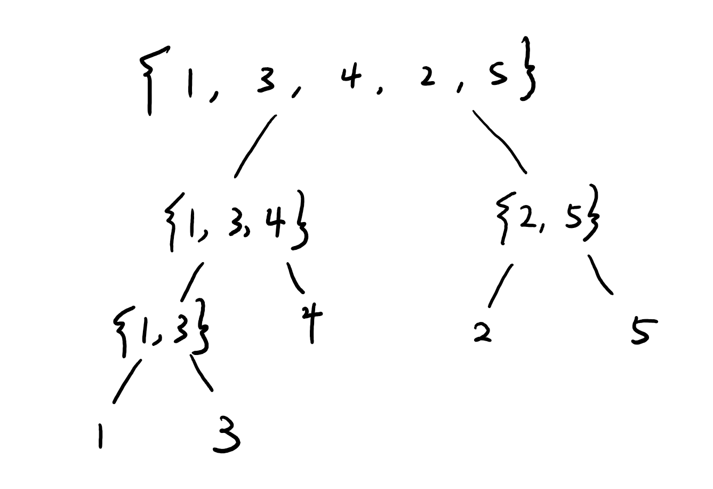
>
> ```c++
> int aid[10];
> int Merge(int arr[], int left, int mid, int right)
> {
> 	int i = 0;
> 	int p1 = left;
> 	int p2 = mid + 1;
> 	int res = 0;
> 	while (p1 <= mid && p2 <= right)
> 	{
> 		if (arr[p1] < arr[p2])
> 		{
> 			res += (right - p2 + 1) * arr[p1];
> 			aid[i++] = arr[p1++];
> 		}
> 		else
> 			aid[i++] = arr[p2++];
> 	}
> 	while (p1 <= mid)
> 		aid[i++] = arr[p1++];
> 	while (p2 <= right)
> 		aid[i++] = arr[p2++];
> 	for (int j = 0; j < i; j++)
> 		arr[left + j] = aid[j];
> 	return res;
> }
> 
> int Solve(int arr[], int left, int right)
> {
> 	if (left == right) return 0;
> 	int mid = left + (right - left) / 2;
> 	return Solve(arr, left, mid) + Solve(arr, mid + 1, right) + Merge(arr, left, mid, right);
> }
> //O(nlogn) O(n)
> ```
>
> //TODO：注释&分析为什么当左==右时必须右边先增加到辅助数组

## 快排应用

> 荷兰国旗问题(快排partition优化)

```c++
void Partition(vector<int>& arr, int num)
{
	int i = 0, less = -1, more = arr.size();
	while (i < more)
	{
		if (arr[i] < num)
		{
			swap(arr[i++], arr[++less]);
		}
		else if (arr[i] == num)
			i++;
		else
			swap(arr[i], arr[--more]);
	}
}
```

